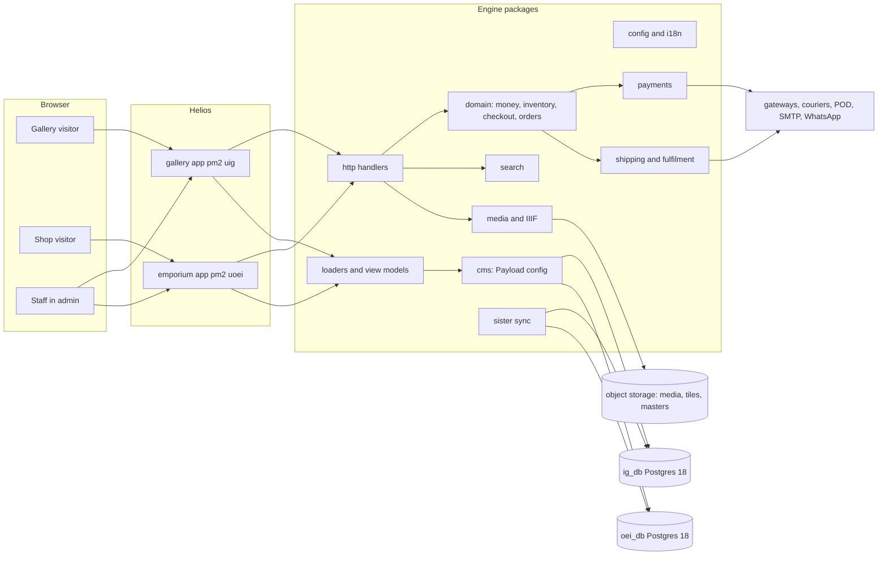
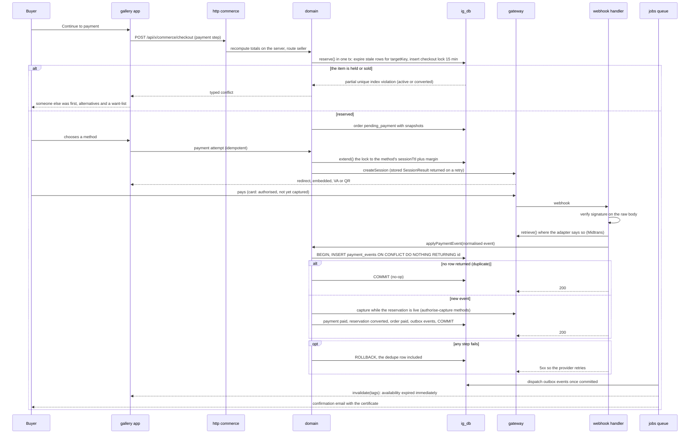
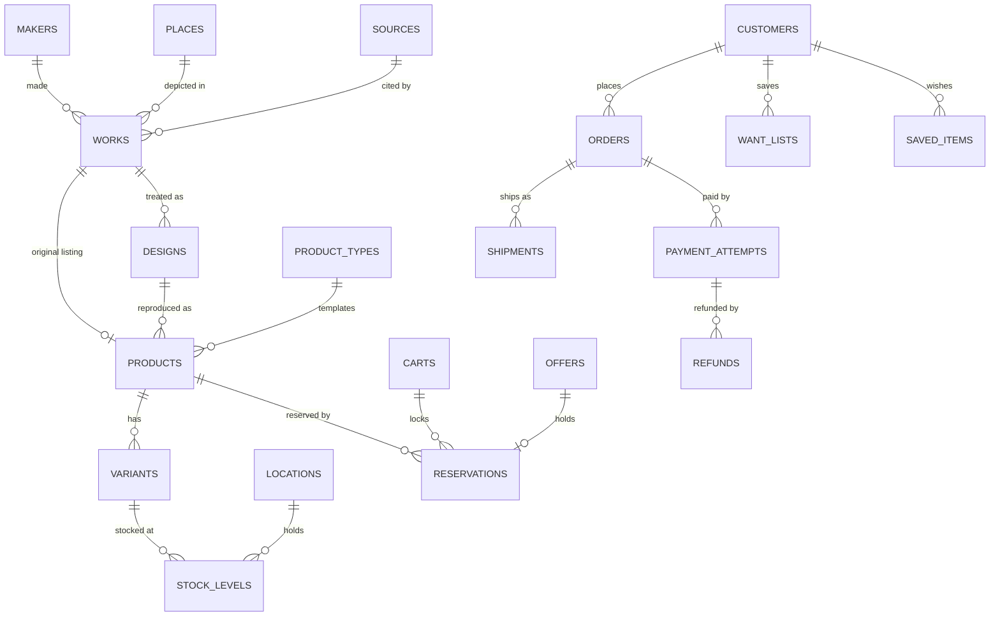
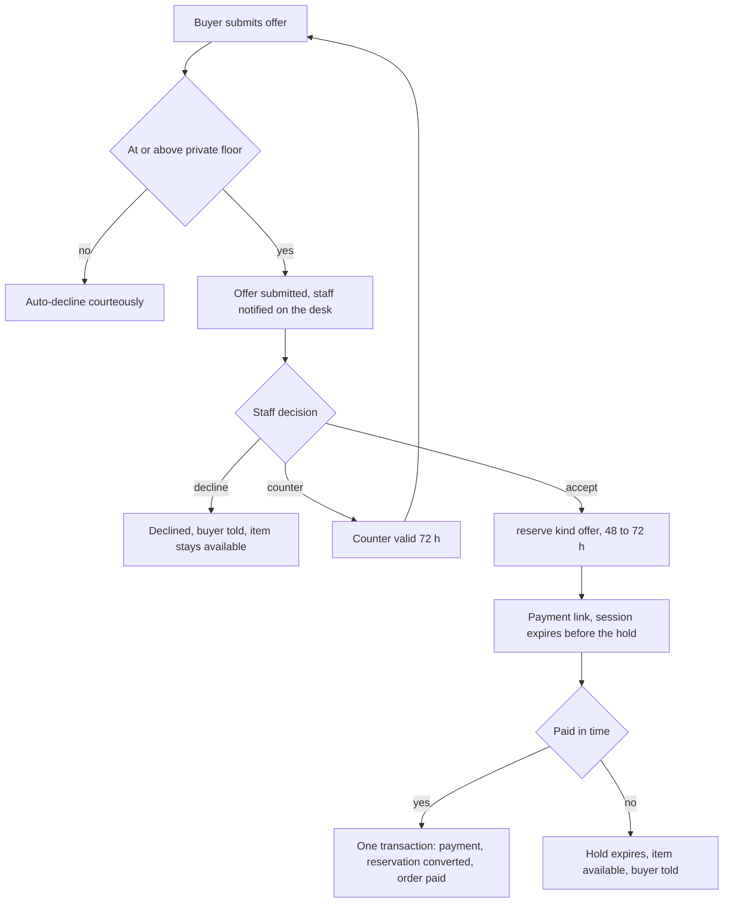
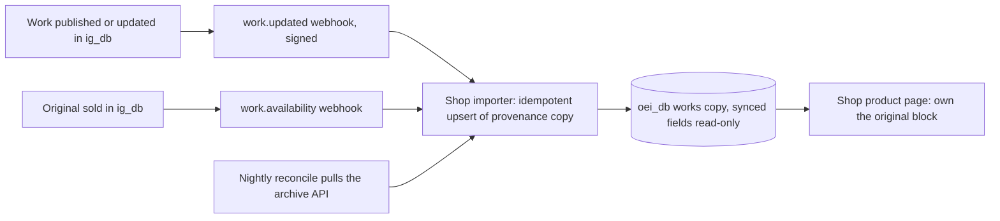
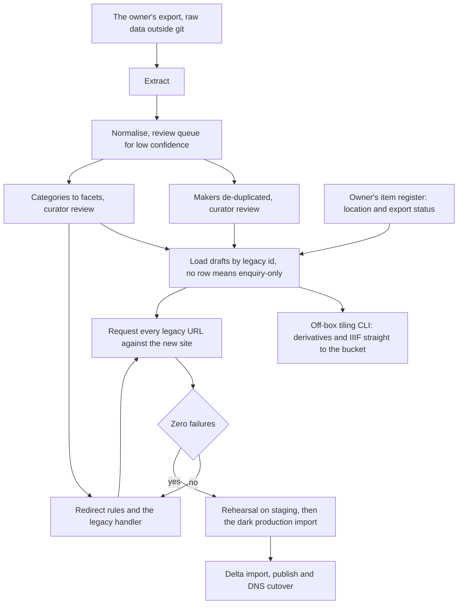
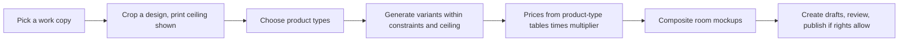

# Design Document — Indies Platform

## Overview

One engine and one CMS serve two sister companies. **Indies Gallery** sells
one-of-one antique maps, prints, photographs and books; **Old East Indies** sells
merchandise reproduced from the same archive. They share every engine package
and differ only in configuration, data, assets and their storefront app.

This document is the digest implementation agents read first. Each section
points to the doc that holds the full reasoning — **when this digest and a doc
disagree, the doc wins and this digest is corrected.**

| Topic | Authority |
| ----- | --------- |
| decisions and stack | `docs/ARCHITECTURE.md` |
| what differs per brand | `docs/BRANDS.md` |
| collections and glossary | `docs/CONTENT-MODEL.md` |
| money, stock, checkout, orders | `docs/COMMERCE.md` |
| gateways | `docs/PAYMENTS.md` |
| legal constraints | `docs/COMPLIANCE.md` |
| surfaces, tokens, blocks, budgets | `docs/DESIGN-SYSTEM.md` |
| page behaviour | `docs/EXPERIENCE-GALLERY.md`, `docs/EXPERIENCE-SHOP.md` |
| lanes, ownership, contracts | `docs/PARALLEL-TRACKS.md` |
| migration | `docs/MIGRATION.md` |
| events | `docs/ANALYTICS.md` |
| environments and releases | `docs/DEPLOYMENT.md` |

**Design decisions and their rationale, in one line each:**

1. Two storefront apps named by archetype (`gallery`, `emporium`), because the
   looks need different page structures; brands choose an app by config.
2. One Payload config, one database per brand, one migration set, hash-checked —
   because Payload binds one database per instance and the brands are separate
   companies.
3. Commerce is ours on Payload; the ecommerce plugin's shapes are borrowed, never
   its endpoints — because as shipped it can sell a unique item twice.
4. One `reserve()` writing a scalar `targetKey`, a partial unique index over
   active **and converted** reservations, a lock that outlives the payment
   method's window, and payment + reservation + order in one transaction — the
   one-of-one guarantee.
5. Sellers of record are data — because an Indonesian PT charges only IDR, Stripe
   needs a Singapore entity, and exports of antiques need clearance.
6. Currency follows the destination — because Indonesian deliveries must be
   priced in IDR alone.
7. Static IIIF tiles on object storage — deep zoom with nothing to run.
8. Postgres search with a gazetteer — historical names are the discovery edge.
9. The default locale unprefixed — the gallery's product URLs stay byte-identical.
10. Nothing is designed by default in code — two signature surfaces are comped in
    the Design stage, every other surface gets a brief before it is built, every surface has
    state fixtures, and every UI phase closes with a design gate and real buyers.
11. No dark mode on the storefronts — paper on a warm mat is the product.
12. Webhooks are deduplicated **inside** the transaction that applies them —
    because a dedupe row committed before a crash would swallow the retry.
13. Next 16 Cache Components, proven by a spike in phase 4 with one documented
    fallback — content cached by tag, availability and the ship-to market
    streamed at request time, availability tags expired immediately.
14. Public reads are published-only and projected (`overrideAccess: false`,
    `_status: 'published'`, `select`) — because the Local API's default would
    leak drafts, costs and consignors to any page that forgot.
15. The Payload config is brand-independent — because a config shaped by `BRAND`
    would silently give two brands two schemas.

## Architecture

### System Architecture Diagram



Each process binds exactly one database. The only cross-brand path is sister
sync, which **copies with provenance** through a signed API — never a
cross-database join on a request.

### Data Flow Diagram — a unique item from checkout to sold



A payment that lands after its lock expired takes the **late-payment path**:
re-reserve and sell if the item is still free, otherwise void or refund
automatically and tell the buyer (PAYMENTS.md §1).

## Components and Interfaces

### Packages and apps

| Unit | Responsibility | Lane |
| ---- | -------------- | ---- |
| `apps/gallery`, `apps/emporium` | UI, route tree, admin mount; re-export `@engine/http` under `/api/x/`; a literal proxy `matcher`; message keys (values live in the brand folder); never query, price or name a brand | UXG, UXE |
| `packages/config` | `BrandConfig` schema, loader, `validateBrandConfigs()` (CI) and `bootCheck()` (boot), module registry, route map | PLT |
| `packages/i18n` | locales, message loading (app keys, brand values), money/date/dimension formatters | PLT |
| `packages/cms` | `buildConfig()` — brand-independent — collections, globals, blocks, hooks, access (`publishedOrStaff`), validators, engine-table DDL (`db/`), registries, migrations, admin views | SCH, ADM |
| `packages/view-models` | every VM + typed fixtures + block union | WEB (contract ARC) |
| `packages/loaders` | Payload → VM per surface through one published-only, projected read helper; fixture source for dev | WEB |
| `packages/ui` | headless primitives, tokens, viewer, configurator engine | WEB |
| `packages/domain` | money, FX, markets, sellers, reservations and inventory, cart, pricing, tax, discounts, gift cards, checkout, orders, offers, holds, the state machines and the outbox, `applyPaymentEvent()`, returns, document numbering and the tax export, want-lists, privacy operations | DOM |
| `packages/payments` | gateway contract, registry, routing and caps, reconciliation, links, stateless adapters (sessions, signatures, `retrieve()`, event-id derivation) | PAY |
| `packages/shipping`, `packages/fulfilment` | provider contracts, profiles, rates, duties, POD routing, adapters | LOG |
| `packages/media` | storage, derivatives, IIIF tiles and manifests, masters, mockups, vision | MED |
| `packages/search` | `SearchPort`, Postgres implementation, gazetteer, facets | SRC |
| `packages/http` | route handlers under `/api/x/` (plus `/api/health` and `/brand-assets/…`), the rewrite-only proxy, the manifest (C13), per-request CSP | WEB and owning lanes |
| `packages/mail`, `packages/documents` | email + WhatsApp templates and senders; PDF documents | NTF |
| `packages/seo`, `packages/analytics` | metadata, JSON-LD, sitemaps, feeds; beacon, consent, events | SEO |
| `packages/sister` | archive API, webhooks, provenance copies | SIS |
| `packages/migrate` | source adapters, normalisers, loader, redirects, report | MIG |
| `packages/testing` | fixtures, contract suites, concurrency harness | owning lanes |

### Key interfaces (contracts — full text in the contract files)

```ts
// C1 — engine/packages/config/src/schema.ts
type BrandConfig = {
  slug: string; name: string; storefront: 'gallery' | 'emporium'
  locales: { default: Locale; supported: Locale[] }; routes: RouteMap; ids: IdConfig
  money: { base: CurrencyCode; markets: MarketConfig[]; rounding: RoundingConfig; fx: FxConfig }
  sellers: SellerConfig[]; commerce: CommerceConfig /* inventory models, named TTLs, tiers */
  modules: ModuleFlags; shipping: ShippingConfig; fulfilment: FulfilmentConfig
  analytics: { ga4Id: string | null; metaPixelId: string | null }   // runtime, never NEXT_PUBLIC_*
  tokens?: TokenOverrides; sisters?: SisterConfig[]
}

// C8 / domain — the one writer of reservations (domain/reservations/reserve.ts)
function reserve(input: {
  targetKey: TargetKey /* 'product:123' | 'unit:9' — or a counted variant at a location */
  quantity: number
  kind: 'checkout-lock' | 'hold' | 'offer' | 'invoice'
  owner: ReservationOwner; ttl: Duration
}): Promise<{ ok: true; reservation: Reservation } | { ok: false; conflict: ReservationConflict }>
// also: extend(id, until) · release(id) · convert(id, orderId) · reverse(id, reason)

// C8 / domain — the only path from a provider event to a state change
function applyPaymentEvent(event: NormalizedPaymentEvent):
  Promise<'applied' | 'duplicate' | 'late-payment-resolved' | 'ignored-stale'>   // throws → rollback → 5xx

// seller routing — an unknown stock location sells nowhere
function routeSeller(input: { lines: CartLine[]; destination: CountryCode }):
  { seller: SellerConfig } | { blocked: LineProblem[] }

// C7 — payments (full contract: docs/PAYMENTS.md §2)
interface PaymentGateway {
  id: ProviderId
  capabilities(ctx: CapabilityContext): (Capability & { sessionTtl: Duration; authCapture: boolean }) | null
  createSession(input: SessionInput): Promise<SessionResult>      // the domain stores the result
  retrieve(providerRef: string): Promise<ProviderState>
  parseWebhook(req: RawWebhook): Promise<NormalizedPaymentEvent[]> // each with providerEventId,
                                                                   // derived per adapter (Midtrans: a hash)
  refund(input: RefundInput): Promise<RefundResult>
  capture?(providerRef: string, amount: Money): Promise<void>
  cancel?(providerRef: string): Promise<void>
}

// search
interface SearchPort {
  search(q: SearchQuery /* includes the market */): Promise<{ hits: Hit[]; facets: FacetCounts; total: number }>
  index(doc: SearchDocument): Promise<void>
}

// loaders — apps call these, never Payload; published-only and projected
function loadItem(params: { locale: Locale; publicId: number; slug: string }):
  Promise<{ vm: ItemVM } | { redirectTo: string } | null>
```

## Data Models

### Core Data Structure Definitions

```ts
type Money = { amount: number /* a SAFE integer of minor units — asserted, never a float or a BigInt */; currency: CurrencyCode }

type Work = {
  workUid: string; stockNumber?: string; title: Localised; originalTitle?: string
  objectType: ObjectType; makers: { maker: MakerRef; role: MakerRole; certainty: Certainty }[]
  date: FuzzyDate; publication: Publication; technique: Technique; colour: Colouring
  dimensions: { image?: Size; sheet?: Size; framed?: Size3 }   // mm
  places: { place: PlaceRef; role: PlaceRole; primary?: boolean }[]
  references: { source: SourceRef; ref: string; note?: string }[]
  condition?: { grade: Grade; notes: string; defects: string[]; restoration?: string }
  images: { media: MediaRef; role: ImageRole; caption?: Localised }[]
  rights: Rights
  physical?: Physical   // location + export status: no defaults (blank → enquiry-only), staff-only, never synced
  origin?: Provenance; book?: BookPart
}

type Product = {
  publicId: number; slug: Localised; kind: ProductKind; inventoryModel: InventoryModel
  work?: WorkRef; design?: DesignRef; productType?: ProductTypeRef
  status: 'available' | 'not-for-sale' | 'archived'
  // drafts are Payload's _status; on hold and sold are DERIVED (availability machine), never stored
  pricing: { mode: 'fixed' | 'on-request' | 'offer-only'; base?: Money; marketPrices: Money[];
             multiplier?: number; offerFloorPct?: number }
  shippingProfile: ShippingProfile; taxClass: TaxClass; channels: Channel[]
}

type Reservation = {
  targetKey: TargetKey /* written only by reserve() */; target: ReservationTarget; quantity: number
  kind: ReservationKind; owner: ReservationOwner; expiresAt: Date
  status: 'active' | 'converted' | 'released' | 'expired' | 'reversed'
}

type Order = {
  number: string; channel: Channel; seller: SellerSnapshot; market: MarketSnapshot; fx?: FxSnapshot
  lines: OrderLineSnapshot[]; totals: PipelineTotals; taxLines: TaxLine[]
  status: OrderStatus; paymentStatus: PaymentStatus; documents: DocumentRef[]
}
```

### Data Model Diagram



## Business Process

### Offer → accepted → paid (gallery)



### Sister sync



### Migration pipeline (gallery)



### Merch from a work (shop admin)



## Error Handling

- **Domain errors are values, not exceptions**, at every boundary a buyer can
  reach: `ReservationConflict`, `LineNotRoutable` (with the reason, e.g. export
  status), `PriceChanged` (totals moved since the last step — show the new total,
  never charge it silently), `CodeInvalid`, `MethodUnavailable`. Each maps to one
  sentence that explains and instructs (DESIGN-SYSTEM.md §10; NOW! copy rules).
- **Provider failures** (gateway, courier, POD) are retried with backoff where
  idempotent, surfaced as "try another method" at checkout, and alerted. A
  courier-rate outage falls back to the seller's flat table and labels the rate
  as an estimate.
- **Webhooks**: bad signature → 401 + alert; duplicate → 200 no-op (the dedupe
  insert returned no row); unknown payment → 200 + alert (never 5xx, or the
  provider retries forever); **a failure while applying → the whole transaction
  rolls back, dedupe row included, and the handler answers 5xx so the provider
  retries**; state machines ignore backwards and stale transitions.
- **Config and globals**: an invalid committed brand config fails CI
  (`validateBrandConfigs()`); an invalid deployed config, a missing secret or a
  sandbox key in production fails the boot check and so the health check; an
  unreadable global falls back to the file and logs why (NOW! S1.3).
- **Cache**: a change of availability or price expires its tags immediately; a
  failed invalidation is retried from the outbox, and the item page never renders
  a purchase control before live availability resolves.
- **Jobs** (derivatives, tiles, PDFs, sync) are idempotent, retried with capped
  attempts, and their status is visible on the record; a failed tile job never
  blocks publishing — the page falls back to the static image.
- **Reservations**: expired-but-unswept rows read as released; late payments
  are re-reserved or refunded automatically (COMMERCE.md §4, PAYMENTS.md §1).
- **Validation**: save-time errors are field-level and specific; publish-time
  guards list every missing requirement at once, in plain language.
- **Unexpected errors** render designed error pages, log with a correlation id,
  and never leak stack traces — the current gallery site's `APP_DEBUG` leak is the
  counter-example.

## Testing Strategy

| Layer | What | Where |
| ----- | ---- | ----- |
| **Unit (Vitest)** | pure modules: money (property-based), FX, rounding, tax, pricing pipeline, seller routing, state machines, facet counts, gazetteer expansion, parsers, validators, config validation, URL codec | each package's `test/` |
| **Contract** | every payment, shipping and fulfilment adapter against one suite with recorded sandbox fixtures: signature failure, duplicate, out-of-order, crash after the dedupe insert, pending → settlement, a session outliving its reservation window, late payment after the item sold, refund idempotency | `tests/contract/**` |
| **Concurrency** | 50 parallel reservations of one unique item → exactly one; a sold item refuses a new reservation, even by direct insert; duplicate webhook → one payment; gapless document numbers under load; discount usage limit under load | `packages/testing/concurrency` + CI Postgres |
| **Access** | a draft and a private field (`physical`, acquisition cost, consignor) requested through every loader and the sister API come back as neither | e2e + `verify-*` scripts |
| **Component** | primitives, viewer, configurator: interaction states, keyboard paths, reduced motion, price/preview agreement | package tests |
| **E2E (Playwright)** | per brand and for `test`, desktop + mobile, on a **production build**: browse → item → buy; offer → accept → pay; hold → expire; CMS publish → live; legacy URL → 301 | `tests/e2e/**` |
| **Accessibility** | axe on every surface; manual screen reader and 200% zoom on checkout in the Launch stage | e2e + audit |
| **Performance** | Lighthouse CI budgets per surface; field Web Vitals in the dashboard | CI + analytics |
| **Visual** | each app's `/style-guide` at three breakpoints | CI snapshots |
| **Migration** | a fixture per dirty-data case; every legacy URL requested against the new site on staging | `tests/migration/**` |
| **Schema** | one migration set; `schema-hash --all` equal; "No schema changes detected" | CI |
| **Brand-agnosticism** | brand-literal lint; the `test` brand on both apps (two configs); route and matcher parity; the config and import map regenerated with `BRAND` unset equal every brand's | CI |

Two standing rules from KOI: **write the test for the criterion as stated** (a
dashboard that renders, not rows that exist), and **a conditional skip is a test
that disables itself** — absent sandbox credentials may skip; present and refused
credentials fail.
