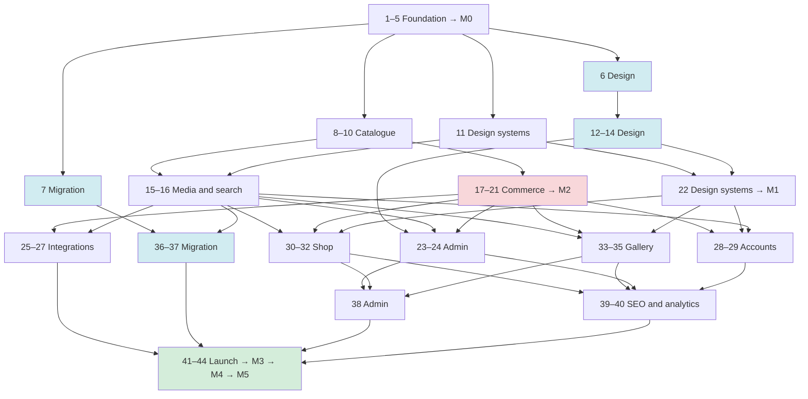

# Indies Platform — Build Plan and Progress

**Finish line:** two new sites on one engine, live on their own domains — **Old East Indies** on `oldeastindies.com` (phase 42), then **Indies Gallery** on `antiquemapsindonesia.com` (phase 43) — each through the launch gate (44.1).

- **New builds, not changes to what exists.** The current sites stay exactly as they are: this plan never logs in to, fixes, changes, freezes or switches them off. What the new sites take from them is a copy — an export the owner hands over or, only with the owner's OK, a read-only look at their public pages.
- **One engine, two storefront apps** (`engine/apps/gallery`, `engine/apps/emporium`), one database per brand. The reasoning lives in `docs/` — start with [docs/PLAN.md](docs/PLAN.md), [docs/PARALLEL-TRACKS.md](docs/PARALLEL-TRACKS.md) and [design.md](.claude/specs/indies-platform/design.md).
- **44 small phases, waves inside each.** A phase has at most eight tasks in at most three waves and ends in something you can open. A phase opens when the phases it needs are ✅; nothing inside it waits on anything outside it except an owner item (👤). There is no calendar across phases.
- **Many agents at once, inside a bound.** At most **three phases are open at once**; inside a phase each wave's tasks run in parallel, one agent each, in its own worktree, on paths nobody else in that wave owns.
- **Every task ends in a Check** — the evidence that it works — and the progress table counts ticked subtasks, so a phase only moves the bar as its steps are proven.

Written 2026-09-25 from the reviewed plan (a UX review and an architecture review, both applied); **replanned 2026-09-28** from 14 large phases, whose waves ran across each other, into 44 small ones (the id mapping is in the Log). Every task lists the requirements it satisfies ([requirements.md](.claude/specs/indies-platform/requirements.md), 161 criteria).

## Progress

Rebuilt from the checkboxes by `node scripts/progress.mjs` — run it after every tick; never edit the table by hand.

<!-- progress:start -->
| Phase | Stage | Needs | Status | Tasks | Subtasks | 👤 open | Progress |
| --- | --- | --- | --- | --- | --- | --- | --- |
| **1** Repository, contracts and agent workspace | Foundation | — | ✅ done | 3/3 | 24/24 | 0 | `██████████` 100% |
| **2** Local infrastructure, quality gates and CI | Foundation | 1 | 🔄 in progress | 2/4 | 16/22 | 0 | `███████░░░`  73% |
| **3** Config spine and Payload boot | Foundation | 2 | · not started | 0/2 | 0/11 | 0 | `░░░░░░░░░░`   0% |
| **4** App shells and the Cache Components spike | Foundation | 3 | · not started | 0/1 | 0/7 | 0 | `░░░░░░░░░░`   0% |
| **5** Staging and the foundation gate 👤 | Foundation | 4 | · not started | 0/2 | 0/10 | 1 | `░░░░░░░░░░`   0% |
| **6** Briefs, image direction and voice | Design | 4 | · not started | 0/3 | 0/12 | 3 | `░░░░░░░░░░`   0% |
| **7** The old catalogue export and the shop's URL discovery 👤 | Migration | 2 | · not started | 0/3 | 0/10 | 2 | `░░░░░░░░░░`   0% |
| **8** Makers, places, terms, works and media | Catalogue | 3 | · not started | 0/3 | 0/16 | 0 | `░░░░░░░░░░`   0% |
| **9** Products, merchandise, editorial and people | Catalogue | 8 | · not started | 0/4 | 0/22 | 0 | `░░░░░░░░░░`   0% |
| **10** Admin organisation, seeds and the catalogue gate | Catalogue | 9 | · not started | 0/4 | 0/19 | 0 | `░░░░░░░░░░`   0% |
| **11** Primitives, tokens, the loader interface and state fixtures | Design systems | 4 | · not started | 0/4 | 0/19 | 0 | `░░░░░░░░░░`   0% |
| **12** The shared base, each brand's accents and the sister system | Design | 6 | · not started | 0/3 | 0/12 | 1 | `░░░░░░░░░░`   0% |
| **13** The owner's pick and the buyer test 👤 | Design | 12 | · not started | 0/3 | 0/14 | 2 | `░░░░░░░░░░`   0% |
| **14** DESIGN.md, tokens and the design gate 👤 | Design | 13 | · not started | 0/2 | 0/11 | 2 | `░░░░░░░░░░`   0% |
| **15** Derivatives, IIIF tiles, manifests and masters | Media and search | 9 | · not started | 0/4 | 0/16 | 0 | `░░░░░░░░░░`   0% |
| **16** The viewer, the search index, facets and the media gate | Media and search | 11, 15 | · not started | 0/4 | 0/17 | 0 | `░░░░░░░░░░`   0% |
| **17** Commerce schema, money, sellers, pricing and tax | Commerce | 10 | · not started | 0/4 | 0/17 | 0 | `░░░░░░░░░░`   0% |
| **18** Reservations, state machines and the cart | Commerce | 17 | · not started | 0/3 | 0/15 | 0 | `░░░░░░░░░░`   0% |
| **19** Checkout, the payment pipeline and Midtrans 👤 | Commerce | 18 | · not started | 0/4 | 0/24 | 1 | `░░░░░░░░░░`   0% |
| **20** Shipping, discounts, notifications, documents, returns and the tax export | Commerce | 19 | · not started | 0/5 | 0/22 | 0 | `░░░░░░░░░░`   0% |
| **21** The commerce API and the money-safety gate 👤 | Commerce | 20 | · not started | 0/2 | 0/11 | 1 | `░░░░░░░░░░`   0% |
| **22** App foundations and surfaces from fixtures | Design systems | 11, 14 | · not started | 0/6 | 0/31 | 1 | `░░░░░░░░░░`   0% |
| **23** The admin shell and cataloguing 👤 | Admin | 10, 14, 15 | · not started | 0/6 | 0/27 | 2 | `░░░░░░░░░░`   0% |
| **24** Admin operations: merch wizard, orders, inbox, stock and manual orders | Admin | 20, 23 | · not started | 0/5 | 0/22 | 0 | `░░░░░░░░░░`   0% |
| **25** Payment adapters 👤 | Integrations | 19 | · not started | 0/3 | 0/13 | 2 | `░░░░░░░░░░`   0% |
| **26** Couriers and the fulfilment router 👤 | Integrations | 15, 20 | · not started | 0/3 | 0/12 | 2 | `░░░░░░░░░░`   0% |
| **27** Sister sync, WhatsApp and the integrations gate 👤 | Integrations | 25, 26 | · not started | 0/3 | 0/12 | 1 | `░░░░░░░░░░`   0% |
| **28** Accounts, consent and data-subject operations | Accounts | 17, 22 | · not started | 0/5 | 0/22 | 0 | `░░░░░░░░░░`   0% |
| **29** Alerts, newsletter, retention and the accounts gate | Accounts | 16, 20, 28 | · not started | 0/4 | 0/17 | 0 | `░░░░░░░░░░`   0% |
| **30** Shop: loaders, home and collections, the product page and the configurator | Shop | 16, 21, 22 | · not started | 0/4 | 0/18 | 0 | `░░░░░░░░░░`   0% |
| **31** Shop: stories, the bag and checkout, order tracking | Shop | 21, 22 | · not started | 0/3 | 0/14 | 0 | `░░░░░░░░░░`   0% |
| **32** Shop: polish, buyers and the shop gate 👤 | Shop | 30, 31 | · not started | 0/3 | 0/14 | 2 | `░░░░░░░░░░`   0% |
| **33** Gallery: loaders, browse, the item page and editorial | Gallery | 16, 21, 22 | · not started | 0/4 | 0/20 | 0 | `░░░░░░░░░░`   0% |
| **34** Gallery: the purchase panel, forms and checkout | Gallery | 33 | · not started | 0/3 | 0/13 | 0 | `░░░░░░░░░░`   0% |
| **35** Gallery: polish, buyers and the gallery gate 👤 | Gallery | 34 | · not started | 0/3 | 0/14 | 2 | `░░░░░░░░░░`   0% |
| **36** Mapping, the loader, the item register and redirects 👤 | Migration | 4, 7, 10, 15 | · not started | 0/4 | 0/14 | 3 | `░░░░░░░░░░`   0% |
| **37** Verification, the staging rehearsal and the migration gate 👤 | Migration | 5, 36 | · not started | 0/3 | 0/12 | 1 | `░░░░░░░░░░`   0% |
| **38** Editors, the timed tests and the admin gate 👤 | Admin | 24, 30, 33 | · not started | 0/3 | 0/14 | 2 | `░░░░░░░░░░`   0% |
| **39** Metadata, JSON-LD, sitemaps and feeds 👤 | SEO and analytics | 30, 33 | · not started | 0/4 | 0/16 | 1 | `░░░░░░░░░░`   0% |
| **40** Analytics, dashboards and the SEO gate | SEO and analytics | 23, 28, 39 | · not started | 0/4 | 0/15 | 0 | `░░░░░░░░░░`   0% |
| **41** Security hardening and production provisioning 👤 | Launch | 5, 21, 27 | · not started | 0/2 | 0/8 | 0 | `░░░░░░░░░░`   0% |
| **42** Old East Indies: readiness, the gallery's dark import and launch 👤 | Launch | 29, 32, 37, 38, 40, 41 | · not started | 0/8 | 0/22 | 7 | `░░░░░░░░░░`   0% |
| **43** Indies Gallery: readiness, the content sprint and cutover 👤 | Launch | 35, 42 | · not started | 0/8 | 0/22 | 6 | `░░░░░░░░░░`   0% |
| **44** The launch gate and the 30-day iteration 👤 | Launch | 43 | · not started | 0/2 | 0/9 | 1 | `░░░░░░░░░░`   0% |
| **All** | 44 phases | | | **5/160** | **40/712** | **46** | `█░░░░░░░░░`   6% |
<!-- progress:end -->

## Stages and milestones

A **stage** is a run of phases on one subject; its last phase ends in the stage's gate, which drives every phase's **Done when** in the stage end to end. The Design and Migration stages wait mostly on the owner (the photographer, the buyers, the export, the register), so they run beside the build line rather than in it.

| Stage | Phases | Gate | Closes |
| --- | --- | --- | --- |
| **Foundation** | 1–5 | 5.2 | **M0** (5) |
| **Design** | 6, 12, 13 and 14 | 14.2 | — |
| **Migration** | 7, 36 and 37 | 37.3 | — |
| **Catalogue** | 8–10 | 10.4 | — |
| **Design systems** | 11 and 22 | 22.6 | **M1** (22) |
| **Media and search** | 15 and 16 | 16.4 | — |
| **Commerce** | 17–21 | 21.2 | **M2** (21) |
| **Admin** | 23, 24 and 38 | 38.3 | — |
| **Integrations** | 25–27 | 27.3 | — |
| **Accounts** | 28 and 29 | 29.4 | — |
| **Shop** | 30–32 | 32.3 | — |
| **Gallery** | 33–35 | 35.3 | — |
| **SEO and analytics** | 39 and 40 | 40.4 | — |
| **Launch** | 41–44 | 44.2 | **M3** (42), **M4** (43), **M5** (44) |

| Milestone | What the owner can open | Phase |
| --- | --- | --- |
| **M0** | Both brand shells live on staging (`ig.gaiada.com`, `oei.gaiada.com`), admin logs in on both | 5 |
| **M1** | A direction picked per brand; both style guides on staging | 22 |
| **M2** | Catalogue, deep zoom, search and commerce core working on staging with sandbox payments | 21 |
| **M3** | **Old East Indies live** on `oldeastindies.com`, with the gallery's archive imported dark behind it | 42 |
| **M4** | **Indies Gallery cut over** on `antiquemapsindonesia.com` | 43 |
| **M5** | The 30-day design iteration done; v2 underway | 44 |

## Running order

A phase opens when every phase in its **Needs** column is ✅, lowest number first, with **at most three open at once** — usually one build phase and one from Design or Migration. Inside a phase, wave W1 runs, merges and passes its gate before W2 is dispatched. Sizes are agent-days of work, not calendar time.

| Phase | Stage | Needs | Waves | Tasks | Size | Closes |
| --- | --- | --- | --- | --- | --- | --- |
| **1** Repository, contracts and agent workspace | Foundation | — | 2 | 3 | ~1.5d |  |
| **2** Local infrastructure, quality gates and CI | Foundation | 1 | 2 | 3 | ~1.5d |  |
| **3** Config spine and Payload boot | Foundation | 2 | 2 | 2 | ~1d |  |
| **4** App shells and the Cache Components spike | Foundation | 3 | 1 | 1 | ~0.5d |  |
| **5** Staging and the foundation gate 👤 | Foundation | 4 | 2 | 2 | ~0.5d | **M0** |
| **6** Briefs, image direction and voice | Design | 4 | 1 | 3 | ~3d |  |
| **7** The old catalogue export and the shop's URL discovery 👤 | Migration | 2 | 2 | 3 | ~2d |  |
| **8** Makers, places, terms, works and media | Catalogue | 3 | 2 | 3 | ~2d |  |
| **9** Products, merchandise, editorial and people | Catalogue | 8 | 2 | 4 | ~3d |  |
| **10** Admin organisation, seeds and the catalogue gate | Catalogue | 9 | 2 | 4 | ~2.5d |  |
| **11** Primitives, tokens, the loader interface and state fixtures | Design systems | 4 | 2 | 4 | ~3d |  |
| **12** Direction rounds and the sister system | Design | 6 | 2 | 3 | ~2.5d |  |
| **13** The owner's pick and the buyer test 👤 | Design | 12 | 2 | 3 | ~3d |  |
| **14** DESIGN.md, tokens and the design gate 👤 | Design | 13 | 2 | 2 | ~2.5d |  |
| **15** Derivatives, IIIF tiles, manifests and masters | Media and search | 9 | 3 | 4 | ~3.5d |  |
| **16** The viewer, the search index, facets and the media gate | Media and search | 11, 15 | 3 | 4 | ~3.5d |  |
| **17** Commerce schema, money, sellers, pricing and tax | Commerce | 10 | 3 | 4 | ~2.5d |  |
| **18** Reservations, state machines and the cart | Commerce | 17 | 1 | 3 | ~2d |  |
| **19** Checkout, the payment pipeline and Midtrans 👤 | Commerce | 18 | 3 | 4 | ~3d |  |
| **20** Shipping, discounts, notifications, documents, returns and the tax export | Commerce | 19 | 1 | 5 | ~3d |  |
| **21** The commerce API and the money-safety gate 👤 | Commerce | 20 | 2 | 2 | ~1.5d | **M2** |
| **22** App foundations and surfaces from fixtures | Design systems | 11, 14 | 3 | 6 | ~5d | **M1** |
| **23** The admin shell and cataloguing 👤 | Admin | 10, 14, 15 | 3 | 6 | ~4.5d |  |
| **24** Admin operations: merch wizard, orders, inbox, stock and manual orders | Admin | 20, 23 | 1 | 5 | ~3.5d |  |
| **25** Payment adapters 👤 | Integrations | 19 | 1 | 3 | ~3.5d |  |
| **26** Couriers and the fulfilment router 👤 | Integrations | 15, 20 | 1 | 3 | ~3d |  |
| **27** Sister sync, WhatsApp and the integrations gate 👤 | Integrations | 25, 26 | 2 | 3 | ~3d |  |
| **28** Accounts, consent and data-subject operations | Accounts | 17, 22 | 2 | 4 | ~3d |  |
| **29** Alerts, newsletter, retention and the accounts gate | Accounts | 16, 20, 28 | 2 | 4 | ~3d |  |
| **30** Shop: loaders, home and collections, the product page and the configurator | Shop | 16, 21, 22 | 1 | 4 | ~4.5d |  |
| **31** Shop: stories, the bag and checkout, order tracking | Shop | 21, 22 | 2 | 3 | ~3.5d |  |
| **32** Shop: polish, buyers and the shop gate 👤 | Shop | 30, 31 | 3 | 3 | ~3.5d |  |
| **33** Gallery: loaders, browse, the item page and editorial | Gallery | 16, 21, 22 | 1 | 4 | ~5d |  |
| **34** Gallery: the purchase panel, forms and checkout | Gallery | 33 | 1 | 3 | ~3.5d |  |
| **35** Gallery: polish, buyers and the gallery gate 👤 | Gallery | 34 | 3 | 3 | ~3.5d |  |
| **36** Mapping, the loader, the item register and redirects 👤 | Migration | 4, 7, 10, 15 | 2 | 4 | ~2.5d |  |
| **37** Verification, the staging rehearsal and the migration gate 👤 | Migration | 5, 36 | 3 | 3 | ~2d |  |
| **38** Editors, the timed tests and the admin gate 👤 | Admin | 24, 30, 33 | 3 | 3 | ~2d |  |
| **39** Metadata, JSON-LD, sitemaps and feeds 👤 | SEO and analytics | 30, 33 | 2 | 4 | ~2.5d |  |
| **40** Analytics, dashboards and the SEO gate | SEO and analytics | 23, 28, 39 | 3 | 4 | ~2.5d |  |
| **41** Security hardening and production provisioning 👤 | Launch | 5, 21, 27 | 1 | 2 | ~1.5d |  |
| **42** Old East Indies: readiness, the gallery's dark import and launch 👤 | Launch | 29, 32, 37, 38, 40, 41 | 2 | 8 | ~4d | **M3** |
| **43** Indies Gallery: readiness, the content sprint and cutover 👤 | Launch | 35, 42 | 2 | 8 | ~4d | **M4** |
| **44** The launch gate and the 30-day iteration 👤 | Launch | 43 | 2 | 2 | ~1.5d | **M5** |

**Start the owner's long-lead items on day one**, whatever phase is open: booking the
photographer (6.2.b), the export of the old catalogue (7.1.a), the item register (36.3.a,
D24), counsel's legal texts and breach contacts (42.3.b), the gateway and courier
merchant accounts (D1–D5), and the buyers for the tests (D21). None of them needs
engineering, and each one blocks a phase if it arrives late.

## Now

One row per agent in flight. The orchestrator adds a row when it dispatches a task and removes it when the task closes. A wave is written `<phase>·W<k>` — `17·W2` is the second wave of phase 17.

| Wave | Task | Agent | Worktree / branch | Since | Note |
| ---- | ---- | ----- | ----------------- | ----- | ---- |

## Decisions for the owner

**How a session asks:** with `AskUserQuestion`, 2–4 options, **the recommended one first, labelled "(Recommended)"**, and one line on what each option means. The answer is recorded under **Answered** with the date, and in the doc the decision changes. Until the owner answers, the default is used, so work never waits.

### Open

| # | Decision | Default until answered | Who answers | Needed by |
| --- | --- | --- | --- | --- |
| **D1** | Selling entities: is Indies Gallery a Singapore company, an Indonesian PT, or both? Where is its stock physically? | one Singapore seller for Singapore stock and export + one Indonesian seller for Jakarta stock sold domestically (COMPLIANCE.md §2) | legal/tax adviser | 17.3 (draft values until then); real values before 42.8 |
| **D2** | Old East Indies' entity; a Singapore seller for export later? | Indonesian PT only at launch; export charged in IDR by card, or PayPal in USD | owner + adviser | 19.3, 42.8 |
| **D3** | Gateways | IG: Stripe SG + bank transfer; OEI: Midtrans + PayPal | merchant accounts + sandbox keys | 19.3, 25.1, 25.2, 25.3 |
| **D4** | PKP / GST registration status of each seller | PPN not charged by OEI until registration is confirmed; IG GST off | accountant | 17.4, 42.3, 43.3 |
| **D5** | Export clearance for items held in Jakarta | every Jakarta item `domestic-only` until a written determination exists | lawyer / customs broker | 17.3 |
| **D6** | **Hofker rights** for the Bali Hotel line | line built but **not published** until confirmed | estate / licence | 12.2 (no direction may depend on it), 42.8 (publish the line or not) |
| **D7** | Launch order | Old East Indies first | owner | 42.8 |
| **D8** | Gallery domain | keep `antiquemapsindonesia.com` canonical; `indiesgallery.com` stays a 301 alias; a brand move is a later, separate release | owner | 43.8 |
| **D9** | The design: which shared base and which accents per brand (the Design stage) | **no default** — the shape is answered (one shared base, distinct accents; see Answered); the owner still picks the base candidate and the accents in 13.1, with their draft as the lead candidate | owner | 13.1 |
| **D10** | Grading scale wording | VG+ · VG · G+ · G · Fair · As-is with A–D equivalents | curator | 8.2, 34.2 |
| **D11** | Returns policy text per seller | none published until drafted — the engine supports returns on every line | counsel | 20.4, 42.3, 43.3 |
| **D12** | Object storage provider | Cloudflare R2 | owner (account) | 5.1 |
| **D13** | Transactional email for each brand's domain | the brand's Google Workspace SMTP with SPF/DKIM/DMARC; a transactional provider if it has none | owner (DNS) | 5.1, 20.3 |
| **D14** | WhatsApp notifications provider — **needed before phase 27 opens**, because viewing reminders, payment instructions and order updates are promised on WhatsApp | if unanswered by then: click-to-chat only, every notification goes by email, and no copy promises a WhatsApp message | owner | 27.2 — before phase 27 opens |
| **D15** | Legacy passwords | no import; "claim your account" email (bcrypt rehash-on-login is a one-day option) | owner | 28.1, 36.3 |
| **D16** | AI cataloguing model provider | a production model behind the `ai.cataloguing` flag, human-verified; Ollama Cloud for development only (not a production dependency) | owner | 23.5 |
| **D17** | Staging tier after launch | staging stays on Helios `.gaiada.com`; Delphi `staging` branch only if wanted | owner | 44.2 |
| **D18** | Default locale per brand (served unprefixed) | English for both; Indonesian at `/id/…` | owner | 3.1 |
| **D19** | Photographer and the pilot shoot (the Design stage) | **no default** — the Design stage cannot finish its comps on today's single web JPEGs | owner (booking, budget) | 6.2 |
| **D20** | Native Indonesian copywriter | **no default** — the lexicon and the launch copy review need one | owner | 6.3 |
| **D21** | Buyers for the prototype test and usability runs (≈ 10 + 10 people) | collectors from the gallery's client list; shoppers recruited through the shop's Instagram | owner (introductions) | 13.2, 35.2, 32.2 |
| **D22** | Offers at launch | **non-binding offers** in v1: accept / counter / decline in the admin; an accepted offer becomes a hold and a private pay link. Binding offers (a contract on acceptance) are v2 | owner | 19.1 |
| **D23** | Print-on-demand abroad at launch | **not at launch** — export orders ship from Bali stock or local production, DAP; Prodigi / Gelato switch on in v2 behind the existing router | owner | 26.3 |
| **D24** | The item register — who compiles location and export status for every original, and by when | the gallery's staff, by the staging rehearsal (37.2); an original without a row publishes **enquiry-only** and sells nowhere online | owner (staff time) | 36.3 |
| **D25** | Dark production import of the gallery before the shop launches | yes, whenever the shop launches first — its sister links and original prices come from the gallery's archive API | owner (Helios go-ahead) | 42.7 |
| **D26** | Minimum print resolution for reproductions | **240 ppi** (≈ 37 cm long edge from today's 3543 px images); a product type may demand more | owner + print partner | 9.2, 15.4 |
| **D27** | FX source for derived prices | ECB reference rates, refreshed daily, plus the per-market buffer; each order stores the rate it used | accountant | 17.2 |
| **D28** | Newsletter sender | a bulk-sending provider for the newsletter and alerts (Workspace SMTP caps daily sends and would put transactional mail at risk); transactional mail stays per D13 | owner (account) | 29.2 |
| **D32** | What a retail partner gets at launch | an application approved by staff; a trade price tier and a minimum order as data; orders placed as quotes through the order builder (24.5) and paid by bank transfer or pay link; no self-serve wholesale cart until the trade portal (v2.7) | owner | 28.5 |
| **D29** | The Singapore seller selling Singapore-held stock to an Indonesian address | priced and charged in **IDR** (the rupiah rule governs what the buyer sees), card or bank transfer, import duties the buyer's (DAP) | tax adviser | 17.3, 25.1 |

### Owner actions (not questions)

| # | Action | Needed by |
| --- | --- | --- |
| **OA1** | ✅ 2026-09-28 — `gaiadabali/antique-map` (private, internal), deploy account `web-gaiada` (admin); `main` pushed | 1.1.f |
| **OA2** | The owner interview — at most 15 questions per brand | 6.1.b |
| **OA3** | Book a photographer and the pilot shoot (D19) | 6.2.b |
| **OA4** | A native Indonesian copywriter for the lexicon and the launch copy (D20) | 6.3.c, 42.6, 43.6 |
| **OA5** | Two or three Indonesian designers or buyers for the shop's cultural review | 12.2.a |
| **OA6** | Buyers for the prototype test and the usability runs — about 10 + 10 people (D21) | 13.2, 35.2, 32.2 |
| **OA7** | A commercial font licence, if a commercial face is chosen | 14.1.f |
| **OA8** | Go-ahead to provision staging on Helios; DNS for `ig.gaiada.com` and `oei.gaiada.com`; the object-storage account; Infisical entries | 5.1.b |
| **OA9** | **The export of the old catalogue** — a MySQL dump and the product-images folder, from whoever hosts the old site. We never log in to it. | 7.1.a |
| **OA10** | **The item register** — stock location and export status for every original (D24) | 36.3 |
| **OA11** | A Search Console export for `oldeastindies.com` | 7.3.a |
| **OA12** | The curator's review of the maker clusters and the category → facet mapping (about an hour) | 36.1 |
| **OA13** | Two observation sessions (a cataloguer, the shop manager), and the same people for the timed tests | 23.1.a, 38.2 |
| **OA14** | Sandbox accounts: Midtrans, Stripe Singapore, PayPal, Biteship, DHL Express (D3) | 19.3, 25.1, 25.2, 26.1, 26.2 |
| **OA15** | A WhatsApp Business account and provider (D14) | 27.2 |
| **OA16** | Merchant Center and Meta Commerce Manager access for each brand | 39.4 |
| **OA17** | Counsel's bilingual legal pages per seller; breach-response contacts; the data-protection-officer decision | 42.3.b |
| **OA18** | Go-aheads on Helios for the staging import, the gallery's dark production import and production provisioning | 37.2, 42.7, 41.2 |
| **OA19** | At launch: live payment and courier credentials; pointing `oldeastindies.com`, then `antiquemapsindonesia.com` and `indiesgallery.com`, at the new sites | 42.8, 43.8 |

### Answered

| # | Answer | Date |
| --- | --- | --- |
| **D39** | **The shop's want list is an email alert, no account:** a shopper saves a search with an email (double opt-in); alerts arrive by email with an unsubscribe link. Needs an additive contract change (C6 subscribe intent, C2 VM, C1 module variant) — a minor version per CONTRACTS.md, landed with the want-list task. | 2026-09-29 |
| **D40** | **"Forgot password" resends the approval link to an approved partner who has not set a password yet;** applicants never get a link, and a first password only comes from an approval link. | 2026-09-29 |
| **D37** | **Only the owner role moves a partner to another trade tier** (`change-tier`, audited), as D33 for the tiers themselves; approval assigning the default tier needs no such right. | 2026-09-29 |
| **D38** | **Consent rule for all tracking stays as ANALYTICS.md §1:** the first-party cookieless beacon counts events (no personal data, no cross-site ids) before consent; GA4 and Meta fire only after consent. D35's wishlist events follow it. | 2026-09-29 |
| **D33** | **Trade tiers** default from the brand config; only an **owner-role** CMS user may override them, every change audited; editors never can. | 2026-09-28 |
| **D34** | **An ended partnership deactivates the retailer's account** — it can no longer sign in; its orders and history stay with the owner (the products are the owner's; partners help sell them). No former-partner area. | 2026-09-28 |
| **D35** | **The shop's wishlist lives on the guest's device** (no account), and every wishlist action is tracked for marketing — within the consent rules of ANALYTICS.md §1 (see D38). | 2026-09-28 |
| **D36** | **One Partnership programme for every business buyer** — retail shops, hotels, villas, cafés and companies alike apply as partners; there is no separate "For Business" path or header item on the shop. | 2026-09-28 |
| **D30** | **The gallery keeps online sales** (reserve, checkout, offers and pay links as planned). The design project note of 11 Sept 2026 recorded "no transactions, enquiry by email form only"; the owner confirmed that note is superseded. | 2026-09-28 |
| **D31** | **Old East Indies: shoppers buy as guests; accounts are for retailers only**, through a Partnership page (a highlight in the home hero and a **Partnership** header item; sign-up or sign-in at the page's last section). The client's decision of 11 Sept 2026, confirmed. Changes 28.1, 28.2, 29.3; adds 28.5 and 1.2.l. | 2026-09-28 |
| **D9 (shape)** | **One shared base, distinct accents:** both sites share layout, components, buttons and type — **Cormorant Garamond + Karla**, which the client asked to keep — and differ in palette and signature details (C3's overridable subset). References: Etalage and Everart, mixed, not copied. The owner's draft (`docs/design/input/claude-design-2026-09/`) is the lead candidate, draft input only. Phases 12–14 reworded. | 2026-09-28 |

## How to update this file — the rule

This file is how the owner sees progress without asking. **It is updated as work happens, not afterwards.**

1. **Opening a phase:** only when every phase its heading **needs** is ✅ and fewer than three phases are open. Check its 👤 items are in hand first; a task that would stall waits in the phase rather than holding an agent.
2. **Dispatching a task:** append `— 🔄 17·W2` (its phase and wave) to the task line and add its row to **Now**. A wave is dispatched only when every earlier wave of its phase is merged.
3. **Finishing a subtask:** when an agent's report evidences it, tick it `[x]` **in this file in the main checkout** — never in a worktree's copy — and run `node scripts/progress.mjs`. Re-read the file just before each edit.
4. **Finishing a task:** only when every subtask is ticked, its **Check** passed on merged `main` and `qa` has driven it. Tick the task line, replace `🔄 …` with `✅ YYYY-MM-DD <short sha>`, add one line to the top of **Log**, update **Now**.
5. **Closing a phase:** when every task in it is ✅, `qa` opens the phase's **Done when** on merged `main` (a production build, a phone viewport) and the orchestrator logs `✅ phase N — <evidence>`. The stage gate later drives every phase of its stage again, together.
6. **Blocked:** append `— ⛔ <reason>` (an owner item: `— ⛔ 👤 D14`), note it in **Now**, and move on to the next unblocked task or phase.
7. **New work:** add it as a subtask, or as a new task at the end of its phase, with the next free id. A phase that would pass eight tasks or three waves gets a **new phase** instead, numbered after the last one and placed by its needs. **Never delete a task** — a dropped one gets `— ✂️ cut: <reason>` and stops counting.
8. **Size a task before dispatch:** one agent, about a day, at most six subtasks plus its Check. A larger one is split first — the contract freeze (1.2: two architects, fourteen commits, two review rounds) is the example not to repeat.
9. **Agents never edit this file.** They report (PARALLEL-TRACKS.md §5); the orchestrator ticks. A solo session outside a wave may tick its own task.

**What "done" means here:** the **Check** is evidenced — a test name, a command output, or a screenshot of the opened screen on a production build (CONVENTIONS.md §11). A UI is shown at 390 px and 1280 px with axe clean (360/390/768/1440 in a design gate). A library passing its own tests is not done.

## Session protocol — the orchestrator

Paste this into a Claude Code session opened at the repo root:

> You are the orchestrator for the Indies Platform. Read `AGENTS.md`, then `TASKS.md` and `.claude/specs/indies-platform/DISPATCH.md`.
>
> 1. List the open phases (needs ✅, not every task ✅). If fewer than three are open, open the next phase whose needs are ✅, lowest number first, and check its 👤 items are in hand.
> 2. In each open phase, take its first wave that is not all ✅. Once the tasks-lint gate has landed (2.2), run `pnpm tasks:lint --phase <n> --wave <k>` and fix the plan if it is red.
> 3. Dispatch one agent per task in that wave with the DISPATCH.md prompt — `model: "opus"`, `isolation: "worktree"` — mark each task 🔄 here, with a row in **Now**.
> 4. As reports arrive, tick the evidenced subtasks here and run `node scripts/progress.mjs`.
> 5. Merge each branch in a clean worktree, run the full gate, have `qa` drive the user-visible criteria, then close the tasks (✅ date sha), update **Now** and add to **Log**. When a phase's last task closes, have `qa` open its **Done when** and log the phase.
> 6. Ask the owner for 👤 items with options and a recommendation; record the answers under **Decisions**.
> 7. Never touch the current live sites, and never write to Helios, DNS or production credentials without the owner's go-ahead.

Each agent's prompt, and the before- and after-wave checklists, are in [DISPATCH.md](.claude/specs/indies-platform/DISPATCH.md).

## Legend

👤 needs the owner (an agent cannot finish it — PARALLEL-TRACKS.md §7) · 🔄 in flight · ✅ done · ⛔ blocked · ✂️ cut · **Lane** codes and file ownership are [PARALLEL-TRACKS.md §1](docs/PARALLEL-TRACKS.md) · agent types are the project's subagents (`architect`, `devops`, `senior-be`, `senior-db`, `senior-fe`, `senior-uiux`, `senior-integrator`, `medior`, `junior`, `qa`).

**Ids, phases and waves.** A task is `N.M` — task M of phase N; its subtasks are `N.M.a`, `N.M.b`… and the last one is always the **Check**. A phase heading reads `Phase N — title · stage · needs … · ~size`. A wave is local to its phase — **W1, W2, W3** — and written `N·Wk` outside it; a task never shares a wave with a task it depends on. `needs:` lists tasks (`17.1`), subtasks (`1.2.f`, that one only) or whole phases (`phase 10`, gate included). Contract files (`@contract`, C1–C13) stay ARC's even inside a folder a task owns.

---

## Phase 1 — Repository, contracts and agent workspace · Foundation · needs — · ~1.5d

**Goal:** the workspace and its verify gate, the frozen contracts C1–C13 every lane builds against, and the worktree helper agents work in.
**Done when:** a fresh clone runs `pnpm install && pnpm verify` green; every contract compiles, is marked `@contract` with an owner and is signed off by its reviewers; `pnpm worktree` gives an agent its own branch, port and database suffix.
**Waves:** W1 — 1.1, 1.2 · W2 — 1.3

- [x] **1.1 Initialise the repository and pnpm workspace** · needs: — — ✅ 2026-09-28 f7e32c1
  - **Lane** HAR · **Agent** devops · **Wave** W1
  - **Owns** root `package.json`, `pnpm-workspace.yaml`, `tsconfig.base.json`, `eslint.config.mjs`, `.prettierrc.json`, `.gitignore`, `.gitattributes`, `.editorconfig`
  - **Read** ARCHITECTURE.md §3–4, CONVENTIONS.md §9
  - _Requirements: 1.2, 19.3_
  - [x] 1.1.a `git init`; `.gitignore` (node_modules, `.next`, `.env*` except `.env.example`, `*/db/`, `*/content/legacy/raw/**` — the old site's raw extracts live in `LEGACY_DATA_DIR`, never in git, while mapping files and URL inventories under `content/legacy/` **are** committed — `test-results/`, `TASKS.md.lock`); `.gitattributes` forcing LF (CRLF breaks deploy scripts — GDA memory); the first commit holds the planning docs, `TASKS.md` and `scripts/progress.mjs` as they stand
  - [x] 1.1.b `pnpm-workspace.yaml` listing `engine/apps/*`, `engine/packages/*`, `engine/tooling`; `allowBuilds` for sharp, esbuild, @tailwindcss/oxide, unrs-resolver
  - [x] 1.1.c root `package.json`: `packageManager` pnpm 11 pinned, `engines.node >=22`, scripts `verify`, `dev`, `build`, `test`, `test:e2e`, `lhci`, `db:*`, `brand:create` (delegating to tooling)
  - [x] 1.1.d `tsconfig.base.json` (strict, `noUncheckedIndexedAccess`, `@engine/*` paths) and a per-package tsconfig template
  - [x] 1.1.e ESLint 9 flat config + typescript-eslint + Prettier; import-boundary rules: apps may not import `payload` outside `(payload)`, packages may not import apps, `view-models` has no runtime dependencies
  - [x] 1.1.f 👤 owner creates the GitHub repository under the organisation and grants the deploy account write access; first push
  - [x] 1.1.g **Check:** a fresh clone on Windows and Linux runs `pnpm install && pnpm verify` green with the empty workspace.

- [x] **1.2 Freeze the contracts C1–C13** · needs: — — ✅ 2026-09-29 e16d73b
  - **Lane** ARC · **Agent** architect ×2, types and docs only — **ARC-P** (platform and UI: 1.2.a–1.2.d, 1.2.h, 1.2.i) and **ARC-D** (domain: 1.2.e–1.2.g, 1.2.j); ARC-P writes 1.2.k · **Wave** W1
  - **Owns** ARC-P: `engine/packages/config/src/{schema,routes}.ts`, `engine/packages/view-models/**`, `engine/packages/ui/src/tokens/contract.ts`, `engine/packages/media/src/contract.ts`, `engine/packages/http/src/manifest.ts`, `engine/packages/CONTRACTS.md` · ARC-D: `engine/packages/domain/src/{money/contract.ts,contracts/**,*/machine.ts,reservations/contract.ts}`, `engine/packages/{payments,shipping,fulfilment,analytics,sister}/src/contract.ts` · each: `engine/packages/<pkg>/{package.json,tsconfig.json}` skeletons (the tsconfig extending the 1.1 template) of the packages it touches
  - **Read** PARALLEL-TRACKS.md §4, BRANDS.md, CONTENT-MODEL.md, COMMERCE.md, PAYMENTS.md §2–4, ARCHITECTURE.md §6, §9, §11, DESIGN-SYSTEM.md §2–5
  - _Requirements: 1.2, 2.7, 3.1, 8.4, 9.1, 10.4, 11.1_
  - [x] 1.2.a C1 `BrandConfig` zod schema: identity, domains, storefront, tokens, locales, routes, ids, money/markets and rounding, sellers (serves, tax, charge currencies, payments, method order, card ceiling, insured threshold, document prefix), commerce (inventory models, named TTLs, purchase tiers), shipping, fulfilment, analytics ids (runtime), modules (a typed registry with descriptions — `hasModule()` keys), sisters
  - [x] 1.2.b C2 view models for every surface in DESIGN-SYSTEM.md §2 + `ShellVM` (with the runtime analytics ids and brand assets); typed fixtures (`item-unique`, `item-sold-with-alternative`, `item-on-hold`, `item-price-on-request`, `item-enquiry-only`, `item-variants`, `listing`, `design`, `cart`, `checkout-id`, `checkout-export`, …); `loadItem` returns `{ vm } | { redirectTo } | null`
  - [x] 1.2.c C3 token contract (DESIGN-SYSTEM.md §4) + the overridable subset
  - [x] 1.2.d C4 block union (15 blocks, DESIGN-SYSTEM.md §5 — incl. `zoomFigure`, `compare`, `shoppableImage`, and note marks in `prose`) with prop shapes; C2 also carries the viewer-relative `ItemVM.purchase` states, the `book` part, and the `Pay`, `Quote`, `OrderLookup`, `Source`, `Exhibition`, `Location`, `Ig`, `GiftCard` and `NewsletterArchive` view models
  - [x] 1.2.e C5 `Money` (safe-integer minor units), `PriceSet`, the pricing-pipeline step signature and the named rounding points; C6 commerce API request/response shapes (cart, ship-to, checkout, offer, hold, enquiry, price request, consignment, appointment, return request, order lookup, quote)
  - [x] 1.2.f C7 `PaymentGateway` (incl. `sessionTtl`, `capture?`, `cancel?`, `retrieve()` and the `providerEventId` rule per adapter), `ShippingProvider`, `FulfilmentProvider`, normalised events (PAYMENTS.md §2–4)
  - [x] 1.2.g C8 state-machine tables as types — order, payment, reservation, availability (derived), offer — the domain-event names they emit, and the service signatures `reserve()` (`reserve` · `extend` · `release` · `convert` · `reverse`) and `applyPaymentEvent()`
  - [x] 1.2.h C9 media artefacts (derivative names and sizes, public 512 px tile cap, private full-resolution prefix, `print-files/` prefix, master access)
  - [x] 1.2.i C10 route map — per-locale segments, facet vocabularies, legacy prefixes, `href(surface, params, locale)`; C13 HTTP handler manifest — every `/api/x/*` route and the literal proxy `matcher`
  - [x] 1.2.j C11 analytics event names (ANALYTICS.md §2); C12 sister work snapshot (published fields only) + webhook events
  - [x] 1.2.k `engine/packages/CONTRACTS.md`: how a contract changes (versioned, announced to consuming lanes, ARC approval)
  - [x] 1.2.l The shop's Partnership surface and retailer accounts (D31, 2026-09-28): a `partnership` route in C10, `PartnershipVM` and the retailer account VM in C2, the retailer application intent in C6, and `retailer` pricing as a tier C5/C6 can carry — routed to ARC-P and ARC-D before phase 1 closes
  - [x] 1.2.m **Check:** every contract compiles, is marked `@contract` with an owner, every fixture type-checks against its view model, and a senior-be and a senior-fe reviewer have signed off in the report.

- [x] **1.3 Agent workspace** · needs: 1.1 — ✅ 2026-09-28 6b30621
  - **Lane** HAR · **Agent** junior · **Wave** W2
  - **Owns** `engine/tooling/worktree/**`, `.claude/skills/**`, `.claude/agents/impeccable-*`
  - **Read** PARALLEL-TRACKS.md §3
  - _Requirements: 19.7_
  - [x] 1.3.a worktree helper script (`worktree` and `worktree:env`)
  - [x] 1.3.b copy the impeccable skill and its agents from Kingdom of Indonesia into `.claude/` (the design workflow the Design stage uses)
  - [x] 1.3.d `.claude/**` ignored by ESLint (as by Prettier); the skill's engine binary gitignored (the launcher downloads and verifies it); the five browser scripts committed unchanged
  - [x] 1.3.c **Check:** `pnpm worktree <phase> <lane>` creates a worktree + branch + `.env.local` with a unique `PORT` and database suffix, `pnpm worktree:env <phase> <lane>` does the `.env.local` part inside a worktree that already exists (agents dispatched with `isolation: "worktree"`), and an agent in either can `db:fresh` and `dev` without touching another worktree. — worktree, branch, unique `PORT`/`DB_SUFFIX` (`p<phase>_<lane>`) and `worktree:env` proven (10 Vitest tests, throwaway-repo runs); the `db:fresh`/`dev` clause moved to 2.1.b/2.1.d, which build those commands

---

## Phase 2 — Local infrastructure, quality gates and CI · Foundation · needs 1 · ~1.5d

**Goal:** Postgres, mail and object storage on a laptop; every quality gate; CI and the release artifact.
**Done when:** `pnpm db:fresh` creates a brand database with `unaccent` and `pg_trgm`; every gate fails on a planted violation and passes once it is removed; a push to `main` runs CI green and a push to `production` publishes a release tarball with both standalone builds.
**Waves:** W1 — 2.1, 2.2, 2.4 · W2 — 2.3

- [x] **2.1 Local infrastructure and database scripts** · needs: 1.1 — ✅ 2026-09-29 463bd91
  - **Lane** HAR · **Agent** devops · **Wave** W1
  - **Owns** `docker-compose.dev.yml`, `.env.example`, `engine/tooling/db/**`
  - **Read** DEPLOYMENT.md §1, §8
  - _Requirements: 1.1, 19.7_
  - [x] 2.1.a compose: `postgres:18` with an init script enabling `unaccent`, `pg_trgm`; Mailpit; MinIO with bootstrap buckets `ig-media`, `oei-media`, `test-media`, `archive-masters`
  - [x] 2.1.b `db:fresh --brand <slug> [--suffix <lane>]` (`--suffix` and the port default to `DB_SUFFIX`/`PORT` in `.env.local`, written by 1.3's `pnpm worktree:env`; add both to `.env.example`), `db:drop`, `db:list` (create, migrate, seed — seed hook no-op until 10.2)
  - [x] 2.1.c `.env.example` documenting every variable in DEPLOYMENT.md §8, grouped, with safe local defaults
  - [x] 2.1.d **Check:** `docker compose -f docker-compose.dev.yml up -d` then `pnpm db:fresh --brand test --suffix smoke` creates a database with `unaccent` and `pg_trgm` on Windows (Docker Desktop) and in CI; and two worktrees made by `pnpm worktree` each run `db:fresh` against their own suffix without touching the other (1.3.c's deferred clause). — Docker Desktop: `test_smoke` has `unaccent` 1.1 and `pg_trgm` 1.6 (template1 carries both); two `pnpm worktree` checkouts made `test_p2_zza` and `test_p2_zzb`, and a table in one was absent from the other; the CI clause moved to 2.3.d, which builds CI

- [x] **2.2 Quality-gate tooling** · needs: 1.1 — ✅ 2026-09-29 13a56d8
  - **Lane** HAR · **Agent** devops · **Wave** W1
  - **Owns** `engine/tooling/{check-file-size,lint-brand-literals,schema-hash,route-parity,tasks-lint,config-drift,brand-create}/**`, `vitest.config.ts` (Vitest 5 has no workspace file — `test.projects`; found in 1.1), `playwright.config.ts`, `lighthouserc*.json`, root `package.json` (scripts and devDependencies for its gates only; the only task in its wave touching it)
  - **Read** CONVENTIONS.md §1–2, BRANDS.md §6–7, ARCHITECTURE.md §2, §11, DESIGN-SYSTEM.md §7, PARALLEL-TRACKS.md §2, §5
  - _Requirements: 1.3, 1.5, 1.6, 1.7, 1.8, 19.1, 19.3_
  - [x] 2.2.a `check-file-size` (port KOI's `scripts/check-file-size.mjs`; 300 lines over `*.ts`, `*.tsx`, `*.js`, `*.mjs`, `*.css` in `engine/` and `scripts/`; generated files, migrations and fixtures excluded — CONVENTIONS.md §2)
  - [x] 2.2.b `lint-brand-literals`: banned terms read from each brand folder's config (slug, names, domains); scans `engine/**`; excludes generated migrations, fixtures with catalogue text, `.env*`
  - [x] 2.2.c `schema-hash`: normalised `pg_dump --schema-only` → sha256 per database; `--all` compares every brand database
  - [x] 2.2.d `route-parity`: reads the `@engine/http` manifest (C13) and fails if an app lacks a mounted `/api/x/*` route, if an engine route's first segment equals a collection slug, `payload-jobs` or `graphql`, or if an app's `proxy.ts` matcher differs from the manifest's literal
  - [x] 2.2.e Vitest workspace; Playwright projects `{ig, oei, test-gallery, test-emporium} × {desktop, mobile}` with axe; LHCI configs per app with the DESIGN-SYSTEM.md §7 budgets
  - [x] 2.2.f `tasks-lint`: parses the root `TASKS.md` — unique ids, every `needs:` resolvable (a task, a subtask, a range or "phase N"), every phase heading's needs earlier-numbered and equal to what its tasks need from outside it, no task sharing a wave with its own dependency, no two tasks in one wave with overlapping **Owns**, at most eight tasks and three waves per phase, every task ending in a **Check** subtask, every requirement covered; `--phase <n> --wave <k>` checks one wave against the ticked boxes, including that the phase's needs are ✅
  - [x] 2.2.g `config-drift` (`pnpm check:generated`): regenerates the migration snapshot, `payload-types.ts` and both apps' `importMap.js` **with `BRAND` unset** and once per brand, and fails on any diff (ARCHITECTURE.md §2)
  - [x] 2.2.h `brand:create <slug> --storefront gallery|emporium`: scaffolds `<slug>/site/` from the matching `test` config with `"draft": true`, database and bucket names, and a copy folder; the result passes `validateBrandConfigs()` (Req 1.7)
  - [x] 2.2.j move the contract smoke tests from `.claude/specs/indies-platform/reviews/smoke-tests/` (C1 config, the C10 round trip, the C13 addresses) into their packages so `pnpm test` runs them (qa, phase 1: no contract package has a test in the gate)
  - [x] 2.2.i **Check:** each gate fails on a planted violation in a CI test (a 301-line file, a brand literal in `engine/`, a drifted schema, a missing route, an engine route shadowing a collection slug, a proxy without a literal matcher, a config that differs with `BRAND` unset, a stale import map, a wave with overlapping **Owns**) and passes once it is removed; `pnpm brand:create` scaffolds a brand that validates.

- [ ] **2.3 CI pipeline, artifact and deploy manifest** · needs: 2.1, 2.2
  - **Lane** HAR · **Agent** devops · **Wave** W2
  - **Owns** `.github/**`, `.gaiadeploy.yml`
  - **Read** DEPLOYMENT.md §3–4
  - _Requirements: 1.4, 1.5, 19.4, 19.7_
  - [ ] 2.3.a `ci.yml`: change detection; static job (file size, brand literals, `check:generated`, `validateBrandConfigs()`, `tasks:lint`, format, lint, types, unit); e2e job (Postgres service, migrate the four databases — ig, oei and the two `test` configs — seed, build both apps **with no database env**, Playwright for ig/oei/test-gallery/test-emporium); Lighthouse job
  - [ ] 2.3.b `artifact` job: build `engine/apps/gallery` and `engine/apps/emporium` standalone, assemble subdirs with `sharp`/`@img` copied beside the server, tar + sha256; `publish` job creating the release (use the GDA deploy-workflows stub pinned by tag, if it fits)
  - [ ] 2.3.c `.gaiadeploy.yml` with the two Helios targets and `subdir` (DEPLOYMENT.md §3); a CI check that fails on the string `TBD`
  - [ ] 2.3.d **Check:** a push to `main` runs static checks, unit and e2e jobs green; a push to `production` publishes a `deploy/production-*` release whose tarball holds `indies-gallery/` and `old-east-indies/` standalone builds with their brand `site/` folders and a `.sha256`; and the e2e job's databases have `unaccent` and `pg_trgm` (2.1.d's CI clause).

- [ ] **2.4 Contract follow-ups (v1.1)** · needs: 1.2
  - **Lane** ARC · **Agent** architect · **Wave** W1
  - **Owns** the contract files of 1.2 (`engine/packages/**` contract files, `engine/packages/CONTRACTS.md`) and the doc sections they change
  - **Read** `.claude/specs/indies-platform/reviews/1.2-arc-d-senior-fe.md`, `1.2l-senior-fe.md`, `1.2l-senior-be.md`, `1.2-arc-d-fix-report.md`, `1.2-arc-p-fix-report.md`
  - _Requirements: 1.2_
  - [x] 2.4.a the should-fix rows 3–17 of the senior-fe review of the domain contracts (order-line snapshot, `QuoteView.buyer`, payment-option UX fields, money display and the exponent note, form decoding and idempotency keys, buyer-facing order status, analytics props the page can know, lead counting, C12 per-market prices and the shop → gallery prints feed)
  - [x] 2.4.b D39's want-list contract (C6 subscribe intent with double opt-in, C2 VM, C1 module variant) and C6 `api.ts`'s "read once" wording aligned with C13 `FORM_RESULT`
  - [ ] 2.4.c doc sync: "For Business"/wholesale remnants (22.3.d, 31.1, COMMERCE §3, CONTENT-MODEL, PLAN, C6 `EnquiryTopic`), ANALYTICS §2 (`item.unsaved`, retailer events), COMPLIANCE §7 (application retention, counsel to confirm), DESIGN-SYSTEM §3–4, DEPLOYMENT §8, ARCHITECTURE §6, PAYMENTS §4, CONTENT-MODEL §4–5, design.md sketches, and the task checks the fix reports list
  - [ ] 2.4.d **Check:** every contract bumped to v1.1 with a CONTRACTS.md changelog entry; `pnpm verify` green; one senior-fe and one senior-be pass sign it off.

---

## Phase 3 — Config spine and Payload boot · Foundation · needs 2 · ~1d

**Goal:** brand configs loaded and validated, i18n and the proxy helpers, and one brand-independent Payload config.
**Done when:** each brand's config loads and a broken one is refused with the field named; `bootCheck()` refuses a missing secret; `/admin` logs in against two different databases whose schema hashes are equal.
**Waves:** W1 — 3.1 · W2 — 3.2

- [ ] **3.1 Platform spine: config loader, i18n, proxy helpers, brand folders** · needs: 1.2.a, 1.2.i
  - **Lane** PLT (+ BRD for brand folders) · **Agent** senior-be · **Wave** W1
  - **Owns** `engine/packages/config/src/{loader,validate,boot-check}/**`, `engine/packages/i18n/**`, `engine/packages/http/src/proxy/**`, `indies-gallery/site/**`, `old-east-indies/site/**`, `test/site/**`
  - **Read** BRANDS.md §3–4, ARCHITECTURE.md §2, §11, COMPLIANCE.md §1
  - _Requirements: 2.1, 2.2, 2.4, 18.1, 18.2_
  - [ ] 3.1.a `loadBrandConfig()` from `BRAND_ROOT` / `BRAND` → `<brand>/site/brand.config.json` (for `test`, the file `TEST_STOREFRONT` names); **`validateBrandConfigs()`** for CI — every committed config: schema, modules ⊆ the app's `supports`, a rounding rule per currency, sellers covering every market — and **`bootCheck()`** at process start — environment, per-seller provider secrets present, sandbox vs live, loader source; the CMS-global merge seam with file fallback and a logged reason
  - [ ] 3.1.b `@engine/i18n`: locales, the message-key loader (keys from the app, **values from `<brand>/site/copy/{en,id}.json`**), `formatMoney`, `formatDate` with precision, `formatDimensions` (mm + inches)
  - [ ] 3.1.c proxy helpers — **rewrites only**: locale resolution (default unprefixed), route-map rewrites for localised segments and facet vocabularies (C10), 404 for internal paths, legacy-prefix rewrite to `/api/x/legacy/…` (the handler answers 404 until 36.4), admin-in-English default (KOI)
  - [ ] 3.1.d draft brand configs for `indies-gallery`, `old-east-indies` and `test` (two configs, `brand.gallery.json` and `brand.emporium.json`) with staging domains, sellers with clearly fictional placeholder legal entities flagged `"draft": true` (owner fills real values later — D1–D3), and empty `copy/` folders
  - [ ] 3.1.e **Check:** `BRAND=test TEST_STOREFRONT=gallery` loads and validates; `validateBrandConfigs()` rejects a broken committed config with a readable message naming the field; `bootCheck()` refuses to start on a missing secret, a sandbox key in production or `LOADERS_SOURCE=fixtures` in production; formatter tests pass (IDR has no decimals, `c. 1750`, 450 mm → 17¾ in); the proxy serves the default locale unprefixed and `/id/…` prefixed, answers 404 for internal paths, rewrites legacy prefixes to `/api/x/legacy/…`, never touches the database, and redirects nothing at the root by `Accept-Language`.

- [ ] **3.2 Payload bootstrap: one brand-independent config, staff users, migrations in the web process** · needs: 2.1, 3.1.a
  - **Lane** SCH · **Agent** senior-be · **Wave** W2
  - **Owns** `engine/packages/cms/src/{payload.config.ts,collections/users,access,migrations,db,registries}/**`, `engine/packages/cms/package.json`
  - **Read** ARCHITECTURE.md §2, §6, §10, §12, DEPLOYMENT.md §3–4, PARALLEL-TRACKS.md §1 (registries), KOI `src/lib/cms/db-adapter.ts`
  - _Requirements: 1.1, 1.5, 1.8, 3.6, 19.7_
  - [ ] 3.2.a `buildConfig()` — **brand-independent** (ARCHITECTURE.md §2): Postgres adapter from `DATABASE_URL`, `push: false`, the superset locales `en`/`id`/`nl`, every collection registered whatever the modules (flags only set `admin.hidden` and access), the S3 storage adapter with `alwaysInsertFields: true` (MinIO locally), nodemailer (Mailpit locally); `BRAND` may set only the server URL, CSRF/CORS, email sender and admin branding (through runtime-reading admin components, not config values)
  - [ ] 3.2.b `users` collection with the seven roles (default `contributor`), access helpers — including **`publishedOrStaff`** (the public sees `_status: 'published'` only) and field-level `staffOnly` — first-user flow, lockout
  - [ ] 3.2.c initial migration (creating `unaccent` and `pg_trgm`) + `prodMigrations` wiring gated by `RUN_MIGRATIONS=1` and `pg_advisory_lock`; the "No schema changes detected" check script
  - [ ] 3.2.d `generate:types` and `generate:importmap` per app (checked by 2.2.g)
  - [ ] 3.2.e the `db/` DDL seam — engine tables and indexes Payload cannot express, declared through the adapter's `afterSchemaInit` / `extendTable` so migrations carry them — proven with one engine table; the `registries/{jobs,views,plugins}.ts` that import each package's barrel (PARALLEL-TRACKS.md §1)
  - [ ] 3.2.f **Check:** both apps' `/admin` log in against two different databases; `push: false` is set; migrations apply only in a process with `RUN_MIGRATIONS=1`, under an advisory lock, when `/api/health` first calls `getPayload()`; the config generated with `BRAND` unset equals every brand's (2.2.g); and `schema-hash --all` is equal for the ig, oei and test databases.

---

## Phase 4 — App shells and the Cache Components spike · Foundation · needs 3 · ~0.5d

**Goal:** both storefront apps booting from brand config, and the spike that proves the item page's caching model before anything is built on it.
**Done when:** both apps serve their brand and `test` in EN and ID with Payload at `/admin`, `/api/health` green and route parity passing; the spike's verdict is recorded in ARCHITECTURE.md §9.
**Waves:** W1 — 4.1

- [ ] **4.1 Storefront app shells, the health route and the Cache Components spike** · needs: 1.2, phase 3
  - **Lane** WEB (mount files, `@engine/http`) + UXG + UXE (app scaffolds) · **Agent** senior-fe · **Wave** W1
  - **Owns** `engine/apps/gallery/**`, `engine/apps/emporium/**`, `engine/packages/http/src/{index.ts,health,brand-assets,legacy,cron}/**`, `docs/spikes/cache-components.md`
  - **Read** ARCHITECTURE.md §9–11, DESIGN-SYSTEM.md §2, BRANDS.md §2, KOI AGENTS.md (Next 16 differs from training data — read `node_modules/next/dist/docs/`)
  - _Requirements: 1.1, 1.2, 1.4, 1.6, 19.4, 19.9, 19.12_
  - [ ] 4.1.a scaffold both Next 16 apps: `next.config.ts` with `withPayload`, `output: 'standalone'`, `cacheComponents: true`, **no route segment config anywhere**; `src/proxy.ts` re-exporting the engine proxy with a **literal** `matcher`; the `(payload)` admin mount; the `(site)` root layout awaiting `connection()` and reading `ShellVM` from the fixture; `src/app/api/x/**` one-line re-exports
  - [ ] 4.1.b `/api/health` in `@engine/http` (calls `getPayload()`) + mounted in both apps; the `/api/x/cron/jobs` route (runs the queue with a per-run limit, `CRON_SECRET`, 503 when unset); manifest entries
  - [ ] 4.1.c an app `supports` declaration file per app (modules it can render)
  - [ ] 4.1.d placeholder `PRODUCT.md` stays as drafted in planning (do not overwrite); `DESIGN.md` absent until 14.1
  - [ ] 4.1.e **the Cache Components spike** (ARCHITECTURE.md §9): a fixture item route resolved by public id with `permanentRedirect()` on a slug mismatch; a `'use cache'` + `cacheTag` record; a `<Suspense>` purchase panel reading the `shipTo` cookie and a fake availability source; `revalidateTag(tag, 'max')` for the record and `{ expire: 0 }` for availability, proven by a test that flips availability and never sees it stale; `next build` with the admin mounted and **no database, brand or secrets**; one gallery build serving `test` and Indies Gallery with different mastheads. Written up in `docs/spikes/cache-components.md` The spike also proves a **JavaScript-off** request gets the page body and every form in the first flush, not only a root fallback (senior-fe, 1.2.l): a streamed part never carries a form or a post result. It posts the ship-to selector and a bag-line removal with JavaScript off (every write is a POST form, C13).
  - [ ] 4.1.f `/brand-assets/[...path]` in `@engine/http`: serves logo, favicon, OG fallback and fonts from `BRAND_ROOT` with immutable caching; the legacy handler stub at `/api/x/legacy/[...path]` (404 until 36.4)
  - [ ] 4.1.g **Check:** both apps run for their brand and for `test`, render the brand name and logo from config with placeholder tokens in EN and ID, mount Payload at `/admin`, serve `/api/health` (app, DB, storage — and it initialises Payload), serve brand files at `/brand-assets/…`, and route parity passes; **the spike's verdict is recorded** in ARCHITECTURE.md §9 — Cache Components confirmed, or the fallback adopted whole.

---

## Phase 5 — Staging and the foundation gate 👤 · Foundation · needs 4 · ~0.5d

**Goal:** both shells on staging from a CI-built release, and the gate over the whole Foundation stage.
**Done when:** `pnpm dev --brand indies-gallery` and `--brand old-east-indies` serve two differently themed shells in EN and ID from two databases; `/admin` logs in on both; `test` runs on both apps; the Cache Components spike's verdict is recorded; every gate fails on a planted violation; both staging hostnames serve a CI-built release.
**Waves:** W1 — 5.1 · W2 — 5.2 · closes **M0**

- [ ] **5.1 Staging on Helios 👤** · needs: 2.3, 4.1
  - **Lane** HAR · **Agent** devops · **Wave** W1
  - **Owns** `scripts/ops/**`
  - **Read** DEPLOYMENT.md §2, §9; KOI docs/ops/helios-koi-setup.sh; memory: Helios writes need the owner's go-ahead each time
  - _Requirements: 19.7, 19.8, 19.9_
  - [ ] 5.1.a `scripts/ops/helios-provision.sh` (idempotent, shellchecked): site users `uig`/`uoei`, ports (verify free), databases and roles, `shared/.env` skeletons (with `BRAND_ROOT` and `RUN_MIGRATIONS=1`), pm2 ecosystem, crontab for the jobs-queue route and the sweepers (DEPLOYMENT.md §5), backup timers
  - [ ] 5.1.b 👤 owner approves and runs it; DNS for both staging hostnames; object-storage buckets and keys; Infisical entries
  - [ ] 5.1.c first release deployed; rollback rehearsed; results recorded in `docs/DEPLOYMENT.md`
  - [ ] 5.1.d **Check:** `ig.gaiada.com` and `oei.gaiada.com` serve the shells from a CI-built release, health checks are green, and one rollback has been rehearsed.

- [ ] **5.2 Foundation gate** · needs: phase 1, phase 2, phase 3, 4.1, 5.1
  - **Lane** QA · **Agent** qa · **Wave** W2
  - **Owns** `docs/gates/foundation.md`
  - **Read** the **Done when** of phases 1–5
  - _Requirements: 1.1–1.8_
  - [ ] 5.2.a The full gate on merged `main`: `pnpm verify`, e2e for `indies-gallery`, `old-east-indies` and both `test` configs on a production build, Lighthouse for the stage's surfaces
  - [ ] 5.2.b Drive every clause of the **Done when** of phases 1–5 on a production build (on staging where it says so), with evidence per clause — a test name, a command output or a screenshot path — in `docs/gates/foundation.md`
  - [ ] 5.2.c A planted violation for every gate (a 301-line file, a brand literal, a drifted schema, a missing route, a shadowing route, a non-literal matcher, config drift, a stale import map, an overlapping wave) — each fails, then passes once removed
  - [ ] 5.2.d Screenshots of both shells in English and Indonesian and both admins, on staging; the Cache Components spike write-up reviewed
  - [ ] 5.2.e File every failure as a subtask of the task that owns it, and re-run the clause after the fix
  - [ ] 5.2.f **Check:** every clause of the **Done when** of phases 1–5 is evidenced in `docs/gates/foundation.md`, with no failure left open.

---

## Phase 6 — Briefs, image direction and voice · Design · needs 4 · ~3d

**Goal:** what each brand is for and who it serves, the photography it will stand on, and how it speaks in both languages.
**Done when:** the product briefs and the 1.1.c journeys are written and approved; the capture standards exist and the pilot shoot is delivered; each brand has a native-reviewed EN/ID voice and lexicon.
**Waves:** W1 — 6.1, 6.2, 6.3

**Why the Design stage is long.** A research recommendation is the category default —
"Print Room" is what a premium dealer site already looks like; a Deco travel
poster is the stock look of vintage-poster print shops. The direction round
exists to beat the default, photography decides perceived quality more than any
component, and the only honest test of a direction is a real buyer on a real
phone (DESIGN-SYSTEM.md §11, §13). Its phases wait mostly on the owner, so they
run beside the build line rather than in it.

- [ ] **6.1 Product briefs and journeys** · needs: 1.3.b
  - **Lane** UXG + UXE · **Agent** senior-uiux · **Wave** W1
  - **Owns** `engine/apps/gallery/PRODUCT.md`, `engine/apps/emporium/PRODUCT.md`, `PRODUCT.md`, `docs/design/journeys/**`
  - **Read** the drafted PRODUCT.md files, EXPERIENCE-GALLERY.md, EXPERIENCE-SHOP.md, RESEARCH.md §1, §3
  - _Requirements: 6.1, 7.1_
  - [ ] 6.1.a impeccable `init` against the drafts; list the questions only the owner can answer
  - [ ] 6.1.b 👤 owner interview (≤ 15 questions per brand); fold answers in
  - [ ] 6.1.c journeys and scenarios — gallery: a collector from Google on a phone → item → verso zoom → request price → WhatsApp → payment link; an institution → proforma → bank transfer; a designer → factsheet → client; a diaspora buyer → town search. Shop: the Instagram in-app browser → configurator → QRIS; a tourist buying in Bali, shipped home to the Netherlands; a hotel → quote → payment link; a showroom QR walk-in; a gift to a recipient abroad. These become the Gallery and Shop stages' done-criteria and the usability scripts for 13.2, 35.2 and 32.2.
  - [ ] 6.1.d **Check:** each PRODUCT.md follows the impeccable product schema with no invented facts and the owner's answers folded in, and 6–8 journeys per brand exist, each naming its surfaces, states, channel handoffs and the moment that decides trust.

- [ ] **6.2 👤 Image direction, capture standards and the pilot shoot** · needs: 1.3.b
  - **Lane** UXG + UXE · **Agent** senior-uiux · **Wave** W1
  - **Owns** `docs/design/imagery/**`
  - **Read** DESIGN-SYSTEM.md §11, CONTENT-MODEL.md (image roles), MIGRATION.md §9, the drafted PRODUCT.md files
  - _Requirements: 4.5, 6.12, 7.12_
  - [ ] 6.2.a capture standards per brand: lighting and colour temperature, a colour target in every frame, the raking-light angle, minimum ppi, backgrounds, mat and shadow, **retouching limits (never restore a defect on an original)**, the studio/lifestyle split (gallery: studio, object, raking light, no people; shop: sun, hands, rooms, packaging, the showroom), and how synthetic mockups are labelled
  - [ ] 6.2.b 👤 book a photographer; pilot shoot of six gallery items — including one **typical migrated item** at real data quality — and one day in the Denpasar showroom
  - [ ] 6.2.c the configurator's room scenes: wall colours, scale props, perspective, pre-composited plates
  - [ ] 6.2.d **Check:** each brand has capture standards, a photographer has shot the pilot set, and the pilot images are in the private masters bucket ready for the comps; any owner answer from 6.1.b that changes the standards is folded in before closing.

- [ ] **6.3 👤 Voice and lexicon** · needs: 3.1.b, 4.1
  - **Lane** UXG + UXE + BRD · **Agent** senior-uiux · **Wave** W1
  - **Owns** `docs/design/{gallery,emporium}/voice.md`, `engine/apps/*/src/messages/keys.ts` (the keys), `indies-gallery/site/copy/**`, `old-east-indies/site/copy/**`, `test/site/copy/**` (the values)
  - **Read** DESIGN-SYSTEM.md §10, BRANDS.md §2, NOW! docs/DESIGN-SYSTEM.md §6 (copy), the drafted PRODUCT.md files
  - _Requirements: 18.8_
  - [ ] 6.3.a voice principles and register per brand
  - [ ] 6.3.b the lexicon as app keys + brand values ("Price on request", "On hold until", "Reproduction / Reproduksi", "Made to order"…); the `test` brand gets deliberately long values (+30%) to catch overflow
  - [ ] 6.3.c 👤 native Indonesian copywriter review
  - [ ] 6.3.d **Check:** each brand has voice principles, a decided Indonesian register (*Anda* for the gallery; the shop's to confirm — likely *kamu*), and an EN/ID lexicon covering every status, purchase mode, configurator label, checkout step, error, empty state and prefilled WhatsApp message — its **keys** in each app, its **values** in each brand's `site/copy/` (no brand copy in `engine/`) — reviewed by a native Indonesian writer; owner answers from 6.1.b folded in.

---

## Phase 7 — The old catalogue export and the shop's URL discovery 👤 · Migration · needs 2 · ~2d

**Goal:** the owner's export restored and normalised, and the shop's legacy URLs inventoried — all from copies, never from the live sites.
**Done when:** the owner's export (or, with the owner's OK, a read-only public read) is restored with its schema documented; dates, dimensions, grades, prices and titles parse with a fixture test per dirty-data case and a review file for the rest; every Squarespace path is inventoried; nothing was done to the old sites.
**Waves:** W1 — 7.1, 7.3 · W2 — 7.2

- [ ] **7.1 👤 Receive the old catalogue export** · needs: 2.1
  - **Lane** MIG · **Agent** senior-integrator (MIG-A) · **Wave** W1
  - **Owns** `engine/packages/migrate/src/sources/{laravel-catalogue,public-read}/**`, `indies-gallery/content/legacy/{schema,inventory}/**` (committed notes and the URL inventory; raw extracts stay in `LEGACY_DATA_DIR`, outside git)
  - **Read** MIGRATION.md §1–3
  - _Requirements: 16.1, 16.5_
  - [ ] 7.1.a 👤 The owner asks whoever hosts the old site for a MySQL dump and the product-images folder, and hands them over — we never log in to, fix or change the old site
  - [ ] 7.1.b restore + schema discovery notes (tables → collections)
  - [ ] 7.1.c A read-only, rate-limited reader of the old site's public pages and sitemap — run only with the owner's OK — that gathers the old URL list for verification
  - [ ] 7.1.d **Check:** the owner's export is restored into a throwaway MySQL container with its schema documented — **or**, as a fallback and only with the owner's OK, a read-only, rate-limited read of the public pages has produced a URL inventory, product JSON (sold included) and images; either way the legacy URL list for verification exists, nothing personal or raw has been committed, and nothing was done to the old site.

- [ ] **7.2 Normalisers and the review queue** · needs: 7.1
  - **Lane** MIG · **Agent** medior (MIG-A) · **Wave** W2
  - **Owns** `engine/packages/migrate/src/normalise/**`
  - **Read** MIGRATION.md §4 (dirty data list)
  - _Requirements: 16.2_
  - [ ] 7.2.a Parsers for dates, dimensions, condition grades, prices, references and titles (hook vs original; SEO suffixes removed)
  - [ ] 7.2.b A fixture test for each dirty-data case in MIGRATION.md §4
  - [ ] 7.2.c The review file — raw value beside the proposal — for everything below confidence
  - [ ] 7.2.d **Check:** dates, dimensions, condition grades, prices, references and titles (hook vs original, SEO suffixes removed) parse from the real extract, with a fixture test per dirty-data case listed in MIGRATION.md, and everything below confidence goes to a review file with raw value beside proposal.

- [ ] **7.3 Old East Indies legacy URL discovery** · needs: 2.1
  - **Lane** MIG · **Agent** medior (MIG-B) · **Wave** W1
  - **Owns** `engine/packages/migrate/src/sources/csv-products/**`, `old-east-indies/content/legacy/**`
  - **Read** MIGRATION.md §10
  - _Requirements: 16.6_
  - [ ] 7.3.a URL discovery (CDX + Search Console export 👤)
  - [ ] 7.3.b **Check:** every Squarespace path from the Search Console export and the Wayback CDX index is inventoried in `old-east-indies/content/legacy/`, and nothing was done to the old site.

---

## Phase 8 — Makers, places, terms, works and media · Catalogue · needs 3 · ~2d

**Goal:** the discovery vocabulary, the works collection and the media and masters collections.
**Done when:** in the gallery admin a non-developer creates a maker, a place with a historical name, and a work with a circa date and a verso image; an incomplete work is refused on publish with a plain reason; all of it appears in the API.
**Waves:** W1 — 8.1, 8.3 · W2 — 8.2

- [ ] **8.1 Discovery vocabulary: makers, places (gazetteer), terms, sources** · needs: 3.2
  - **Lane** SCH · **Agent** senior-db · **Wave** W1
  - **Owns** `engine/packages/cms/src/collections/{makers,places,terms,sources}/**`, their validators
  - **Read** CONTENT-MODEL.md §3, ARCHITECTURE.md §8, EXPERIENCE-GALLERY.md §2
  - _Requirements: 3.4, 3.5, 5.1_
  - [ ] 8.1.a makers: names, sortName, aliases, roles, life dates with precision, bio (blocks), portrait, `sameAs`
  - [ ] 8.1.b places: localised modern name, `historicalNames[]`, type, parent, geo point + bbox; cycle guard
  - [ ] 8.1.c terms (subject, mood, room, occasion, recipient) and sources (bibliography)
  - [ ] 8.1.d gazetteer seed data file (`test/content/seed/gazetteer.json` shape, reused by every brand): the place hierarchy of EXPERIENCE-GALLERY.md §2 and the historical names of ARCHITECTURE.md §8
  - [ ] 8.1.e **Check:** each collection saves with validation, localisation and slugs; a place stores historical names and a parent; a unit test proves a place cannot be its own ancestor.

- [ ] **8.2 Works** · needs: 8.1, 8.3
  - **Lane** SCH · **Agent** senior-db · **Wave** W2
  - **Owns** `engine/packages/cms/src/collections/works/**`, `validators/work-*.ts`, `hooks/work-*.ts`
  - **Read** CONTENT-MODEL.md §1, §9; COMPLIANCE.md §1, §8
  - _Requirements: 3.1, 3.2, 3.3, 3.7, 3.8, 3.9, 3.10, 3.11_
  - [ ] 8.2.a fields and groups (collation, dimensions in mm, condition with the grade as a `terms(grade)` reference, references, provenance, images with roles, master, rights, **physical with no defaults** — location and export status stay blank until the item register sets them — origin, cataloguing, the `book` group for books and atlases, legacy, seo); the print ceiling lives on designs, not works
  - [ ] 8.2.b pure validators: date order and precision, positive dimensions, image ≤ sheet
  - [ ] 8.2.c publish guard (title, object type, date, primary place or maker, primary image with alt, grade for originals, verified AI fields) — a blank location or export status **never blocks publishing**; it makes the item enquiry-only (Req 16.8)
  - [ ] 8.2.d field-level access for `physical`; read-only guard for synced fields on copies; `publishedOrStaff` read access
  - [ ] 8.2.e `afterChange` / `afterDelete` → `invalidate(tags)` for the work and everything that lists it
  - [ ] 8.2.f **Check:** every field in CONTENT-MODEL.md §1 exists; save-time validation and the publish guard are unit-tested; public read is `publishedOrStaff`; `physical` fields are invisible to roles without access and to the public; a provenance copy's synced fields reject edits.

- [ ] **8.3 Media and masters** · needs: 3.2
  - **Lane** MED · **Agent** senior-be · **Wave** W1
  - **Owns** `engine/packages/cms/src/collections/{media,masters}/**` (by agreement with SCH), `engine/packages/media/src/storage/**`
  - **Read** ARCHITECTURE.md §7, CONTENT-MODEL.md §6, KOI CONTENT-MODEL Media
  - _Requirements: 4.3, 4.6_
  - [ ] 8.3.a `media` upload collection: localised alt text required, image roles, the brand bucket through `@payloadcms/storage-s3`
  - [ ] 8.3.b `masters` as a plain collection: a presigned PUT straight to the private bucket (never through the app server), checksum recorded on completion, no public URL
  - [ ] 8.3.c Bucket policies: the shop's credentials write only under `print-files/`; local MinIO policies mirror production
  - [ ] 8.3.d Upload size limits and allowed types
  - [ ] 8.3.e **Check:** a public upload requires localised alt text and lands in the brand bucket; `masters` is a **plain collection** (not an upload collection) whose files go straight to the private bucket by presigned PUT — never through the app server — and have no public URL; the shop's credentials can write only under `print-files/`; upload limits and allowed types are enforced.

---

## Phase 9 — Products, merchandise, editorial and people · Catalogue · needs 8 · ~3d

**Goal:** the product collections for both brands, the merchandise model, editorial content and the customer-side collections.
**Done when:** in the gallery admin a unique product is created from a work; in the shop admin a design, a product type and a product with variants; a story with blocks and a page publish; all appear in the API.
**Waves:** W1 — 9.1, 9.3, 9.4 · W2 — 9.2

- [ ] **9.1 Products** · needs: 8.1, 8.3
  - **Lane** SCH · **Agent** senior-be · **Wave** W1
  - **Owns** `engine/packages/cms/src/collections/products/**`, `validators/product-*.ts`, `hooks/product-*.ts`
  - **Read** CONTENT-MODEL.md §1, COMMERCE.md §3–4, §7
  - _Requirements: 3.1, 3.3, 3.11, 6.10, 8.4, 16.8_
  - [ ] 9.1.a fields (kind, inventoryModel, work/design/productType, status, pricing group with market prices, shipping profile, tax class, HS code derivation, badges, channels, seo)
  - [ ] 9.1.b `publicId` sequence starting above the highest legacy id; slug derivation (NOW! S1 rule: never re-derive on edit)
  - [ ] 9.1.c publish guard (pricing mode, price unless on request, shipping profile, tax class, a routable seller — **or**, for a unique item whose work has no location or export status, publish as enquiry-only — rights for reproductions)
  - [ ] 9.1.d guard: originals can never have channel `marketplace`
  - [ ] 9.1.e `afterChange` → `invalidate(tags)`: editorial tags stale-while-revalidate, the product's price and availability tags expired immediately (Req 19.12)
  - [ ] 9.1.f **Check:** `publicId` is a unique integer sequence that accepts preserved legacy ids; slugs derive once and never re-derive; `status` is only `available · not-for-sale · archived` — *on hold* and *sold* are derived from reservations (C8 availability), never stored; public read is `publishedOrStaff`; the publish guard is tested.

- [ ] **9.2 Merchandise schema: designs, product types, variants, locations, stock** · needs: 8.2, 9.1
  - **Lane** SCH · **Agent** senior-db · **Wave** W2
  - **Owns** `engine/packages/cms/src/collections/{designs,product-types,variants,locations,stock-levels}/**`, `engine/packages/cms/src/db/inventory.ts`
  - **Read** CONTENT-MODEL.md §2, COMMERCE.md §4, §8, ARCHITECTURE.md §7
  - _Requirements: 3.1, 4.4, 7.2, 12.4_
  - [ ] 9.2.a designs (work, crop, print file stored under `print-files/` in the masters bucket, aspect, derived print ceiling, story, archive number)
  - [ ] 9.2.b product types (axes and options, price table per market, constraints, minimum ppi — 240 by default, D26 — fulfilment routes, shipping profile, HS code, materials, mockup scenes)
  - [ ] 9.2.c variants (options, SKU pattern, market prices, weight/dimensions, fulfilment mapping)
  - [ ] 9.2.d locations and stock levels; `engine.inventory_movements` append-only table declared in `db/inventory.ts`
  - [ ] 9.2.e **Check:** a product type with axes, a price table and constraints saves; a variant cannot exceed its design's print ceiling (enforced again in 15.4); `stockLevels.reserved` is not editable in the admin; `inventory_movements` exists as an engine table in the wave migration.

- [ ] **9.3 Editorial and site: stories, pages, curations, exhibitions, redirects, globals, blocks** · needs: 1.2.d, 3.2
  - **Lane** SCH · **Agent** senior-be · **Wave** W1
  - **Owns** `engine/packages/cms/src/{collections/{stories,pages,curations,exhibitions,redirects},globals,blocks}/**`
  - **Read** CONTENT-MODEL.md §6–7, DESIGN-SYSTEM.md §5, BRANDS.md §3
  - _Requirements: 2.3, 2.4, 3.5, 3.9, 3.11_
  - [ ] 9.3.a block definitions from C4 + an exhaustiveness test against `@engine/view-models` blocks
  - [ ] 9.3.b stories, pages (template hints), curations (kinds, members or query, PDF field), exhibitions
  - [ ] 9.3.c globals: brandSettings, navigation, homepage (ordered bands), commerceSettings, consent, seoDefaults — wired into the config merge seam (3.1.a)
  - [ ] 9.3.d redirects collection (from, to, code, source, hits) with a unique `from`
  - [ ] 9.3.e draft preview at the real URL for staff (NOW! S4 pattern: staff session, not a token) and live preview config
  - [ ] 9.3.f **Check:** all fifteen blocks from C4 have Payload definitions matching the union exactly (a test compares them), including `prose` note marks that cite a source and `zoomFigure` regions addressed in IIIF coordinates; the six globals save (the holiday calendar inside `commerceSettings`, which holds **no prices**); a curation can be a manual list or a saved facet query, with price thresholds **per market currency**; every drafts-enabled collection reads `publishedOrStaff`.

- [ ] **9.4 People (non-commerce): customers, addresses, saved items, want-lists, subscribers, reviews** · needs: 3.2
  - **Lane** SCH · **Agent** senior-be · **Wave** W1
  - **Owns** `engine/packages/cms/src/collections/{customers,addresses,saved-items,want-lists,subscribers,reviews}/**`
  - **Read** CONTENT-MODEL.md §5, ARCHITECTURE.md §12, COMPLIANCE.md §7
  - _Requirements: 13.1, 13.2, 18.5_
  - [ ] 9.4.a `customers` as its own auth collection (profile, verification, consents) — never the staff collection; the custom strategy and its cookie arrive in 28.1
  - [ ] 9.4.b `addresses` with the Indonesian shape (province → city → district → sub-district, postcode) and an international form
  - [ ] 9.4.c `saved-items`, `want-lists` (saved query + budget stored with its market currency), `subscribers` (with recorded consent), `reviews` (verified buyer, moderation state)
  - [ ] 9.4.d Access rules — a customer reads and edits only their own records — with tests
  - [ ] 9.4.e **Check:** `customers` is its own auth collection (the custom strategy and its separate session cookie arrive in 28.1), a customer can read and edit only their own records (tested), addresses validate the Indonesian shape, want-list budgets store their market currency, and consents store purpose, timestamp and policy version.

---

## Phase 10 — Admin organisation, seeds and the catalogue gate · Catalogue · needs 9 · ~2.5d

**Goal:** the admin grouped and worded for non-developers, seeds for every brand, the stage's migration, and the gate over the Catalogue stage.
**Done when:** in the gallery admin a non-developer creates a maker, a place with a historical name, a work with a circa date and a verso image, and a unique product; in the shop admin a design, a product type and a product with variants; all appear in the API; an incomplete work is refused on publish with a plain reason; schema hashes are identical across three databases.
**Waves:** W1 — 10.1, 10.2 · W2 — 10.4 · 10.3 after each wave's merge

- [ ] **10.1 Admin organisation and plain language** · needs: phase 8, phase 9
  - **Lane** SCH · **Agent** senior-uiux · **Wave** W1
  - **Owns** `admin.*` settings inside `engine/packages/cms/src/collections/**` (after the wave's authors hand off)
  - **Read** NOW! docs/SURFACES-PLAN.md §2.2 and S3 (writer-first screens, legacy fields in tabs, plain labels)
  - _Requirements: 2.5, 14.8_
  - [ ] 10.1.a Sidebar groups — Catalogue · Merchandise · Commerce · Editorial · People · Settings — through `admin.group`
  - [ ] 10.1.b A cataloguer's default screens: engine and legacy fields in collapsed tabs, list columns chosen for the job
  - [ ] 10.1.c Plain-language labels and descriptions in English and Indonesian
  - [ ] 10.1.d `admin.hidden` driven by module flags, so a disabled module's collections disappear
  - [ ] 10.1.e **Check:** the sidebar is grouped (Catalogue · Merchandise · Commerce · Editorial · People · Settings), a cataloguer's default screen shows no engine or legacy field, every label a cataloguer sees is in plain English and Indonesian, and disabled modules' collections are hidden.

- [ ] **10.2 Seeds** · needs: phase 8, phase 9
  - **Lane** BRD (+ SCH for the seed runner) · **Agent** medior · **Wave** W1
  - **Owns** `engine/packages/cms/src/seed/**`, `*/content/seed/**`
  - **Read** CONTENT-MODEL.md §10
  - _Requirements: 3.9, 9.5_
  - [ ] 10.2.a The seed runner: re-runnable, idempotent by natural key, everything landing as drafts
  - [ ] 10.2.b Gallery cases: sold with an alternative, price on request, a circa date, Jakarta `domestic-only`, an original with **no location** (enquiry-only), a verso photograph
  - [ ] 10.2.c Shop cases: three designs (one rights-pending), four product types, showroom stock, a gift card
  - [ ] 10.2.d The `test` brand's fictional catalogue for both of its configs
  - [ ] 10.2.e **Check:** `pnpm seed --brand <slug>` is re-runnable, lands everything as drafts, and loads the cases CONTENT-MODEL.md §10 lists (sold with alternative, price on request, circa date, Jakarta `domestic-only`, an original with **no location** (enquiry-only), verso photograph; three designs incl. one rights-pending; four product types; showroom stock; a gift card).

- [ ] **10.3 Migrations and schema verification (per wave)** · needs: each wave's merge
  - **Lane** SCH · **Agent** senior-db (SCH lead) · **Wave** after each wave's merge in phases 8–10
  - **Owns** `engine/packages/cms/src/migrations/**`, `engine/packages/cms/payload-types.ts` (generated)
  - _Requirements: 1.5, 19.7_
  - [ ] 10.3.a wave A migration
  - [ ] 10.3.b wave B migration
  - [ ] 10.3.c wave C migration (incl. `engine.inventory_movements`)
  - [ ] 10.3.d a verify script creating a work + product through the Local API with hooks (NOW! `verify-*` pattern), then reading them **as the public** (`overrideAccess: false`) to prove a draft and a `physical` field never come back; run in CI
  - [ ] 10.3.e **Check:** each wave has exactly one generated migration, `payload migrate:create` reports "No schema changes detected" after it, types are regenerated, and `schema-hash --all` is equal.

- [ ] **10.4 Catalogue gate** · needs: phase 8, phase 9, 10.1–10.3
  - **Lane** QA · **Agent** qa · **Wave** W2
  - **Owns** `docs/gates/catalogue.md`
  - **Read** the **Done when** of phases 8–10
  - _Requirements: 3.1–3.11_
  - [ ] 10.4.a The full gate on merged `main`: `pnpm verify`, e2e for `indies-gallery`, `old-east-indies` and both `test` configs on a production build, Lighthouse for the stage's surfaces
  - [ ] 10.4.b Drive every clause of the **Done when** of phases 8–10 on a production build (on staging where it says so), with evidence per clause — a test name, a command output or a screenshot path — in `docs/gates/catalogue.md`
  - [ ] 10.4.c File every failure as a subtask of the task that owns it, and re-run the clause after the fix
  - [ ] 10.4.d **Check:** every clause of the **Done when** of phases 8–10 is evidenced in `docs/gates/catalogue.md`, with no failure left open.

---

## Phase 11 — Primitives, tokens, the loader interface and state fixtures · Design systems · needs 4 · ~3d

**Goal:** the brand-agnostic UI base — everything that does not need the owner's pick of a direction.
**Done when:** the headless primitives pass their keyboard and axe tests; changing a brand's token overrides re-skins every primitive and a failing palette is rejected; a surface loads through the loader interface from the fixture source; every purchase and availability state has a fixture.
**Waves:** W1 — 11.1, 11.2, 11.3 · W2 — 11.4

- [ ] **11.1 Headless primitives** · needs: 1.2
  - **Lane** WEB · **Agent** senior-fe · **Wave** W1
  - **Owns** `engine/packages/ui/src/primitives/**`
  - **Read** DESIGN-SYSTEM.md §1, §9
  - _Requirements: 19.2_
  - [ ] 11.1.a Overlay primitives — dialog, sheet, drawer, toast — with focus trap, focus return and an inert background
  - [ ] 11.1.b Disclosure, tabs, combobox and radio group
  - [ ] 11.1.c Form fields (label, hint, error), price, skip link and visually-hidden
  - [ ] 11.1.d Component tests for every interaction state and keyboard path
  - [ ] 11.1.e **Check:** dialog, sheet, drawer, tabs, disclosure, combobox, radio group, toast, form fields, price, skip link and visually-hidden are keyboard-complete and screen-reader-labelled, unstyled and token-driven, with component tests for their interaction states.

- [ ] **11.2 Token pipeline, runtime overrides and the contrast gate** · needs: 1.2.c, 3.1.a
  - **Lane** WEB · **Agent** senior-fe · **Wave** W1
  - **Owns** `engine/packages/ui/src/tokens/**` (not `contract.ts`, which is C3)
  - **Read** DESIGN-SYSTEM.md §4, KOI DESIGN-SYSTEM.md §1 and "Secondary text"
  - _Requirements: 2.6, 19.2_
  - [ ] 11.2.a Inject brand token overrides from config into the root layout as CSS custom properties, at runtime
  - [ ] 11.2.b Derive `--c-ink-soft` against the deepest surface; the contrast validator checks every text pairing against WCAG AA
  - [ ] 11.2.c A failing palette is rejected whole: the app's default tokens render and the reason is logged (unit tests)
  - [ ] 11.2.d **Check:** brand overrides are injected at runtime, `--c-ink-soft` is derived against the deepest surface, and a unit test proves a failing palette is rejected whole.

- [ ] **11.3 Loader interface with a fixture source** · needs: 1.2.b, 4.1.e
  - **Lane** WEB · **Agent** senior-fe · **Wave** W1
  - **Owns** `engine/packages/loaders/**`
  - **Read** DESIGN-SYSTEM.md §2–3, ARCHITECTURE.md §9, §12, the spike write-up
  - _Requirements: 1.2, 3.11_
  - [ ] 11.3.a `loadX(params)` per surface returning its VM; `loadItem` returns `{ vm } | { redirectTo } | null`
  - [ ] 11.3.b The fixture source behind `LOADERS_SOURCE=fixtures` — the boot check refuses it in production
  - [ ] 11.3.c The one Payload read helper — always `overrideAccess: false`, `_status: 'published'` and a `select` — and a lint rule failing any other Local API call in `loaders/`
  - [ ] 11.3.d Stubbed Payload sources per surface, ready for the storefront stages
  - [ ] 11.3.e **Check:** every surface has a `loadX(params)` returning its VM (`loadItem` returns `{ vm } | { redirectTo } | null`), backed by fixtures when `LOADERS_SOURCE=fixtures` (dev and component tests — the boot check refuses it in production), with the Payload source stubbed for the storefront stages behind one read helper that **always** passes `overrideAccess: false`, `_status: 'published'` and a `select` (a lint rule fails any other Local API call in `loaders/`).

- [ ] **11.4 State matrix fixtures** · needs: 1.2.b, 11.3
  - **Lane** WEB · **Agent** senior-fe · **Wave** W2
  - **Owns** `engine/packages/view-models/src/fixtures/states/**`
  - **Read** DESIGN-SYSTEM.md §3
  - _Requirements: 6.11, 19.2_
  - [ ] 11.4.a Per-surface state fixtures: loading/streaming, empty, partial, error, JavaScript off
  - [ ] 11.4.b Long content and extreme values — Dutch titles, 300-character Latin transcriptions, +30% text, `Rp 1.250.000.000` — and images at aspects 0.3, 1 and 3.5
  - [ ] 11.4.c The purchase-panel matrix: one fixture per combination, including *enquiry-only*
  - [ ] 11.4.d Register every fixture with both apps' `/style-guide` state switchers
  - [ ] 11.4.e **Check:** every surface has fixtures for loading/streaming, empty, partial, error, JavaScript off, long content (Dutch titles, 300-character Latin transcriptions, +30% text expansion) and extreme values (`Rp 1.250.000.000`), and the gallery purchase panel has one fixture per purchase-state combination (including *enquiry-only*: an original with no known location); both apps' `/style-guide` state switchers list them.

---

## Phase 12 — The shared base, each brand's accents and the sister system · Design · needs 6 · ~2.5d

**Goal:** one base system both sites share — layout, components, buttons, type (Cormorant Garamond + Karla) — with each brand's own accents on top, on real photography, and the sister system drawn in it (D9, 2026-09-28).
**Done when:** the base-system candidates are on staging as comps on real photography — the owner's draft (`docs/design/input/claude-design-2026-09/`) as the lead candidate, Etalage and Everart as the references — each shown as a pair: the gallery's item page and the shop's product page with the configurator open, each in its brand's accents; the sister system exists in the shared base, ready for the owner to judge.
**Waves:** W1 — 12.1 · W2 — 12.2 · W3 — 12.3

- [ ] **12.1 The shared base-system round** · needs: 6.1.c, 6.2.b
  - **Lane** UXG + UXE · **Agent** senior-uiux · **Wave** W1
  - **Owns** `docs/design/base/**`
  - **Read** `docs/design/input/claude-design-2026-09/` (the owner's draft and `project-notes.md` — draft input, not decided), impeccable `reference/new-work.md` §3, EXPERIENCE-GALLERY.md, EXPERIENCE-SHOP.md, RESEARCH.md §1.5, §3, DESIGN-SYSTEM.md
  - _Requirements: 6.1, 6.2, 7.2, 19.2_
  - [ ] 12.1.a Audit the owner's draft against the surfaces (DESIGN-SYSTEM.md §2) and the two references — Etalage (showcase catalogue, detailed product presentation) and Everart (a consistent catalogue in artistic frames, complete filtering) — taking their look and feel, mixed, never copied; list what the draft settles and what it leaves open (states, phone layouts, Indonesian text, interaction)
  - [ ] 12.1.b Run impeccable's direction round **for the shared base only** — layout grid, components, buttons, type scale on the locked pair Cormorant Garamond + Karla — with the owner's draft as the lead candidate and at most four challengers; `concept-seed --scope direction`, IMPECCABLE'S PICK and a canon card for each survivor
  - [ ] 12.1.c Comp, for the top two or three base candidates at full fidelity on the pilot photography (first viewport and one scroll, phone first): **the gallery's item page** — including the typical migrated item and its hook-title fallback — and **the shop's product page with the configurator open**, each in a neutral accent
  - [ ] 12.1.d Structure cards for home and browse per candidate, and an impeccable critique of each
  - [ ] 12.1.e **Check:** the owner's draft is audited against every surface and both references, with its open points listed; the base round has run — the draft as lead, at most four challengers, a `concept-seed --scope direction` roll, IMPECCABLE'S PICK and a canon card — on the locked type pair; the top two or three candidates show the gallery's item page and the shop's product page with the configurator open at full fidelity, phone first on the pilot photography, including the typical migrated item and its hook-title fallback; home and browse appear as structure cards; each finalist has an impeccable critique.

- [ ] **12.2 Each brand's accents and the cultural review** · needs: 12.1.b
  - **Lane** UXG + UXE · **Agent** senior-uiux · **Wave** W2
  - **Owns** `docs/design/gallery/**`, `docs/design/emporium/**`
  - **Read** DESIGN-SYSTEM.md §4 (the overridable token subset), BRANDS.md, `docs/design/input/claude-design-2026-09/project-notes.md` (the logo colours)
  - _Requirements: 6.1, 7.2, 19.2_
  - [ ] 12.2.a For each base candidate, the gallery's accents (super premium, for one-of-one originals) and the shop's (warmer, for prints and souvenirs, starting from its logo's brown `#593D21` and cream `#F1E5D3`) — palette, signature details, image mats and frames — kept inside C3's overridable subset, so accents never change layout, components or type
  - [ ] 12.2.b 👤 recruit two or three Indonesian designers or buyers for the cultural review
  - [ ] 12.2.c **Check:** every base candidate has a gallery and a shop accent set inside C3's overridable subset, every text pairing clearing AA; every shop set works **without** the Hofker line as hero (D6); and a cultural review by Indonesian designers and buyers has produced a written position on what the shop's accents celebrate and avoid.

- [ ] **12.3 The sister system** · needs: 12.1, 12.2
  - **Lane** UXG + UXE · **Agent** senior-uiux · **Wave** W3
  - **Owns** `docs/design/sister/**`
  - **Read** BRANDS.md §5
  - _Requirements: 15.3_
  - [ ] 12.3.a The shared lockup and the Archive No. / stock-number tag — one format both brands print and show
  - [ ] 12.3.b The cross-link components — sister strip, "own the original", "get a print", the separate-account note — drawn once in each base candidate: the two-way bridge between the sites the client asked for
  - [ ] 12.3.c The same components shown in each brand's accents, so every candidate is judged with its sister system
  - [ ] 12.3.d **Check:** a shared lockup, the shared Archive No. / stock-number tag and format, and each cross-link component (sister strip, "own the original", "get a print", the separate-account note) are drawn in each base candidate and shown in both brands' accents.

---

## Phase 13 — The owner's pick and the buyer test 👤 · Design · needs 12 · ~3d

**Goal:** the shared base and each brand's accents, picked by the owner and tested with real buyers, and the admin's visual brief.
**Done when:** the owner has picked the shared base and each brand's accents — judged side by side, on their own phone and on a desktop; real buyers have run the prototype and their findings are written up against each direction; the admin has its visual brief.
**Waves:** W1 — 13.1 · W2 — 13.2, 13.3

- [ ] **13.1 👤 Owner picks the shared base and each brand's accents** · needs: 12.3
  - **Lane** ARC · **Agent** — (orchestrator presents) · **Wave** W1
  - **Owns** `docs/design/DECISIONS.md`
  - _Requirements: 6.1, 7.1_
  - [ ] 13.1.a Prepare each base candidate with both brands' accents as phone-sized and desktop comps, behind one link the owner opens on their own phone
  - [ ] 13.1.b 👤 The review session: the owner compares the candidates side by side, gallery and shop together, phone first, then desktop
  - [ ] 13.1.c Record the choice, the device used and every requested change verbatim, with the date, in `docs/design/DECISIONS.md`; hand the changes to 13.2
  - [ ] 13.1.d **Check:** the owner has compared the base candidates, each with both brands' accents, side by side on their own phone and on a desktop, and the choice, the device used and every requested change are recorded verbatim with the date.

- [ ] **13.2 👤 Prototype test with real buyers** · needs: 13.1
  - **Lane** UXG + UXE · **Agent** senior-uiux, qa · **Wave** W2
  - **Owns** `docs/design/research/prototype-test/**`
  - _Requirements: 19.10_
  - [ ] 13.2.a Build a clickable phone prototype of the chosen item page and configurator, with 13.1's requested changes
  - [ ] 13.2.b Write the test script from the 6.1.c journeys — tasks, success criteria, what to observe — in English and Indonesian
  - [ ] 13.2.c 👤 Recruit five collectors and five Instagram-type shoppers (D21), two of the sessions in Indonesian
  - [ ] 13.2.d Run and record the ten sessions: task time, success, quotes, findings ranked by severity
  - [ ] 13.2.e Turn the findings into a list of design changes for 14.1
  - [ ] 13.2.f **Check:** a clickable phone prototype of the chosen item page and configurator has been tested with five collectors and five Instagram-type shoppers — two sessions in Indonesian — on the 6.1.c journeys, with task times, success and findings recorded and folded into 14.1.

- [ ] **13.3 Admin visual brief** · needs: 13.1
  - **Lane** ADM · **Agent** senior-uiux · **Wave** W2
  - **Owns** `docs/design/admin/visual-brief.md`
  - _Requirements: 14.8_
  - [ ] 13.3.a Each brand's admin colour application — chrome and accents only, never dense tables or form fields
  - [ ] 13.3.b Decide whether Payload's dark theme is tokenised to AA or disabled, and record it
  - [ ] 13.3.c Density, type size and target size for long cataloguing sessions
  - [ ] 13.3.d **Check:** each brand's admin colour application is specified (chrome and accents only — never dense tables or form fields), Payload's dark theme is either tokenised to AA or disabled (decided and recorded), and density and target size for long cataloguing sessions are set.

---

## Phase 14 — DESIGN.md, tokens and the design gate 👤 · Design · needs 13 · ~2.5d

**Goal:** the picked base and accents recorded as `DESIGN.md` and token files, and the gate over the Design stage.
**Done when:** the owner has approved the shared base and each brand's accents — on their own phone and on a desktop — after a prototype test with real buyers; both `DESIGN.md` files (sharing one base section) (with motion, iconography, image treatment, font budget and the dark-mode decision) and token files are committed; each brand has a native-reviewed EN/ID voice and lexicon; the sister system exists in both worlds; the admin has its visual brief.
**Waves:** W1 — 14.1 · W2 — 14.2

- [ ] **14.1 👤 DESIGN.md and token files** · needs: 13.1, 13.2
  - **Lane** UXG + UXE (one agent each) · **Agent** senior-uiux · **Wave** W1
  - **Owns** `engine/apps/gallery/{DESIGN.md,src/styles/tokens.css}`, `engine/apps/emporium/{DESIGN.md,src/styles/tokens.css}`
  - **Read** DESIGN-SYSTEM.md §4, §7–13, the chosen comps, the prototype findings
  - _Requirements: 2.6, 19.2_
  - [ ] 14.1.a motion spec: at most six named motions, each with trigger, duration, easing and reduced-motion fallback
  - [ ] 14.1.b iconography: one family per app matched to the type's stroke; the viewer's glyphs (recto, verso, raking, transmitted, reset, loupe); payment, courier and WhatsApp marks per their owners' guidelines
  - [ ] 14.1.c image treatment: box behaviour at aspects 0.3, 1 and 3.5; mats against toned paper; the contact shadow; black-and-white and albumen photographs
  - [ ] 14.1.d font budget: ≤ 3 files on first paint, subsets for Latin + Indonesian + Dutch, glyph coverage checked against real original titles (`ſ`, ligatures, diacritics), a CJK plan
  - [ ] 14.1.e record the dark-mode decision (storefronts: none; the viewer's lightbox rung) — DESIGN-SYSTEM.md §4
  - [ ] 14.1.f 👤 owner approves and buys any commercial font licence (web + PDF embedding for 23.6), or accepts the free alternative
  - [ ] 14.1.g **Check:** each DESIGN.md records the shared base with its canon card — word for word the same in both — and its brand's accents; every C3 token is defined, the brands differing only in the overridable subset, with every text pairing clearing AA, font licences are confirmed (a commercial face like DTL Elzevir needs the owner — else its Google alternative), and the sections below exist; the signature surface has had a full-fidelity pass in the chosen direction.

- [ ] **14.2 Design gate — with the design gate** · needs: phase 6, phase 12, phase 13, 14.1
  - **Lane** QA + UXG/UXE · **Agent** qa, senior-uiux · **Wave** W2
  - **Owns** `docs/gates/design.md`
  - **Read** the **Done when** of phases 6, 12, 13 and 14, DESIGN-SYSTEM.md §13
  - _Requirements: 6.1, 7.1, 19.10_
  - [ ] 14.2.a Collect the evidence for every clause of the **Done when** of phases 6, 12, 13 and 14 — the approved base and accents, both DESIGN.md and token files, the native-reviewed lexicons, the sister system — in `docs/gates/design.md`
  - [ ] 14.2.b The design gate on the final comps (DESIGN-SYSTEM.md §13): impeccable `critique` at 360, 390, 768 and 1440 px, in English and Indonesian — zero P0/P1 left
  - [ ] 14.2.c 👤 The owner confirms the final comps are the ones they approved; recorded in `docs/design/DECISIONS.md`
  - [ ] 14.2.d **Check:** every clause of the **Done when** of phases 6, 12, 13 and 14 is evidenced in `docs/gates/design.md`, the design gate reports zero P0/P1, and the owner has confirmed the comps.

---

## Phase 15 — Derivatives, IIIF tiles, manifests and masters · Media and search · needs 9 · ~3.5d

**Goal:** every image turned into the derivatives, tiles and manifests the storefronts and the viewer need, with the masters kept private.
**Done when:** a 3543 × 2840 scan becomes the derivative ladder and IIIF tiles (by the queue job and by the bulk CLI) with a valid Presentation manifest; the master stays private and its print ceiling is computed.
**Waves:** W1 — 15.1, 15.4 · W2 — 15.2 · W3 — 15.3

- [ ] **15.1 Derivative ladder and image loader** · needs: 8.3
  - **Lane** MED · **Agent** senior-be · **Wave** W1
  - **Owns** `engine/packages/media/src/{derivatives,jobs/derivatives}/**`
  - **Read** ARCHITECTURE.md §7, DESIGN-SYSTEM.md §7
  - _Requirements: 4.1, 4.6_
  - [ ] 15.1.a The derivative job: AVIF + WebP at 320/640/1024/1600/2400 px and a blur placeholder, with `sharp` concurrency capped
  - [ ] 15.1.b Queue wiring through `@engine/media/jobs` (run by `/api/x/cron/jobs`), with the job's status on the media record
  - [ ] 15.1.c A custom `next/image` loader that picks from the ladder
  - [ ] 15.1.d **Check:** an upload produces AVIF + WebP at 320/640/1024/1600/2400 and a blur placeholder via a Payload job with a concurrency cap, and a custom `next/image` loader picks from the ladder.

- [ ] **15.2 IIIF tiling — the queue job and the bulk CLI** · needs: 15.1
  - **Lane** MED · **Agent** senior-be · **Wave** W2
  - **Owns** `engine/packages/media/src/{iiif,jobs/tiles,cli}/**`
  - **Read** ARCHITECTURE.md §7, §10, DEPLOYMENT.md §2
  - _Requirements: 4.2_
  - [ ] 15.2.a the tiler (pure, shared by both paths) and the queue job
  - [ ] 15.2.b the off-box CLI with resume, a dry run and a per-item report
  - [ ] 15.2.c **Check:** `sharp().tile({ layout: 'iiif3', size: 512 })` writes Level 0 tiles and `info.json` to the brand bucket; **public tiles stop at the configured resolution cap** while the full-resolution pyramid goes to the private prefix; the queue job (new uploads, `sharp.concurrency` capped, run by `/api/x/cron/jobs`) is idempotent and retried and the media record shows its status; and `pnpm media:tile` tiles a batch **off-box** — on a workstation or CI runner, straight to the bucket, resumable, updating records through the API — for the migration (36.3).

- [ ] **15.3 IIIF Presentation manifests** · needs: 8.2, 15.2
  - **Lane** MED · **Agent** medior · **Wave** W3
  - **Owns** `engine/packages/media/src/manifests/**`, `engine/packages/http/src/media/**`
  - _Requirements: 4.2, 4.3_
  - [ ] 15.3.a A IIIF Presentation 3 manifest per work, images ordered by role, labels localised
  - [ ] 15.3.b A signed full-resolution manifest for staff, reading the private prefix
  - [ ] 15.3.c Served under `/api/x/media/…`, cached and invalidated by tag
  - [ ] 15.3.d **Check:** each work serves a Presentation 3 manifest ordering images by role with localised labels, and a signed full-resolution manifest is available to staff.

- [ ] **15.4 Masters and the print ceiling** · needs: 8.3, 9.2
  - **Lane** MED · **Agent** senior-be · **Wave** W1
  - **Owns** `engine/packages/media/src/masters/**`
  - **Read** ARCHITECTURE.md §7, MIGRATION.md §9
  - _Requirements: 4.3, 4.4_
  - [ ] 15.4.a The presigned-PUT upload flow into the private bucket, recording pixels, ppi, colour profile and checksum
  - [ ] 15.4.b Presigned read URLs with an expiry, and an access log
  - [ ] 15.4.c The print ceiling per design, computed from its master at the product type's minimum ppi, stored and shown
  - [ ] 15.4.d Enforcement on variant save and on publish; the MinIO-policy test for `print-files/`
  - [ ] 15.4.e **Check:** masters are uploaded by presigned PUT straight to the private bucket and record pixels, ppi, colour profile and checksum; presigned read URLs expire and are logged; the shop's key is refused outside `print-files/` (a test against MinIO policies); a design's print ceiling is computed from its master at the product type's minimum ppi (240 by default: a 3543 px long edge → 375 mm) and stored; a test proves an over-ceiling variant is refused on save and on publish.

---

## Phase 16 — The viewer, the search index, facets and the media gate · Media and search · needs 11, 15 · ~3.5d

**Goal:** deep zoom, search with the gazetteer, the facet engine, and the gate over the Media and search stage.
**Done when:** a 3543 × 2840 scan becomes derivatives and tiles and deep-zooms smoothly on a mid-range Android without moving the item page's JS budget; "Celebes" and "Sulawesi" return the same works; facet counts follow the rule.
**Waves:** W1 — 16.1, 16.2 · W2 — 16.3 · W3 — 16.4

- [ ] **16.1 The zoom viewer** · needs: 1.2.h, 11.1
  - **Lane** WEB · **Agent** senior-fe · **Wave** W1
  - **Owns** `engine/packages/ui/src/viewer/**`
  - **Read** EXPERIENCE-GALLERY.md §6
  - _Requirements: 4.5, 4.7, 19.1_
  - [ ] 16.1.a An OpenSeadragon wrapper that loads on intent (first tap or hover, or idle after LCP); until then the primary image is a plain responsive image
  - [ ] 16.1.b A filmstrip across recto, verso and details; controls as real buttons; the keyboard map
  - [ ] 16.1.c Touch: pinch and double-tap zoom, one-finger pan only once zoomed, `touch-action`; full screen as a fixed overlay
  - [ ] 16.1.d Reduced motion as cuts; a Lighthouse run proving the item page's initial JavaScript is unchanged
  - [ ] 16.1.e **Check:** OpenSeadragon loads only on intent, shows a filmstrip across recto/verso/details, has keyboard controls and a reset, pans with one finger only once zoomed, honours reduced motion, and a Lighthouse run shows the item page's initial JS unchanged by it.

- [ ] **16.2 Search index with the gazetteer** · needs: 8.1, 8.2, 9.1
  - **Lane** SRC (+ SCH lead for 16.2.a) · **Agent** senior-db · **Wave** W1
  - **Owns** `engine/packages/search/src/{index-builder,pg,gazetteer}/**`, `engine/packages/cms/src/db/search.ts` (16.2.a, SCH lead)
  - **Read** ARCHITECTURE.md §8, NOW! ARCHITECTURE §8.G
  - _Requirements: 5.1, 5.5_
  - [ ] 16.2.a (SCH lead) the DDL in `db/search.ts`: the table, the text-search configuration, the IMMUTABLE `unaccent` wrapper and the indexes, in the wave migration
  - [ ] 16.2.b the index builder, gazetteer expansion and publish/nightly rebuilds
  - [ ] 16.2.c **Check:** `engine.search_documents` is rebuilt on publish and nightly, per locale, with trigram and tsvector indexes on an `unaccent` + `simple` text-search configuration wrapped in an IMMUTABLE function (so the index can use it), **per-market price columns** refreshed by the FX job, and **no stored availability** (it is joined from live reservations at query time); a test proves historical-name expansion (Celebes ⇄ Sulawesi, Batavia ⇄ Jakarta, Iava ⇄ Java) and fuzzy maker matching (Valentyn → Valentijn).

- [ ] **16.3 Facet engine, SearchPort and the search API** · needs: 16.2
  - **Lane** SRC · **Agent** senior-db · **Wave** W2
  - **Owns** `engine/packages/search/src/{port.ts,facets}/**`, `engine/packages/http/src/search/**`
  - _Requirements: 5.2, 5.3, 5.4, 5.6, 8.3_
  - [ ] 16.3.a `SearchPort` and the Postgres facet counts with the all-but-this-facet rule
  - [ ] 16.3.b The place facet rolled up over the hierarchy; availability joined from live reservations at query time
  - [ ] 16.3.c Price facets per market currency — rupiah only for an Indonesian destination — with "on request"; zero-result queries recorded
  - [ ] 16.3.d The `/api/x/search` handler mounted in both apps; unit and e2e tests
  - [ ] 16.3.e **Check:** facets per brand and module compute counts with the all-but-this-facet rule (unit + e2e), the place facet rolls up the hierarchy, availability is computed at query time, **price facets are in the viewer's market currency** (rupiah only for an Indonesian destination — a test fails on any foreign amount) and include "on request", zero-result queries are recorded, and the handler is mounted in both apps under `/api/x/search`.

- [ ] **16.4 Media and search gate** · needs: phase 15, 16.1–16.3
  - **Lane** QA · **Agent** qa · **Wave** W3
  - **Owns** `docs/gates/media-and-search.md`
  - **Read** the **Done when** of phases 15 and 16
  - _Requirements: 4.1–4.7, 5.1–5.6_
  - [ ] 16.4.a The full gate on merged `main`: `pnpm verify`, e2e for `indies-gallery`, `old-east-indies` and both `test` configs on a production build, Lighthouse for the stage's surfaces
  - [ ] 16.4.b Drive every clause of the **Done when** of phases 15 and 16 on a production build (on staging where it says so), with evidence per clause — a test name, a command output or a screenshot path — in `docs/gates/media-and-search.md`
  - [ ] 16.4.c File every failure as a subtask of the task that owns it, and re-run the clause after the fix
  - [ ] 16.4.d **Check:** every clause of the **Done when** of phases 15 and 16 is evidenced in `docs/gates/media-and-search.md`, with no failure left open.

---

## Phase 17 — Commerce schema, money, sellers, pricing and tax · Commerce · needs 10 · ~2.5d

**Goal:** the commerce collections, money and FX, seller routing with the rupiah rule, and the pricing pipeline with tax.
**Done when:** a basket priced for Bali, Singapore and the Netherlands comes out of the server pipeline in the right seller, currency and tax for each — IDR only for an Indonesian address — and every figure reproduces from its stored inputs.
**Waves:** W1 — 17.1, 17.2 · W2 — 17.3 · W3 — 17.4

**Money-path review.** Every task in the Commerce stage (phases 17–21) that touches `domain/**` or
`payments/**` gets a senior-be review **and** a senior-db review of its
transactions before merge (PARALLEL-TRACKS.md §6) — the reservation service, the
state machines and `applyPaymentEvent()` above all.

- [ ] **17.1 Commerce schema** · needs: phase 10
  - **Lane** SCH · **Agent** senior-db (SCH lead) · **Wave** W1
  - **Owns** `engine/packages/cms/src/collections/{carts,reservations,orders,payment-attempts,refunds,shipments,returns,offers,enquiries,consignments,appointments,invoices,discounts,gift-cards}/**`, `engine/packages/cms/src/db/{reservations,payments,outbox,fx,documents}.ts`, the wave migration
  - **Read** CONTENT-MODEL.md §4, §8, COMMERCE.md §4, §6, §12–13, PAYMENTS.md §4, ARCHITECTURE.md §6
  - _Requirements: 8.5, 8.10, 9.1, 9.9, 11.3_
  - [ ] 17.1.a collections and access rules; `payment-attempts` store the provider's `SessionResult` (domain-held idempotency)
  - [ ] 17.1.b DDL in `db/`: the reservation partial unique index (on the reservations table itself — never on a relationship table, which would not see the scalar key); `engine.payment_events` (unique `provider` + `provider_event_id`); `engine.domain_events` (the outbox: id, type, payload, created, dispatched, attempts); `engine.fx_rates`; `engine.document_sequences` (gapless per seller and series); the gift-card ledger
  - [ ] 17.1.c wave migration + schema hash
  - [ ] 17.1.d **Check:** every collection exists with access rules (nothing public reads orders; customers read only their own); reservations carry a scalar **`targetKey`** (`product:<id>` for a unique item, `unit:<id>` for a numbered edition unit; counted stock is guarded by the conditional `stock_levels` update instead) and the partial unique index on `target_key WHERE status IN ('active','converted')` for exclusive targets is declared through `afterSchemaInit` and present in the migration; the engine tables below exist; and admin list views minimise PII.

- [ ] **17.2 Money, FX and market price lists** · needs: 1.2.e
  - **Lane** DOM · **Agent** senior-be (DOM-A) · **Wave** W1
  - **Owns** `engine/packages/domain/src/{money,fx,markets}/**` (not `money/contract.ts`, which is C5)
  - **Read** COMMERCE.md §3, CONVENTIONS.md §3
  - _Requirements: 8.4, 8.5, 8.8_
  - [ ] 17.2.a money module, rounding points, allocation + property tests
  - [ ] 17.2.b FX: rate source port (ECB reference rates by default, D27), daily refresh job, snapshots
  - [ ] 17.2.c market price resolution + "From" price for a destination
  - [ ] 17.2.d **Check:** safe-integer money arithmetic with ISO exponents (a guard rejects any non-safe-integer at every boundary), the **named rounding points** with their methods — half-even, and largest-remainder allocation so parts sum to the whole (COMMERCE.md §3) — the three price sources (explicit, product-type table × multiplier, derived FX + buffer + market price point), "From" prices and the FX snapshot are pure and **property-tested** (no float, no rounding outside a named point, totals reproducible).

- [ ] **17.3 Seller routing, destination and the rupiah rule** · needs: 3.1.a, 17.2
  - **Lane** DOM · **Agent** senior-be (DOM-A) · **Wave** W2
  - **Owns** `engine/packages/domain/src/{sellers,destination}/**`, `engine/packages/http/src/commerce/destination/**`
  - **Read** COMMERCE.md §2–3, COMPLIANCE.md §1–2
  - _Requirements: 8.1, 8.2, 8.3, 8.9, 16.8, 18.7_
  - [ ] 17.3.a `routeSeller()` from stock location and destination, with typed blocked-line reasons (no known location → enquiry-only; `domestic-only` abroad)
  - [ ] 17.3.b The one `shipTo` cookie (defaulted from `CF-IPCountry`) and its API under `/api/x/commerce/destination` — no currency parameter anywhere
  - [ ] 17.3.c The rupiah rule in VM formatting, with a test that fails on any foreign amount for an Indonesian destination
  - [ ] 17.3.d The Singapore seller's Indonesian deliveries priced and charged in IDR (D29)
  - [ ] 17.3.e **Check:** `routeSeller()` picks one seller from stock location and destination, or explains blocked lines; an original with **no known location sells nowhere** (enquiry-only); a Jakarta `domestic-only` item is blocked for a Dutch destination with the stated message; the Singapore seller shipping to Indonesia prices in IDR (D29); the one `shipTo` cookie (defaulted from `CF-IPCountry`) and its API are the **only** input to the market — there is no currency parameter anywhere; VM formatting provably renders **IDR only** for Indonesian destinations (a test fails if any foreign amount is present).

- [ ] **17.4 Pricing pipeline and tax** · needs: 17.2, 17.3
  - **Lane** DOM · **Agent** senior-be (DOM-A) · **Wave** W3
  - **Owns** `engine/packages/domain/src/{pricing,tax}/**`
  - **Read** COMMERCE.md §3, §9; COMPLIANCE.md §3
  - _Requirements: 8.5, 8.6_
  - [ ] 17.4.a Every pipeline step as a pure function returning its intermediate figures for the order snapshot
  - [ ] 17.4.b Tax regimes as dated data — ID-PPN 12% on an 11/12 base, SG-GST 9%, `none` — with exports zero-rated
  - [ ] 17.4.c Inclusive and exclusive price lists producing the right tax lines, under property tests
  - [ ] 17.4.d **Check:** each pipeline step is a pure function; ID-PPN (12% on an 11/12 base), SG-GST 9% and `none` are data with effective dates; exports are zero-rated; inclusive and exclusive price lists produce the right tax lines; every intermediate figure is returned for the order snapshot.

---

## Phase 18 — Reservations, state machines and the cart · Commerce · needs 17 · ~2d

**Goal:** the one-of-one guarantee, the state machines and the outbox, and the cart.
**Done when:** two parallel reservations of one unique item yield exactly one and one clean conflict; a sold item cannot be reserved again; every machine refuses an illegal transition and each transition writes its outbox event in the same transaction; a cart holds lines and re-prices on the server.
**Waves:** W1 — 18.1, 18.2, 18.3

- [ ] **18.1 The reservation service** · needs: 1.2.g, 17.1
  - **Lane** DOM · **Agent** senior-be (DOM-B), reviewed by senior-db · **Wave** W1
  - **Owns** `engine/packages/domain/src/{reservations,inventory}/**` (not `reservations/contract.ts`, which is C8), `engine/packages/testing/src/concurrency/**`, `engine/packages/http/src/cron/reservations/**`
  - **Read** ARCHITECTURE.md §6, COMMERCE.md §4, PAYMENTS.md §1
  - _Requirements: 9.1, 9.2, 9.4, 9.5, 9.9, 11.6_
  - [ ] 18.1.a `reserve()` writing the scalar `targetKey` and first expiring stale active rows for that target, in one transaction
  - [ ] 18.1.b `extend`, `release`, `convert` and `reverse`; counted stock through the conditional `stock_levels` update
  - [ ] 18.1.c The concurrency harness: 50 parallel reservations → one success and 49 typed conflicts; a sold item refusing a new reservation, even by direct insert
  - [ ] 18.1.d The sweeper route `/api/x/cron/reservations` — housekeeping only
  - [ ] 18.1.e **Check:** `reserve()` — `reserve` · `extend` · `release` · `convert` · `reverse` — is the only writer and always writes the scalar `targetKey`; inside its transaction it first expires stale active rows **for that target**, so correctness never waits on the sweeper; 50 parallel reservations of one unique item yield exactly one success and 49 typed conflicts (test); **a converted (sold) item refuses every new reservation at the database** (test, including a direct insert); `extend` lengthens a checkout lock to the chosen method's `sessionTtl` + margin within the configured ceiling; stocked quantity races never oversell; an expired active row reads as available; the sweeper route is housekeeping only.

- [ ] **18.2 State machines and the outbox** · needs: 1.2.g, 17.1
  - **Lane** DOM · **Agent** senior-be (DOM-D), reviewed by senior-db · **Wave** W1
  - **Owns** `engine/packages/domain/src/{machines,outbox,availability}/**` (not `availability/machine.ts`, which is C8), `engine/packages/http/src/cron/outbox/**`
  - **Read** COMMERCE.md §6, §13, ANALYTICS.md §1
  - _Requirements: 10.4, 19.12_
  - [ ] 18.2.a The machine runner enforcing the C8 tables for order, payment, reservation and offer — an illegal transition throws
  - [ ] 18.2.b The outbox writer: each transition's event into `engine.domain_events` in the same transaction
  - [ ] 18.2.c Availability as a pure function of product status and live reservations, never stored
  - [ ] 18.2.d The dispatcher job: at-least-once delivery with event ids and backoff, to email, analytics, the sister webhook and `invalidate(tags)`
  - [ ] 18.2.e A rollback test proving an event never leaves a rolled-back transaction
  - [ ] 18.2.f **Check:** one machine runner enforces the C8 tables for order, payment, reservation and offer — an illegal transition throws — and **writes each transition's domain event to `engine.domain_events` in the same transaction**; availability is a pure function of product status and live reservations, never stored; a dispatcher job (run by the jobs queue) delivers each event **at least once** with its id to its consumers (email, analytics, sister webhook, cache invalidation) and retries with backoff; a test rolls back a transaction and proves its event never leaves.

- [ ] **18.3 Cart** · needs: 17.1, 17.2
  - **Lane** DOM · **Agent** senior-be (DOM-C) · **Wave** W1
  - **Owns** `engine/packages/domain/src/cart/**`
  - **Read** COMMERCE.md §5
  - _Requirements: 8.8, 9.1_
  - [ ] 18.3.a Guest carts behind a hashed token, merged on sign-in
  - [ ] 18.3.b Line validation (status, active variant, routable) and 30-day expiry
  - [ ] 18.3.c `CartVM` computation, and a test proving a cart never reserves
  - [ ] 18.3.d **Check:** guest carts (hashed token), merge on sign-in, line validation (status, variant active, routable), 30-day expiry and `CartVM` computation are tested; **a cart never reserves**.

---

## Phase 19 — Checkout, the payment pipeline and Midtrans 👤 · Commerce · needs 18 · ~3d

**Goal:** order placement, payments core, the Midtrans sandbox adapter and `applyPaymentEvent()`.
**Done when:** a checkout places an order and pays by VA in the Midtrans sandbox; one webhook delivered twice yields one payment; a crash after the dedupe insert rolls back and applies once on the retry; a payment landing after its reservation expired takes the late-payment path.
**Waves:** W1 — 19.1 · W2 — 19.2, 19.4 · W3 — 19.3

- [ ] **19.1 Checkout and order placement** · needs: 17.4, phase 18
  - **Lane** DOM · **Agent** senior-be (DOM-B) · **Wave** W1
  - **Owns** `engine/packages/domain/src/{orders,checkout,offers,holds}/**` (not their `machine.ts`, which are C8)
  - **Read** COMMERCE.md §5–7, PAYMENTS.md §1–3
  - _Requirements: 9.3, 9.5, 9.6, 9.7, 10.1, 10.4, 11.6_
  - [ ] 19.1.a `CheckoutVM.steps` derived from seller, destination and lines
  - [ ] 19.1.b Order placement snapshotting every figure: lines, pipeline, tax, FX, seller
  - [ ] 19.1.c The payment step: take the checkout lock, `extend()` it at method choice to the method's `sessionTtl` + margin (no cash-at-retail for a unique item), and create the payment attempt idempotently — a retry returns its stored `SessionResult`
  - [ ] 19.1.d Offers (non-binding, D22): submit, auto-decline below the floor, accept → an offer hold and a payment link that expires before it; staff holds
  - [ ] 19.1.e Every transition through the 18.2 machine runner
  - [ ] 19.1.f **Check:** `CheckoutVM.steps` derive from seller, destination and lines; placing an order snapshots every figure; the checkout lock is taken at the payment step and **extended at method choice** to that method's `sessionTtl` + margin (no cash-at-retail for a unique item); the payment step creates a payment attempt idempotently and returns its **stored `SessionResult`** on a retry; offers are non-binding (D22), auto-decline below the floor, and an accepted offer creates an offer hold and a payment link that expires before it; every transition goes through the 18.2 machine runner.

- [ ] **19.2 Payments core** · needs: 1.2.f, 17.3, 19.1
  - **Lane** PAY · **Agent** senior-integrator · **Wave** W2
  - **Owns** `engine/packages/payments/src/{registry,routing,limits.ts,reconcile,links,boot-check,adapters/manual,adapters/bank-transfer}/**`, `engine/packages/http/src/webhooks/payments/**`, `engine/packages/http/src/cron/reconcile/**`, `tests/contract/payments/**`
  - **Read** PAYMENTS.md
  - _Requirements: 11.1, 11.2, 11.4, 11.5, 11.8, 18.7_
  - [ ] 19.2.a provider registry per seller (secrets as `PAYMENT_<SELLER>_<PROVIDER>_*`) + the shared contract suite: signature failure, duplicate, out-of-order, **crash after the dedupe insert**, pending → settlement, refund idempotency, a session outliving its reservation window, late payment after the item sold
  - [ ] 19.2.b routing with `limits.ts` (sourced, dated caps)
  - [ ] 19.2.c the thin webhook handler (parse → retrieve → apply; no business logic)
  - [ ] 19.2.d reconciliation cron route `/api/x/cron/reconcile`
  - [ ] 19.2.e payment links `/pay/{token}`; manual and bank-transfer providers (instructions, proforma reference)
  - [ ] 19.2.f the payments part of the boot check: sandbox/live key vs environment
  - [ ] 19.2.g **Check:** routing offers only allowed methods with dated caps (no retail method for a unique item); the webhook handler at `/api/x/webhooks/payments/{provider}` verifies the signature on the raw body, calls `retrieve()` where the adapter says so, and hands one normalised event to `domain.applyPaymentEvent()` (19.4), answering 200 only after it commits and 5xx otherwise; reconciliation runs every 10 minutes through the same path; payment links work; `manual` and `bank-transfer` pass the contract suite.

- [ ] **19.3 👤 Midtrans adapter (sandbox)** · needs: 19.2.a · 👤 a Midtrans sandbox merchant account and keys
  - **Lane** PAY · **Agent** senior-integrator · **Wave** W3
  - **Owns** `engine/packages/payments/src/adapters/midtrans/**`
  - **Read** PAYMENTS.md §2–4, §6; Midtrans docs (Snap, Core API, notification signature, status API)
  - _Requirements: 11.1, 11.3, 11.7_
  - [ ] 19.3.a 👤 The owner opens a Midtrans **sandbox** merchant account; its keys go into Infisical, never into chat
  - [ ] 19.3.b Snap redirect and Core API sessions (virtual account, QRIS) in IDR, each method's `sessionTtl` declared
  - [ ] 19.3.c The notification signature check, `retrieve()` before applying, and the `providerEventId` hash
  - [ ] 19.3.d `cancel`, refunds, and manual refund tasks for VA and retail
  - [ ] 19.3.e Recorded sandbox fixtures and the shared contract suite
  - [ ] 19.3.f **Check:** Snap redirect and Core API VA/QRIS sessions are created in IDR with each method's `sessionTtl` declared; notifications are signature-verified and **re-fetched with `retrieve()` before they are applied**; `providerEventId` is the hash of `transaction_id | transaction_status | fraud_status | status_code` (Midtrans sends no event id), so a repeated status dedupes and a new status does not; `cancel`, refunds (or manual refund tasks for VA/retail) work; and the adapter passes the contract suite against recorded sandbox fixtures.

- [ ] **19.4 The payment-event pipeline — `applyPaymentEvent()`** · needs: 18.1, 18.2, 19.1
  - **Lane** DOM · **Agent** senior-be (DOM-B), reviewed by senior-db and senior-integrator · **Wave** W2
  - **Owns** `engine/packages/domain/src/payments/**` (not its `machine.ts`)
  - **Read** PAYMENTS.md §1, §4, ARCHITECTURE.md §6
  - _Requirements: 9.8, 11.3, 11.6_
  - [ ] 19.4.a The one transaction: `INSERT … engine.payment_events … ON CONFLICT DO NOTHING RETURNING id`, then the payment transition, reservation conversion, order transition and outbox events
  - [ ] 19.4.b Capture or settlement only while the reservation is live
  - [ ] 19.4.c The late-payment path: re-reserve if the item is still free, otherwise void or refund automatically and tell the buyer
  - [ ] 19.4.d Stale and out-of-order events never move a machine backwards; the crash-after-dedupe contract test passes
  - [ ] 19.4.e **Check:** `applyPaymentEvent()` runs **one** transaction — `INSERT … engine.payment_events … ON CONFLICT DO NOTHING RETURNING id` (no row → commit as a no-op), then the payment transition, reservation conversion, order transition and outbox events — and any failure rolls back **the dedupe row too**, so the provider's retry applies it once (the crash-after-dedupe contract test passes); capture or settlement happens only while the reservation is live; a **late payment** re-reserves the item if it is still free, otherwise voids or refunds automatically and notifies the buyer; a stale or out-of-order event never moves a machine backwards.

---

## Phase 20 — Shipping, discounts, notifications, documents, returns and the tax export · Commerce · needs 19 · ~3d

**Goal:** everything around a placed order: shipping and duties, discounts and gift cards, the order's emails and documents, returns and the tax export.
**Done when:** an order to Bali and one to the Netherlands get their shipping and duties; a discount, a gift card and gift wrap apply; the order's emails arrive with its PDF documents numbered in sequence; a return refunds; the tax export reproduces the period.
**Waves:** W1 — 20.1, 20.2, 20.3, 20.4, 20.5

- [ ] **20.1 Discounts, gift cards, bundles, gift wrap** · needs: 17.4, 18.3
  - **Lane** DOM · **Agent** senior-be (DOM-C) · **Wave** W1
  - **Owns** `engine/packages/domain/src/{discounts,gift-cards,bundles}/**`
  - **Read** COMMERCE.md §10
  - _Requirements: 8.7_
  - [ ] 20.1.a Discount codes with usage limits enforced atomically (a concurrency test)
  - [ ] 20.1.b The gift-card ledger, which never goes below zero
  - [ ] 20.1.c Bundles and "3 for 2" at line level; order discounts allocated by largest remainder
  - [ ] 20.1.d The free-shipping threshold as an automatic rule per market; gift wrap as a priced product line
  - [ ] 20.1.e **Check:** codes enforce usage limits atomically under concurrency (test), gift cards debit a ledger and never go below zero, bundles and "3 for 2" apply at line level with the order discount allocated by largest remainder, the free-shipping threshold is an automatic rule per market, and gift wrap is a priced product line.

- [ ] **20.2 Shipping basics and duties** · needs: 1.2.f, 9.2
  - **Lane** LOG · **Agent** medior · **Wave** W1
  - **Owns** `engine/packages/shipping/src/{profiles,rates,duties,adapters/{flat,quote,collect}}/**`
  - **Read** COMMERCE.md §8, COMPLIANCE.md §3–4
  - _Requirements: 10.3, 12.1, 12.2, 12.3_
  - [ ] 20.2.a Shipping profiles and flat zone tables per seller and destination
  - [ ] 20.2.b Pickup at stocked locations; "quote required" above the insured threshold
  - [ ] 20.2.c The duties estimate per destination (a data table)
  - [ ] 20.2.d All of it through the `ShippingProvider` contract, with unit tests
  - [ ] 20.2.e **Check:** shipping profiles, flat zone tables, pickup at stocked locations, quote-required for originals above the insured threshold, and a per-destination duties estimate (data table) work through the `ShippingProvider` contract.

- [ ] **20.3 Transactional notifications and the documents job** · needs: 1.2.g, 18.2, 19.1
  - **Lane** NTF · **Agent** medior · **Wave** W1
  - **Owns** `engine/packages/{mail,documents}/**`
  - **Read** COMMERCE.md §12–13, ANALYTICS.md §1–2
  - _Requirements: 10.5, 13.5_
  - [ ] 20.3.a template system and senders (SMTP), bilingual, list-unsubscribe where marketing
  - [ ] 20.3.b event → template wiring; PDF job infrastructure (confirmation, proforma; COA and commercial invoice in 24.2)
  - [ ] 20.3.c email design system per brand (senior-uiux): layouts that work with images off and in dark-mode clients, stay under Gmail's 102 KB clipping limit and render in Outlook; the payment-instructions email designed as carefully as the payment-pending page; the newsletter layout for 29.2
  - [ ] 20.3.d **Check:** EN/ID templates exist for order received/paid, payment instructions (VA, QR), pickup ready, shipped, refund, return received, offer received/accepted/countered/expired, hold granted/expiring, enquiry acknowledged + staff alert, consignment received; WhatsApp deep links are built; a Payload job renders order PDFs; **the outbox dispatcher (18.2) triggers them** — never a request handler — with the event id as the idempotency key (Mailpit in CI).

- [ ] **20.4 Returns** · needs: 17.4, 19.1
  - **Lane** DOM · **Agent** senior-be (DOM-B) · **Wave** W1
  - **Owns** `engine/packages/domain/src/returns/**`
  - **Read** COMMERCE.md §11, COMPLIANCE.md §6
  - _Requirements: 10.6_
  - [ ] 20.4.a The return request per order line and its states (requested → approved → received → refunded | rejected), through the machine runner
  - [ ] 20.4.b Refunds through the gateway adapter or as a tracked manual refund task; partial refunds allocated by largest remainder
  - [ ] 20.4.c `reverse` for a unique item only after staff confirm it is back in the drawer; restock for counted stock
  - [ ] 20.4.d **Check:** a return request per order line moves through its states (requested → approved → received → refunded | rejected), a refund goes through the gateway adapter or becomes a tracked manual refund task, a partial refund across lines is allocated by largest remainder, a unique item's `reverse` puts it back on sale only after staff confirm it is back in the drawer, and every step writes its domain event.

- [ ] **20.5 Document numbering and the tax export** · needs: 17.4, 19.1
  - **Lane** DOM · **Agent** senior-be (DOM-A) · **Wave** W1
  - **Owns** `engine/packages/domain/src/{documents,tax-export}/**`
  - **Read** COMMERCE.md §9, §12, COMPLIANCE.md §3
  - _Requirements: 8.6, 8.10_
  - [ ] 20.5.a Gapless numbering per seller and series from `engine.document_sequences`, inside the transaction that issues the document
  - [ ] 20.5.b A concurrency test: no gap, no duplicate
  - [ ] 20.5.c The per-seller CSV export, one row per document: date, number, customer country, net, tax base, tax, currency, FX snapshot
  - [ ] 20.5.d **Check:** every seller's orders, invoices, credit notes and receipts are numbered **gaplessly per series** from `engine.document_sequences` inside the transaction that issues them (a concurrency test proves no gap and no duplicate), and a per-seller export (CSV, per document: date, number, customer country, net, tax base, tax, currency, FX snapshot) reproduces the tax figures the accountant files.

---

## Phase 21 — The commerce API and the money-safety gate 👤 · Commerce · needs 20 · ~1.5d

**Goal:** the handlers the storefronts call, and the gate over the Commerce stage.
**Done when:** two parallel checkouts on one unique gallery item yield exactly one paid order and one clean conflict; a sold item cannot be reserved again; one webhook delivered twice yields one payment, and a crash after the dedupe insert rolls back and applies once on the retry; a payment landing after its reservation expired takes the late-payment path; a multi-line shop cart to Bali prices in IDR only, never offers QRIS above IDR 10 m, pays by VA in the Midtrans sandbox, and its emails arrive; every order reproduces its own total.
**Waves:** W1 — 21.1 · W2 — 21.2 · closes **M2**

- [ ] **21.1 Commerce API handlers** · needs: 17.4, 18.3, 19.1, 19.2, 19.4, 20.1, 20.4
  - **Lane** DOM (+ WEB for mounting) · **Agent** senior-be (DOM-C) · **Wave** W1
  - **Owns** `engine/packages/http/src/commerce/**` (not `commerce/destination/**`, 17.3's), app `src/app/api/x/commerce/**` re-exports
  - **Read** C6, C13, COMMERCE.md
  - _Requirements: 8.8, 19.5_
  - [ ] 21.1.a Handlers under `/api/x/commerce/…`: cart, ship-to, checkout, offer, hold request, price request, enquiry
  - [ ] 21.1.b Consignment, appointment, return request, order lookup and quote
  - [ ] 21.1.c zod validation on every input, client prices ignored, rate limits
  - [ ] 21.1.d Mounted in both apps, parity green
  - [ ] 21.1.e **Check:** cart, ship-to, checkout, offer, hold request, price request, enquiry, consignment, appointment, return request, order lookup and quote endpoints under `/api/x/commerce/…` validate input with zod, ignore any client price, are rate-limited, and are mounted in both apps (parity green; the manifest entries were declared in C13).

- [ ] **21.2 👤 Commerce gate — the money-safety gate** · needs: phase 17, phase 18, phase 19, phase 20, 21.1 · 👤 the Midtrans sandbox keys in staging's `shared/.env`
  - **Lane** QA · **Agent** qa · **Wave** W2
  - **Owns** `docs/gates/commerce.md`
  - **Read** the **Done when** of phases 17–21
  - _Requirements: 8.1–8.10, 9.1–9.9, 10.1, 10.4, 10.6, 11.1–11.8_
  - [ ] 21.2.a 👤 The Midtrans sandbox keys in staging's `shared/.env` (through Infisical)
  - [ ] 21.2.b The full gate on merged `main`: `pnpm verify`, e2e for `indies-gallery`, `old-east-indies` and both `test` configs on a production build
  - [ ] 21.2.c On staging: the concurrency test against the real database, a sold-item re-reservation attempt, a duplicate-webhook replay, and a forced crash between the dedupe insert and the commit
  - [ ] 21.2.d On staging: the multi-line shop cart to a Bali address — IDR only, no QRIS above IDR 10 m, paid by virtual account in the Midtrans sandbox, emails arriving — and every order reproducing its own total
  - [ ] 21.2.e Evidence per clause in `docs/gates/commerce.md`; every failure filed as a subtask of the task that owns it and re-run after the fix
  - [ ] 21.2.f **Check:** the **Done when** of phases 17–21 runs on staging with the Midtrans sandbox, including the concurrency test against the real database, a sold-item re-reservation attempt, a duplicate-webhook replay and a forced crash between the dedupe insert and the commit — evidenced in `docs/gates/commerce.md`.

---

## Phase 22 — App foundations and surfaces from fixtures · Design systems · needs 11, 14 · ~5d

**Goal:** each app's shell and blocks in its picked direction, a brief for every surface, every surface built from fixtures, and the gate over the Design systems stage.
**Done when:** changing a brand's token overrides re-skins every component and a failing palette is rejected; every surface has an approved brief; both `/style-guide` pages render every component, block and state at 360/768/1440 px with axe clean and budgets met; the design gate passes.
**Waves:** W1 — 22.1, 22.2, 22.3 · W2 — 22.4, 22.5 · W3 — 22.6 · closes **M1**

- [ ] **22.1 Gallery app foundation** · needs: 11.1, 11.2, 14.1
  - **Lane** UXG · **Agent** senior-uiux (app lead) · **Wave** W1
  - **Owns** `engine/apps/gallery/src/{styles,components,app/(site)/[locale]/layout.tsx,app/(site)/[locale]/style-guide}/**`, `engine/apps/gallery/src/surfaces/_blocks/**`
  - **Read** engine/apps/gallery/DESIGN.md, EXPERIENCE-GALLERY.md §2, DESIGN-SYSTEM.md §6, §9, §12
  - _Requirements: 6.1, 8.9, 18.3, 19.1, 19.2_
  - [ ] 22.1.a fonts via `next/font` (self-hosted, within the 14.1.d budget); Tailwind v4 `@theme inline` roles
  - [ ] 22.1.b shell components fed by `ShellVM`; the bottom-edge slot with its priority order (DESIGN-SYSTEM.md §9)
  - [ ] 22.1.c the work card (image on its mat, never cropped — verified with fixtures at aspects 0.3, 1 and 3.5; one link; the wishlist button outside the link with its own focus stop; status as text)
  - [ ] 22.1.d block renderers (exhaustive map against C4)
  - [ ] 22.1.e `/style-guide` (an underscore folder would be private in the App Router) with a token-override picker, module toggles and the state switcher from 11.4 (noindex)
  - [ ] 22.1.f **Check:** the shell (header with utility row, navigation — with the phone menu's prioritised order and the place drill-down — footer with seller identity and sister strip, consent banner, the ship-to selector that decides the currency, locale banner), the **bottom-edge stacking policy**, the work card, the type scale and all fifteen block renderers exist and appear in `/style-guide`.

- [ ] **22.2 Shop app foundation** · needs: 11.1, 11.2, 14.1
  - **Lane** UXE · **Agent** senior-uiux (app lead) · **Wave** W1
  - **Owns** `engine/apps/emporium/src/{styles,components,app/(site)/[locale]/layout.tsx,app/(site)/[locale]/style-guide}/**`, `engine/apps/emporium/src/surfaces/_blocks/**`
  - **Read** engine/apps/emporium/DESIGN.md, EXPERIENCE-SHOP.md §2, DESIGN-SYSTEM.md §6, §9, §12
  - _Requirements: 7.1, 8.9, 18.3, 19.1, 19.2_
  - [ ] 22.2.a Fonts via `next/font` (self-hosted, within the 14.1.d budget); Tailwind v4 `@theme inline` roles
  - [ ] 22.2.b Shell components fed by `ShellVM`: the utility bar (ship-to, WhatsApp, account, bag), the Shop mega-menu, the footer
  - [ ] 22.2.c The bottom-edge stacking policy: WhatsApp merged into the buy bar on product pages, no welcome offer before first engagement, no exit-intent pop-up on phones
  - [ ] 22.2.d The product tile: named swatches, badge, Reproduction label, "From" price
  - [ ] 22.2.e Block renderers (an exhaustive map against C4)
  - [ ] 22.2.f `/style-guide` with a token-override picker, module toggles and the 11.4 state switcher (noindex)
  - [ ] 22.2.g **Check:** the shell (utility bar with ship-to, WhatsApp, account, bag; Shop mega-menu; footer), the bottom-edge stacking policy (WhatsApp merged into the buy bar on product pages; no welcome offer before first engagement; no exit-intent pop-up on phones), the product tile (named swatches, badge, Reproduction label, "From" price), all fifteen block renderers and `/style-guide` (with the state switcher) exist.

- [ ] **22.3 Surface briefs** · needs: 14.1
  - **Lane** UXG + UXE · **Agent** senior-uiux (one per app, not the app leads) · **Wave** W1
  - **Owns** `docs/design/{gallery,emporium}/surfaces/**`, `.impeccable/` surface briefs per app
  - **Read** DESIGN-SYSTEM.md §2, §12, EXPERIENCE-*.md, the 6.1.c journeys
  - _Requirements: 6.11, 7.11, 19.10_
  - [ ] 22.3.a gallery surface briefs
  - [ ] 22.3.b shop surface briefs
  - [ ] 22.3.c cross-cutting behaviours, designed: switching ship-to (which moves currency) and locale; the language banner's place; the WhatsApp handoff (DESIGN-SYSTEM.md §12)
  - [ ] 22.3.d **Check:** every surface not comped in the Design stage has an impeccable `shape` brief naming its mode (Experience · Operate · Read · Persuade), its states and its content rules, with `concept-seed --scope surface` run for the open ones — including 404/410/500, the payment-pending page, the bag's edge cases, `Pay`, `Quote`, `OrderLookup`, the trust pages, For Business and the design page.

- [ ] **22.4 Surface skeletons from fixtures in both apps** · needs: 11.3, 22.1–22.3
  - **Lane** UXG + UXE · **Agent** medior (one per app) · **Wave** W2
  - **Owns** `engine/apps/*/src/app/(site)/[locale]/**` route folders and `src/surfaces/*/` skeletons (not the layout, not `style-guide`)
  - **Read** DESIGN-SYSTEM.md §2, the surface briefs from 22.3
  - _Requirements: 1.2, 18.1_
  - [ ] 22.4.a Gallery: a route folder and a skeleton for every supported surface, rendering its fixture view model to its surface brief
  - [ ] 22.4.b Shop: the same for every shop surface
  - [ ] 22.4.c Landmarks and heading order per surface, and route-map resolution in both locales (an e2e smoke test)
  - [ ] 22.4.d **Check:** every surface the app supports renders its fixture view model following its surface brief, with correct landmarks and heading order, and routes resolve through the route map in both locales.

- [ ] **22.5 Accessibility and performance baseline** · needs: 22.1, 22.2
  - **Lane** QA · **Agent** qa · **Wave** W2
  - **Owns** `tests/e2e/design-system/**`
  - _Requirements: 19.1, 19.2_
  - [ ] 22.5.a e2e: the skip link is the first tab stop; focus is visible and never obscured with every bottom-edge element open (WCAG 2.4.11)
  - [ ] 22.5.b e2e: every drag has a non-drag alternative (2.5.7), reduced motion collapses transitions, search works without JavaScript
  - [ ] 22.5.c axe on both style guides and LHCI budgets on them, in CI
  - [ ] 22.5.d **Check:** e2e asserts the skip link is the first tab stop, focus is visible **and never obscured** with every bottom-edge element open (WCAG 2.4.11), every drag has a non-drag alternative (2.5.7), reduced motion collapses transitions, search works without JavaScript, axe is clean on both style guides, and LHCI budgets pass on them.

- [ ] **22.6 Design-systems gate — with the design gate** · needs: phase 11, 22.1–22.5
  - **Lane** QA + UXG/UXE · **Agent** qa, senior-uiux · **Wave** W3
  - **Owns** `docs/gates/design-systems.md`
  - **Read** the **Done when** of phases 11 and 22, DESIGN-SYSTEM.md §13
  - _Requirements: 2.6, 19.1, 19.2, 19.10_
  - [ ] 22.6.a The full gate on merged `main`: `pnpm verify`, e2e for `indies-gallery`, `old-east-indies` and both `test` configs on a production build, Lighthouse for the stage's surfaces
  - [ ] 22.6.b Drive every clause of the **Done when** of phases 11 and 22 on a production build (on staging where it says so), with evidence per clause — a test name, a command output or a screenshot path — in `docs/gates/design-systems.md`
  - [ ] 22.6.c File every failure as a subtask of the task that owns it, and re-run the clause after the fix
  - [ ] 22.6.d The design gate (DESIGN-SYSTEM.md §13): impeccable `critique` and `audit` on real-device screenshots at 360, 390, 768 and 1440 px, in English and Indonesian, against the approved comp — zero P0/P1 left
  - [ ] 22.6.e 👤 The owner signs off the screenshot set; recorded in `docs/design/DECISIONS.md`
  - [ ] 22.6.f **Check:** every clause of the **Done when** of phases 11 and 22 is evidenced in `docs/gates/design-systems.md`, the design gate reports zero P0/P1, and the owner has signed off the screenshot set.

---

## Phase 23 — The admin shell and cataloguing 👤 · Admin · needs 10, 14, 15 · ~4.5d

**Goal:** the admin the staff actually work in: observed first, then the shell, fast cataloguing, bulk upload, AI drafts and the printed collateral.
**Done when:** the contextual inquiry is written up as admin surface briefs; each brand's admin opens on its desk with its branding; a work is catalogued with images through the fast form and the bulk upload; AI drafts appear behind `ai.cataloguing`, marked unverified; the printed collateral renders from a real work.
**Waves:** W1 — 23.1, 23.4, 23.6 · W2 — 23.2, 23.3 · W3 — 23.5

Every custom admin component is registered through ADM's `views` barrel (PARALLEL-TRACKS.md §1)
and reaches Payload through the regenerated `importMap.js` — never a hand edit; the config-drift gate
fails the build when the import map is stale. This holds for phases 23, 24 and 38.

- [ ] **23.1 👤 Contextual inquiry and admin surface briefs** · needs: 10.1
  - **Lane** ADM · **Agent** senior-uiux · **Wave** W1
  - **Owns** `docs/design/admin/{inquiry,briefs}/**`
  - **Read** CONTENT-OPERATIONS.md, KOI CONTENT-OPERATIONS.md
  - _Requirements: 14.1, 14.2, 14.8_
  - [ ] 23.1.a 👤 the owner schedules the two observation sessions and names the cataloguer and shop manager who will also sit the 38.2 timed tests
  - [ ] 23.1.b observation notes (what they do, in what order, with what at hand, where they wait)
  - [ ] 23.1.c the *Operate* briefs
  - [ ] 23.1.d **Check:** a cataloguer has been observed at the drawer and the shop manager on WhatsApp and in the showroom (about two hours each), and impeccable `shape` briefs in *Operate* mode exist for the desk, cataloguing, bulk upload, the merch wizard, the inbox, the order builder and the showroom sale — each with a keyboard map and a density spec — and Payload's Indonesian admin translation has been checked against the custom views.

- [ ] **23.2 Admin shell, branding and the desk** · needs: 10.1, 13.3, 23.1
  - **Lane** ADM · **Agent** senior-uiux (ADM-A) · **Wave** W2
  - **Owns** `engine/packages/cms/src/admin/{shell,desk,theme}/**`
  - **Read** NOW! SURFACES-PLAN S3.1 (custom views inside `DefaultTemplate`), DESIGN-SYSTEM.md §4
  - _Requirements: 14.1, 14.8_
  - [ ] 23.2.a The admin wearing the brand's tokens (chrome and accents, per 13.3)
  - [ ] 23.2.b The desk: the queues in Req 14.1, each with its count
  - [ ] 23.2.c Custom views inside Payload's `DefaultTemplate` so they keep its navigation, registered through ADM's `views` barrel
  - [ ] 23.2.d **Check:** the admin wears the brand's tokens, the desk shows the queues in Req 14.1 with counts, and every custom view renders inside Payload's navigation (opened, not assumed).

- [ ] **23.3 Fast cataloguing** · needs: 8.2, 23.1
  - **Lane** ADM · **Agent** senior-fe (ADM-B) · **Wave** W2
  - **Owns** `engine/packages/cms/src/admin/cataloguing/**`
  - **Read** the 23.1 cataloguing brief, CONTENT-OPERATIONS.md §2, KOI CONTENT-OPERATIONS.md (fast person screen), CONTENT-MODEL.md §1
  - _Requirements: 14.2, 16.8_
  - [ ] 23.3.a Save-and-add-another keeping context (drawer, source work, maker)
  - [ ] 23.3.b Fuzzy dates (`c. 1750`, `1724–26`, `abad ke-18`) and dimensions (cm/in) parsed with a visible interpretation
  - [ ] 23.3.c Inline maker and place creation with alias hints; duplicate warnings; autosave; locales side by side
  - [ ] 23.3.d The grade picker with definitions; the enquiry-only state for a work missing location or export status
  - [ ] 23.3.e **Check:** save-and-add-another keeps context (drawer, source work, maker), fuzzy dates (`c. 1750`, `1724–26`, `abad ke-18`) and dimensions (cm/in) parse with visible interpretation, makers and places can be created inline with alias hints, duplicates warn, drafts autosave, locales sit side by side, the grade picker shows definitions, and a work whose location or export status is blank carries a visible "Enquiry only until location and export status are set" state (staff with `physical` access set them here).

- [ ] **23.4 Bulk image upload** · needs: 8.3, 15.1
  - **Lane** ADM · **Agent** medior (ADM-C) · **Wave** W1
  - **Owns** `engine/packages/cms/src/admin/bulk-upload/**`
  - _Requirements: 14.3_
  - [ ] 23.4.a A drop zone matching files to works by the stock number in the filename, with a list of what did not match
  - [ ] 23.4.b Inline role tags (recto, verso, detail…) and captions
  - [ ] 23.4.c Each file's derivative and tiling status
  - [ ] 23.4.d **Check:** dropping many files matches them to works by stock number in the filename, lets staff tag roles (recto, verso, detail…) and caption inline, and shows each file's derivative and tiling status.

- [ ] **23.5 👤 AI-assisted cataloguing (behind `ai.cataloguing`)** · needs: 23.3 · 👤 the production model provider (D16)
  - **Lane** ADM + senior-integrator · **Agent** senior-integrator · **Wave** W3
  - **Owns** `engine/packages/cms/src/admin/ai-assist/**`, `engine/packages/media/src/vision/**`
  - **Read** ARCHITECTURE.md §1 principle 7; owner decision D16
  - _Requirements: 14.4, 3.3_
  - [ ] 23.5.a 👤 The owner chooses the production model provider (D16)
  - [ ] 23.5.b The pluggable provider interface — a development provider locally (Ollama Cloud is dev-only), the owner's choice in production
  - [ ] 23.5.c Proposals for title, original-title transcription, places, makers and description, each flagged unverified
  - [ ] 23.5.d The verification UI, and the publish guard refusing unverified fields
  - [ ] 23.5.e **Check:** the assistant proposes title, original-title transcription, places, makers and a description from the scan, every proposal is flagged until a human verifies it, publishing refuses unverified fields, and the provider is pluggable (a development provider may be used locally; production uses the owner-approved one).

- [ ] **23.6 Printed collateral design** · needs: 14.1
  - **Lane** ADM + NTF · **Agent** senior-uiux · **Wave** W1
  - **Owns** `docs/design/collateral/**`, `engine/packages/documents/src/templates/**`
  - **Read** COMMERCE.md §12, DESIGN-SYSTEM.md §11
  - _Requirements: 10.5, 19.10_
  - [ ] 23.6.a The certificate of authenticity (image, stock number, grade, the Parry signature block, a slot for the v2 verification QR) and the designers' item factsheet
  - [ ] 23.6.b The proforma, the commercial invoice, the packing slip and its gift variant
  - [ ] 23.6.c The gift card (digital and print), the shop's story card, the showroom QR placard, the hang tag / Archive No. label
  - [ ] 23.6.d Bilingual, A4 and US Letter, fonts embedded — and test-printed on a real printer
  - [ ] 23.6.e **Check:** each brand's printed and PDF artefacts are designed, bilingual, in A4 and US Letter with embedded fonts, and **test-printed on a real printer**: the certificate of authenticity (image, stock number, grade, the Parry signature block, a slot for the v2 verification QR), the item factsheet designers present, the proforma, the commercial invoice, the packing slip (and its gift variant), the gift card (digital and print), the shop's story card, the showroom QR placard, and the hang tag / Archive No. label.

---

## Phase 24 — Admin operations: merch wizard, orders, inbox, stock and manual orders · Admin · needs 20, 23 · ~3.5d

**Goal:** the screens that run the business once orders arrive.
**Done when:** a shop manager turns one work into a twelve-variant giclée product with mockups; an order is fulfilled with its documents; an accepted offer reaches the buyer as a working payment link; stock moves between locations and a showroom sale records; a manual quote becomes an order.
**Waves:** W1 — 24.1, 24.2, 24.3, 24.4, 24.5

- [ ] **24.1 Merch-from-work wizard and mockups** · needs: 9.2, 15.4
  - **Lane** ADM (+ MED for compositing) · **Agent** senior-fe (ADM-A), senior-be (MED) · **Wave** W1
  - **Owns** `engine/packages/cms/src/admin/merch-wizard/**`, `engine/packages/media/src/mockups/**`
  - **Read** CONTENT-MODEL.md §2, EXPERIENCE-SHOP.md §5
  - _Requirements: 14.5, 4.4_
  - [ ] 24.1.a Pick a work (a provenance copy) and crop a design with the print ceiling visible
  - [ ] 24.1.b Choose product types; preview the generated variants within constraints and ceilings, priced from the tables
  - [ ] 24.1.c Composite room mockups (MED) and create the drafts
  - [ ] 24.1.d **Check:** a manager picks a work (provenance copy), crops a design with the print ceiling visible, selects product types, previews generated variants that respect constraints and ceilings, sees prices from the tables, and creates drafts with composited room mockups.

- [ ] **24.2 Order operations and documents** · needs: 19.1, 19.2, 20.3, 23.6
  - **Lane** ADM + NTF · **Agent** senior-fe (ADM-B), medior (NTF) · **Wave** W1
  - **Owns** `engine/packages/cms/src/admin/orders/**`, `engine/packages/documents/src/{coa,factsheet,commercial-invoice,packing-slip}/**`
  - **Read** COMMERCE.md §6, §11–12, the 23.6 collateral designs
  - _Requirements: 10.5, 10.6, 14.6_
  - [ ] 24.2.a The order screen with its state-machine timeline
  - [ ] 24.2.b Shipments with tracking; pickups marked ready
  - [ ] 24.2.c Refunds (gateway or manual task) and returns, including the shop's photo claim for a damaged print
  - [ ] 24.2.d Documents to the 23.6 designs: the COA with the curator signature block, the factsheet, the commercial invoice, the packing slip and its gift variant
  - [ ] 24.2.e **Check:** the order screen shows the state-machine timeline, creates shipments with tracking, marks pickups ready, issues refunds (gateway or manual task), processes returns (including the shop's photo claim for a damaged print), and generates — **to the 23.6 designs** — the COA (with curator signature block), the item factsheet, the commercial invoice and the packing slip (with a gift variant that hides prices).

- [ ] **24.3 The inbox: offers, holds, price requests, enquiries, consignments, appointments** · needs: 19.1, 19.2.e
  - **Lane** ADM · **Agent** senior-fe (ADM-A) · **Wave** W1
  - **Owns** `engine/packages/cms/src/admin/inbox/**`
  - _Requirements: 9.5, 9.7, 11.5, 14.7_
  - [ ] 24.3.a Offers: accept (issuing a payment link), counter, decline
  - [ ] 24.3.b Holds (grant, release, expiry) and price-request answers from templates
  - [ ] 24.3.c Consignment statuses and the appointments calendar
  - [ ] 24.3.d Layouts that work at 390 px and 768 px as well as on a desktop
  - [ ] 24.3.e **Check:** staff accept (issuing a payment link), counter or decline offers; grant or release holds with expiry; answer price requests from templates; move consignments through their statuses; and see appointments on a calendar — **on a phone (390 px) and a tablet (768 px)** as well as a desktop, because the shop manager works from a phone.

- [ ] **24.4 Stock, locations and showroom sales** · needs: 18.1
  - **Lane** ADM · **Agent** medior (ADM-C) · **Wave** W1
  - **Owns** `engine/packages/cms/src/admin/stock/**`
  - _Requirements: 9.1, 7.8_
  - [ ] 24.4.a Stock counts and transfers between locations; the showroom stock view
  - [ ] 24.4.b Low-stock alerts
  - [ ] 24.4.c The showroom sale, reserving and converting through `reserve()` (channel `showroom`), on the counter's tablet and a phone
  - [ ] 24.4.d **Check:** staff count and transfer stock, see showroom stock, get low-stock alerts, and record a showroom sale that reserves and converts through `reserve()` (channel `showroom`) — the showroom-sale screen working on the counter's tablet (768 px) and a phone.

- [ ] **24.5 Manual order and quote builder** · needs: 19.1, 19.2, 23.1
  - **Lane** ADM · **Agent** senior-fe (ADM-C) · **Wave** W1
  - **Owns** `engine/packages/cms/src/admin/order-builder/**`
  - **Read** COMMERCE.md §5, §7, PAYMENTS.md §5, the 23.1 order-builder brief
  - _Requirements: 9.1, 11.5, 14.6, 14.7_
  - [ ] 24.5.a Build an order or a quote: items (a unique item is reserved through `reserve()` the moment it is added), the customer, the destination
  - [ ] 24.5.b Staff discounts within the role's limit, with every figure priced by the server
  - [ ] 24.5.c Send it as a payment link or a quote PDF — from a phone at 390 px
  - [ ] 24.5.d **Check:** staff build an order or a quote for a WhatsApp, phone or showroom sale — pick items (a unique item is reserved through `reserve()` the moment it is added), the customer and the destination, apply a staff discount within the role's limit — with every figure **priced by the server**, and send it as a payment link or a quote PDF; it works on a phone (390 px), because most of these sales start in a WhatsApp chat.

---

## Phase 25 — Payment adapters 👤 · Integrations · needs 19 · ~3.5d

**Goal:** the remaining payment providers behind the `PaymentGateway` contract.
**Done when:** the Stripe (Singapore seller) and PayPal adapters — and Xendit or DOKU if chosen — pass the contract suite on recorded sandbox fixtures.
**Waves:** W1 — 25.1, 25.2, 25.3

- [ ] **25.1 👤 Stripe adapter (Singapore seller)** · needs: 19.2 · 👤 sandbox keys (D3)
  - **Lane** PAY · **Agent** senior-integrator · **Wave** W1
  - **Owns** `engine/packages/payments/src/adapters/stripe/**`
  - **Read** PAYMENTS.md §2–4
  - _Requirements: 11.1, 11.5, 11.6, 11.7_
  - [ ] 25.1.a 👤 Stripe Singapore **sandbox** account and keys, into Infisical (D3)
  - [ ] 25.1.b The Payment Element (cards, Apple/Google Pay, PayNow; iDEAL/SEPA where enabled) with 3DS; authorise-then-capture for unique items
  - [ ] 25.1.c Checkout Sessions with `expires_at` at least 30 minutes out (the lock is extended to cover it); IDR charging for the Singapore seller's Indonesian deliveries (D29)
  - [ ] 25.1.d Webhooks keyed by Stripe's event id, refunds, Invoicing / Payment Links — through the contract suite
  - [ ] 25.1.e **Check:** the Payment Element (cards, Apple/Google Pay, PayNow; iDEAL/SEPA where enabled) with 3DS, authorise-then-capture for unique items (capture only while the reservation is live), Checkout Sessions whose `expires_at` respects Stripe's 30-minute minimum (so the lock is extended to cover it), IDR charging for the Singapore seller's Indonesian deliveries (D29), webhooks keyed by Stripe's event id, refunds, and Invoicing/Payment Links for inquire → pay pass the contract suite.

- [ ] **25.2 PayPal adapter** · needs: 19.2
  - **Lane** PAY · **Agent** senior-integrator · **Wave** W1
  - **Owns** `engine/packages/payments/src/adapters/paypal/**`
  - _Requirements: 11.1, 11.7_
  - [ ] 25.2.a Orders v2 approve and capture
  - [ ] 25.2.b Webhooks and refunds
  - [ ] 25.2.c Never offered for IDR; the contract suite
  - [ ] 25.2.d **Check:** Orders v2 approve/capture, webhooks and refunds pass the contract suite; PayPal is never offered for IDR.

- [ ] **25.3 Xendit or DOKU adapter — only if chosen (D3)** · needs: 19.2 · 👤 the owner's choice (D3)
  - **Lane** PAY · **Agent** senior-integrator · **Wave** W1
  - **Owns** `engine/packages/payments/src/adapters/{xendit,doku}/**`
  - _Requirements: 11.7_
  - [ ] 25.3.a 👤 The owner's choice (D3) — or close this task as "not chosen", with the date
  - [ ] 25.3.b The chosen adapter and its recorded sandbox fixtures
  - [ ] 25.3.c The contract suite
  - [ ] 25.3.d **Check:** the chosen adapter passes the contract suite, or this task is closed as "not chosen" with the date.

---

## Phase 26 — Couriers and the fulfilment router 👤 · Integrations · needs 15, 20 · ~3d

**Goal:** domestic and export shipping, and the router that sends each line to where it is made or held.
**Done when:** a Denpasar order gets live Biteship rates and tracking; a Netherlands order ships from Bali stock by DHL Express with a duties estimate; the router sends each line to own stock or local made-to-order (print-on-demand abroad is not part of the launch, D23).
**Waves:** W1 — 26.1, 26.2, 26.3

- [ ] **26.1 👤 Biteship** · needs: 20.2 · 👤 sandbox key
  - **Lane** LOG · **Agent** senior-integrator · **Wave** W1
  - **Owns** `engine/packages/shipping/src/adapters/biteship/**`, `engine/packages/http/src/webhooks/shipping/**`
  - _Requirements: 10.2, 12.1, 12.7_
  - [ ] 26.1.a 👤 The Biteship sandbox key, into Infisical
  - [ ] 26.1.b Address → area resolution; rates with ETA, same-day included
  - [ ] 26.1.c Order creation with the insurance flag; tracking webhooks feeding notifications
  - [ ] 26.1.d **Check:** address → area resolution, rates with ETA (incl. same-day), order creation, insurance flag and tracking webhooks work in sandbox and feed notifications.

- [ ] **26.2 👤 DHL Express** · needs: 20.2 · 👤 account
  - **Lane** LOG · **Agent** senior-integrator · **Wave** W1
  - **Owns** `engine/packages/shipping/src/adapters/dhl-express/**`
  - _Requirements: 12.1, 12.2, 12.6_
  - [ ] 26.2.a 👤 A DHL Express account with test-environment access
  - [ ] 26.2.b Rates, declared value and commercial-invoice data
  - [ ] 26.2.c Tracking; originals above the threshold still route to "quote required"
  - [ ] 26.2.d **Check:** rates, declared value, commercial-invoice data and tracking work in the test environment; originals above the threshold still route to "quote required".

- [ ] **26.3 The fulfilment router — own stock and local made-to-order** · needs: 9.2, 15.4, 19.1
  - **Lane** LOG · **Agent** senior-integrator · **Wave** W1
  - **Owns** `engine/packages/fulfilment/src/{routing,adapters/{own-stock,local-mto}}/**`
  - **Read** COMMERCE.md §8, COMPLIANCE.md §5
  - _Requirements: 12.4, 12.5, 12.7_
  - [ ] 26.3.a The router: own stock → local made-to-order → POD near the buyer (only while `fulfilment.pod` is on) → not offered
  - [ ] 26.3.b The local made-to-order adapter: a production task for the Bali print partner, with a presigned print file from `print-files/`
  - [ ] 26.3.c Tests: an Indonesian destination never routes overseas; switching `fulfilment.pod` on needs no router change
  - [ ] 26.3.d **Check:** each line routes own stock → local made-to-order (a production task for the Bali print partner, with its presigned print file from `print-files/`) → **POD near the buyer only while `fulfilment.pod` is on** (off at launch, D23) → not offered; a test proves Indonesian destinations never route overseas and that switching `fulfilment.pod` on needs no router change. The Prodigi and Gelato adapters are post-launch (v2.18).

---

## Phase 27 — Sister sync, WhatsApp and the integrations gate 👤 · Integrations · needs 25, 26 · ~3d

**Goal:** the gallery's works reaching the shop, WhatsApp notifications, and the gate over the Integrations stage.
**Done when:** every adapter passes the contract suite on recorded sandbox fixtures; a Denpasar order gets live Biteship rates and tracking; a Netherlands order ships from Bali stock by DHL Express with a duties estimate (print-on-demand abroad is not part of the launch, D23); publishing a work in the gallery updates its shop copy within a minute and the shop's "own the original" reads "sold" after the gallery sells it.
**Waves:** W1 — 27.1, 27.2 · W2 — 27.3

- [ ] **27.1 Sister sync** · needs: 1.2.g, 8.2
  - **Lane** SIS · **Agent** senior-integrator · **Wave** W1
  - **Owns** `engine/packages/sister/**`, `engine/packages/http/src/sister/**`
  - **Read** BRANDS.md §5
  - _Requirements: 3.8, 3.11, 15.1, 15.2, 15.3, 15.4, 15.5, 16.6, 8.3_
  - [ ] 27.1.a The gallery's signed read-only archive API at `/api/x/sister/…` — published works only, `overrideAccess: false`, a field `select` — and a test that drafts, `physical` and acquisition fields never leave
  - [ ] 27.1.b `work.*` webhooks, sent from the outbox
  - [ ] 27.1.c The shop's idempotent provenance-copy importer (synced fields read-only) and a nightly reconcile
  - [ ] 27.1.d Both cross-links: the gallery item page linking to the exact products; the shop's "own the original" in the visitor's market currency, export status respected
  - [ ] 27.1.e A two-database test: a sale in the gallery flips the shop's block to sold within a minute
  - [ ] 27.1.f **Check:** the gallery's signed read-only archive API at `/api/x/sister/…` — reading **published works only**, with `overrideAccess: false` and a field `select`, so drafts, `physical` and acquisition fields never leave (a test asserts it) — and `work.*` webhooks sent from the outbox feed the shop's idempotent provenance-copy importer (synced fields read-only); both cross-links resolve, the gallery item page links to the exact products made from its work (Req 16.6), and a two-database test proves a sale in the gallery flips the shop's "own the original" to sold within a minute. The shop's link shows the original's price **in the visitor's market currency** (never USD beside an IDR page) and **respects export status** — tested for an Indonesian destination and for a `domestic-only` original seen from abroad.

- [ ] **27.2 👤 WhatsApp notifications** · needs: 20.3 · 👤 provider (D14 — needed before this wave; otherwise close as email-only with the date)
  - **Lane** NTF · **Agent** senior-integrator · **Wave** W1
  - **Owns** `engine/packages/mail/src/whatsapp/**`
  - _Requirements: 13.5, 18.5_
  - [ ] 27.2.a WhatsApp template copy in EN and ID from the lexicon, within Meta's length and button limits, submitted for approval (👤 the business account)
  - [ ] 27.2.b **Check:** opted-in buyers receive order and shipping updates through the chosen provider's templates, the sender is pluggable, and opt-in is recorded as a consent.

- [ ] **27.3 Integrations gate** · needs: phase 25, phase 26, 27.1, 27.2
  - **Lane** QA · **Agent** qa · **Wave** W2
  - **Owns** `docs/gates/integrations.md`
  - **Read** the **Done when** of phases 25–27
  - _Requirements: 11.1, 11.6, 11.7, 12.1–12.7, 15.1–15.5, 16.6_
  - [ ] 27.3.a The full gate on merged `main`: `pnpm verify`, e2e for `indies-gallery`, `old-east-indies` and both `test` configs on a production build, Lighthouse for the stage's surfaces
  - [ ] 27.3.b Drive every clause of the **Done when** of phases 25–27 on a production build (on staging where it says so), with evidence per clause — a test name, a command output or a screenshot path — in `docs/gates/integrations.md`
  - [ ] 27.3.c File every failure as a subtask of the task that owns it, and re-run the clause after the fix
  - [ ] 27.3.d **Check:** every clause of the **Done when** of phases 25–27 is evidenced in `docs/gates/integrations.md`, with no failure left open.

---

## Phase 28 — Accounts, consent and data-subject operations · Accounts · needs 17, 22 · ~3d

**Goal:** collector sign-in and the legacy claim flow on the gallery, retailer accounts on the shop (shoppers buy as guests, D31), both account areas, consent, and the data-subject operations.
**Done when:** a gallery collector signs up and a legacy customer claims their account; a shop visitor checks out as a guest and finds no shopper sign-up; a retailer applies from the Partnership page, is approved by staff and signs in to the retailer area; the consent banner records each choice and the beacon runs cookieless without consent; an erasure request removes a customer's personal data while their orders stay reproducible.
**Waves:** W1 — 28.1, 28.3, 28.4 · W2 — 28.2, 28.5

- [ ] **28.1 Customer authentication and the legacy claim flow** · needs: 9.4
  - **Lane** WEB (+ SCH consult) · **Agent** senior-be · **Wave** W1
  - **Owns** `engine/packages/http/src/auth/**`
  - **Read** ARCHITECTURE.md §12, MIGRATION.md §5, NOW! READER-IDENTITY.md
  - _Requirements: 13.1, 16.4, 19.5_
  - [ ] 28.1.a The custom auth strategy on `customers` under its own cookie — a staff session in the same browser survives (test)
  - [ ] 28.1.b Register, verify, sign in, reset, lockout, rate limits — on the gallery for collectors; on the shop **for approved retailers only**, with no shopper registration route at all (D31)
  - [ ] 28.1.c Cart merge on sign-in; the claim flow for the gallery's migrated accounts (random, unusable password)
  - [ ] 28.1.d Tests: wrong password, unknown user (the same answer), lockout, a customer on an admin route
  - [ ] 28.1.e **Check:** customer sessions are issued by a **custom auth strategy on `customers` under their own cookie** — a member of staff signed in to `/admin` stays signed in after signing in as a customer in the same browser (test); register, verify, sign in, reset, lockout and rate limits work for customers only — collectors on the gallery, approved retailers on the shop, and the shop exposes no shopper sign-up; carts merge on sign-in; a migrated account (random, unusable password) can claim itself by email link; tests cover wrong password, unknown user (same answer as wrong password), lockout and a customer attempting an admin route.

- [ ] **28.2 The gallery's account area and the shop's retailer area** · needs: 28.1
  - **Lane** UXG + UXE · **Agent** senior-uiux (one per app) · **Wave** W2
  - **Owns** `engine/apps/*/src/surfaces/account/**` + routes
  - _Requirements: 13.2, 18.6_
  - [ ] 28.2.a The gallery: overview, orders with documents, wishlist, want-lists (with an unsubscribe landing page), addresses, profile, consents, export and deletion requests. The shop's retailer area: overview, orders and quotes with documents, the retail terms (data set by D32), addresses, profile, consents, export and deletion requests
  - [ ] 28.2.b The gallery's conversations: my offers (with the counter's countdown), holds, price requests, viewings (reschedule, cancel, `.ics`), consignments with their timeline
  - [ ] 28.2.c Empty states that invite rather than blank
  - [ ] 28.2.d **Check:** the gallery's account and the shop's retailer area each hold what 28.2.a lists; in the gallery, overview, orders with documents, wishlist (the gallery's viewing pull list), want-lists (with an unsubscribe landing page), addresses, profile and consents, and export/deletion requests work; the gallery's account also holds **my offers** (with the counter's countdown), holds, price requests, viewings (reschedule, cancel, `.ics`) and consignments with their status timeline; empty states invite rather than blank (NOW! DESIGN-SYSTEM §4).

- [ ] **28.3 Consent banner, records and the cookieless beacon mode** · needs: 9.4, 22.1, 22.2
  - **Lane** SEO · **Agent** senior-fe · **Wave** W1
  - **Owns** `engine/packages/analytics/src/consent/**`
  - **Read** ANALYTICS.md §1, COMPLIANCE.md §7, KOI DESIGN-SYSTEM.md ("the consent banner is fixed")
  - _Requirements: 17.5, 17.6, 18.5_
  - [ ] 28.3.a The fixed, CLS-safe banner
  - [ ] 28.3.b Consent records: purpose, timestamp, policy version
  - [ ] 28.3.c The beacon cookieless until consent; GA4 and Meta loaded from the runtime ids in `ShellVM` only after marketing consent; an e2e for rejection
  - [ ] 28.3.d **Check:** the banner is fixed (CLS-safe), records purpose + timestamp + policy version, keeps the beacon cookieless until consent, loads GA4 and Meta only from the **runtime** ids in `ShellVM` after marketing consent, and an e2e proves rejecting consent loads no marketing tag.

- [ ] **28.4 Data-subject operations** · needs: 9.4, 17.1
  - **Lane** DOM + WEB · **Agent** senior-be · **Wave** W1
  - **Owns** `engine/packages/domain/src/privacy/**`, `engine/packages/http/src/privacy/**`
  - **Read** COMPLIANCE.md §7, MIGRATION.md §5
  - _Requirements: 13.2, 18.6_
  - [ ] 28.4.a Export (JSON) and correction
  - [ ] 28.4.b Erasure: personal fields removed or pseudonymised everywhere, while orders, invoices and tax records keep what the law requires and still reproduce their totals
  - [ ] 28.4.c The record-of-processing export per brand; never-claimed migrated accounts purged on counsel's schedule
  - [ ] 28.4.d An operations log that never holds the personal data itself
  - [ ] 28.4.e **Check:** a verified customer (or staff on their behalf) can **export** their data as JSON, **correct** it, and **erase** it — personal fields removed or pseudonymised everywhere, while orders, invoices and tax records keep what the retention law requires and still reproduce their totals; a record-of-processing export exists per brand; migrated customers who never claim their account are purged on the schedule counsel sets; every operation is logged without the personal data itself.

- [ ] **28.5 The Partnership page and retailer accounts** · needs: 28.1, 22.4
  - **Lane** UXE + DOM (+ SCH for the `retailerStatus` field, in the wave migration) · **Agent** senior-uiux, senior-be · **Wave** W2
  - **Owns** `engine/apps/emporium/src/surfaces/partnership/**` + its routes, `engine/packages/domain/src/retailers/**`
  - **Read** `docs/design/input/claude-design-2026-09/Old East Indies/Partnership.dc.html` and `project-notes.md` (the client's decision of 11 Sept 2026), EXPERIENCE-SHOP.md §9, COMPLIANCE.md §7
  - _Requirements: 7.8, 13.1, 13.2_
  - [ ] 28.5.a The Partnership page: what a retail partner gets (the terms D32 sets), reached from the partnership highlight in the home hero and from **Partnership** in the header; its last section is the call to action that opens sign-up or sign-in, inline or as a dialog
  - [ ] 28.5.b The retailer application — business name, tax number (NPWP), address, type of shop, contact, consent — saved as a customer with `retailerStatus: applied`; staff approve or decline it in the admin, and approval emails a set-password link
  - [ ] 28.5.c An approved retailer signs in (28.1) and sees the retail terms as data — the trade price tier and minimum order (D32) — and orders through a quote (the order builder, 24.5); a declined or pending applicant sees their status, never trade prices
  - [ ] 28.5.d **Check:** from the home hero and from the header, a visitor reaches the Partnership page, applies at its last section, is approved by staff in the admin, sets a password from the email and signs in to the retailer area with the trade terms; a pending or declined applicant never sees a trade price; a shopper has no sign-up route and checks out as a guest.

---

## Phase 29 — Alerts, newsletter, retention and the accounts gate · Accounts · needs 16, 20, 28 · ~3d

**Goal:** want-list alerts, the newsletter, the shop's retention features, and the gate over the Accounts stage.
**Done when:** a guest's saved search emails them when a match is published; a confirmed subscriber receives the next generated digest; a consented abandoned bag sends one email and a non-consented one sends none; an erasure request removes a customer's personal data while their orders stay reproducible.
**Waves:** W1 — 29.1, 29.2 · W2 — 29.3 · W3 — 29.4

- [ ] **29.1 Want-list matching and alerts** · needs: 16.3, 20.3
  - **Lane** DOM · **Agent** senior-be · **Wave** W1
  - **Owns** `engine/packages/domain/src/want-lists/**`
  - _Requirements: 13.3, 5.6_
  - [ ] 29.1.a Matching on publish, from an outbox event run by the queue
  - [ ] 29.1.b Delivery within 15 minutes or in a daily digest, as the subscriber chose; "another example arrived" for sold items
  - [ ] 29.1.c Budgets compared in the want-list's own market currency; an unsubscribe per alert
  - [ ] 29.1.d **Check:** publishing a work or product emits an outbox event that the queue matches against saved queries, notifying **within 15 minutes** or in a daily digest as the subscriber chose (a test measures publish → email in Mailpit), including "another example arrived" for sold items; budgets compare in the want-list's own market currency; each alert can be unsubscribed.

- [ ] **29.2 Newsletter: double opt-in and the generated digest** · needs: 9.4, 20.3
  - **Lane** NTF · **Agent** medior · **Wave** W1
  - **Owns** `engine/packages/mail/src/newsletter/**`
  - _Requirements: 13.4_
  - [ ] 29.2.a Double opt-in (KOI)
  - [ ] 29.2.b The digest generated from inventory published since the last issue, archived as HTML pages
  - [ ] 29.2.c Sending through the D28 newsletter sender, with list-unsubscribe
  - [ ] 29.2.d **Check:** double opt-in works (KOI), the gallery digest is generated from inventory published since the last issue, issues are archived as HTML pages, sends go through the newsletter sender chosen in D28 (never the transactional SMTP's daily quota), and every send carries list-unsubscribe.

- [ ] **29.3 Shop retention: welcome offer, reviews, back in stock, abandoned bag, gift-card purchase** · needs: 20.1, 29.2
  - **Lane** DOM + UXE + NTF · **Agent** senior-be, medior · **Wave** W2
  - **Owns** `engine/packages/domain/src/{reviews,retention}/**`, `engine/apps/emporium/src/surfaces/{reviews,gift-card}/**`
  - _Requirements: 13.6, 13.7, 8.7_
  - [ ] 29.3.a A welcome code on a confirmed newsletter signup (no account — shoppers buy as guests, D31)
  - [ ] 29.3.b Verified-buyer reviews with photos, under moderation
  - [ ] 29.3.c Back-in-stock alerts; abandoned-bag email only with consent (tested both ways)
  - [ ] 29.3.d Gift cards bought and redeemed
  - [ ] 29.3.e **Check:** a confirmed newsletter signup issues a welcome code, verified buyers (by their order, no account) can review with photos under moderation, restock alerts fire, abandoned-bag email goes only to consented buyers (test both ways), and gift cards can be bought and redeemed.

- [ ] **29.4 Accounts gate** · needs: phase 28, 29.1–29.3
  - **Lane** QA · **Agent** qa · **Wave** W3
  - **Owns** `docs/gates/accounts.md`
  - **Read** the **Done when** of phases 28 and 29
  - _Requirements: 13.1–13.7, 18.6_
  - [ ] 29.4.a The full gate on merged `main`: `pnpm verify`, e2e for `indies-gallery`, `old-east-indies` and both `test` configs on a production build, Lighthouse for the stage's surfaces
  - [ ] 29.4.b Drive every clause of the **Done when** of phases 28 and 29 on a production build (on staging where it says so), with evidence per clause — a test name, a command output or a screenshot path — in `docs/gates/accounts.md`
  - [ ] 29.4.c File every failure as a subtask of the task that owns it, and re-run the clause after the fix
  - [ ] 29.4.d **Check:** every clause of the **Done when** of phases 28 and 29 is evidenced in `docs/gates/accounts.md`, with no failure left open.

---

## Phase 30 — Shop: loaders, home and collections, the product page and the configurator · Shop · needs 16, 21, 22 · ~4.5d

**Goal:** the shop's browsing half on real data, built to its briefs.
**Done when:** on a phone, inside the Instagram in-app browser, the shop's home, menus, collections, places and eras, gifts and search run on real data; a product page shows its variants; the configurator builds the largest giclée the seed scan allows (≈ 37 cm on the long edge at 240 ppi, D26) with a teak frame and mount, seen to scale.
**Waves:** W1 — 30.1, 30.2, 30.3, 30.4

- [ ] **30.1 Shop loaders** · needs: phase 10, 15.3, 16.3, 21.1
  - **Lane** WEB · **Agent** senior-fe · **Wave** W1
  - **Owns** `engine/packages/loaders/src/{design,collection,product-type,ig,showroom,gift-card,business-quote}.ts` (shop-specific; the shared loaders are 33.1's, and a change one of them needs for the shop is routed to 33.1's agent, not made here)
  - **Read** DESIGN-SYSTEM.md §2–3, ARCHITECTURE.md §9, §12
  - _Requirements: 1.2, 3.11, 7.5, 8.3, 19.12_
  - [ ] 30.1.a The Payload source for the shop-specific loaders, through the 11.3 read helper
  - [ ] 30.1.b `DesignVM` and variant pricing for the current destination (rupiah only for Indonesia)
  - [ ] 30.1.c `IgVM` from the CMS-curated posts, `LocationVM` with showroom stock, `GiftCardVM`
  - [ ] 30.1.d The same cache and streaming rules, and tests, as 33.1
  - [ ] 30.1.e **Check:** every shop surface loads real, published-only, projected data through the 11.3 read helper, including `DesignVM`, the variant-pricing VMs for the current destination (rupiah only for Indonesia), `IgVM` from the CMS-curated posts (an Instagram API feed is v2), `LocationVM`/showroom stock and `GiftCardVM`; the same cache and streaming rules as 33.1 hold.

- [ ] **30.2 Home, menus, collections, places & eras, gifts, search and filters** · needs: 22.4
  - **Lane** UXE · **Agent** senior-uiux (UXE-A) · **Wave** W1
  - **Owns** `engine/apps/emporium/src/surfaces/{home,browse,search,collection}/**` + routes
  - **Read** EXPERIENCE-SHOP.md §2–3
  - _Requirements: 7.4, 5.3_
  - [ ] 30.2.a The Shop mega-menu and home bands
  - [ ] 30.2.b Collections, places & eras, and gifts by price, recipient and occasion
  - [ ] 30.2.c The filter sheet and sort; tiles showing the destination's valid "From" price; empty bands omitted
  - [ ] 30.2.d The designed 404, 410 and 500
  - [ ] 30.2.e **Check:** the Shop mega-menu, collections, places & eras, gifts by price/recipient/occasion, the filter sheet and sorting work on real data; tiles show the "From" price valid for the destination; empty bands (reviews, Instagram photos) are omitted, never shown empty; 404, 410 and 500 are the designed pages.

- [ ] **30.3 The product page** · needs: 22.4
  - **Lane** UXE · **Agent** senior-uiux (UXE-B) · **Wave** W1
  - **Owns** `engine/apps/emporium/src/surfaces/item/**` + route
  - **Read** EXPERIENCE-SHOP.md §4
  - _Requirements: 7.1, 7.5, 7.6, 15.3, 18.7_
  - [ ] 30.3.a Images and the title block (Archive No., Reproduction label, badge, live price)
  - [ ] 30.3.b The delivery promise from the holiday calendar, a shipping estimate for the saved district, the stated COD position
  - [ ] 30.3.c The sticky buy bar with WhatsApp merged in (prefilled from the lexicon), the trust row, story, specs and "more with this image"
  - [ ] 30.3.d The original's status (market currency, export status respected, the separate-account note); the in-showroom mode from a showroom QR
  - [ ] 30.3.e **Check:** images, the title block (Archive No., Reproduction label, badge, live price), the delivery promise (reading the holiday calendar) with a shipping estimate for the saved district and the stated COD position, the sticky buy bar with WhatsApp merged in and prefilled from the lexicon, trust row, story, the original's status (price in the visitor's market currency, export status respected, the separate-account note), specs and "more with this image" render from real data; a page opened from a showroom QR switches to the in-showroom mode.

- [ ] **30.4 The configurator** · needs: 9.2, 17.2
  - **Lane** WEB (30.4.a) + UXE (30.4.b) · **Agent** senior-fe, senior-uiux (UXE-B) · **Wave** W1
  - **Owns** `engine/packages/ui/src/configurator/**` (30.4.a), `engine/apps/emporium/src/surfaces/configurator/**` (30.4.b; the item page imports it)
  - **Read** EXPERIENCE-SHOP.md §5, COMMERCE.md §3
  - _Requirements: 4.4, 7.2, 7.3, 19.1, 19.2_
  - [ ] 30.4.a headless configurator state machine, constraint evaluation, URL codec, GET-form fallback (unit-tested)
  - [ ] 30.4.b configurator UI and layered preview (scan, mount, frame, shadow; three views; pinned on phones)
  - [ ] 30.4.c **Check:** the options are server-rendered radio groups in a GET form that works without JavaScript and hydrates progressively; constraints from the product type disable impossible combinations with a reason; the price updates instantly from the destination's price table shipped with the page (display only — the bag re-prices on the server and shows any difference); the preview (pre-sized AVIF, 9-slice frames, pre-composited room plates, SVG scale) loads on intent and renders flat/on a wall/to scale in under 100 ms **measured on the reference device**; the configuration round-trips through the URL; swatches are named with ≥ 24 px targets and a text summary.

---

## Phase 31 — Shop: stories, the bag and checkout, order tracking · Shop · needs 21, 22 · ~3.5d

**Goal:** the shop's buying half on real data, built to its briefs.
**Done when:** the shop's design pages, stories, For Business, `/ig`, showroom and gift-card pages render on real data; a bag checks out in the sandbox in IDR only — by QRIS, or by VA following the payment-pending page; a guest tracks the order and a showroom pickup is confirmed.
**Waves:** W1 — 31.1, 31.2 · W2 — 31.3

- [ ] **31.1 Design pages, stories, For Business, `/ig`, showroom, gift cards** · needs: 21.1, 22.4
  - **Lane** UXE · **Agent** senior-uiux (UXE-C) · **Wave** W1
  - **Owns** `engine/apps/emporium/src/surfaces/{design,story,page,form,quote,ig,showroom,gift-card}/**` + routes
  - **Read** EXPERIENCE-SHOP.md §6, §8–9
  - _Requirements: 7.7, 7.8_
  - [ ] 31.1.a Design pages listing every product made from one design
  - [ ] 31.1.b Stories with shop-the-story rails and `shoppableImage` hotspots
  - [ ] 31.1.c For Business → the quote page (lines, validity, PDF, accept → payment link), and "Turn this into a quote" from a configured product
  - [ ] 31.1.d `/ig` from the CMS-curated posts; the showroom page ("In the showroom now", hours, map); gift cards (choose, schedule for a recipient, check a balance)
  - [ ] 31.1.e **Check:** a design page lists every product from one design; stories carry shop-the-story rails and `shoppableImage` hotspots; the business enquiry becomes a **quote page** (lines, validity, PDF, accept → payment link) that a configured product can also start ("Turn this into a quote"); `/ig` shows the posts staff curate in the CMS, each linked to the products it shows (no Instagram API at launch); the showroom page shows "In the showroom now" stock with hours and map; gift cards can be chosen, scheduled for a recipient, and checked for balance.

- [ ] **31.2 Bag drawer, checkout, payment-pending and order pages** · needs: 19.1, 21.1, 22.4
  - **Lane** UXE · **Agent** senior-fe (UXE-D) · **Wave** W1
  - **Owns** `engine/apps/emporium/src/surfaces/{cart,checkout,order,pay}/**` + routes
  - **Read** EXPERIENCE-SHOP.md §7, COMMERCE.md §5, PAYMENTS.md §3, DESIGN-SYSTEM.md §2, §12
  - _Requirements: 7.9, 7.11, 10.1, 10.2, 10.3, 10.8, 12.3, 18.7, 19.11_
  - [ ] 31.2.a The bag drawer (free-shipping bar, upsells, voucher field) and every bag edge case with a fixture and a designed state, including re-pricing to IDR with a notice
  - [ ] 31.2.b The Indonesian checkout: WhatsApp first (+62), one full-name field, searchable address pickers with an optional pin; the "I'm visiting Bali" path; gift options
  - [ ] 31.2.c Routed methods only; the payment-pending page (VA copy, per-bank steps, a countdown matching the session's real expiry, the cap warning, auto-switch to paid, QRIS save-to-gallery and e-wallet deep links, retry keeping the bag)
  - [ ] 31.2.d The in-app-browser hint; the `Pay` page; the export flow with market currency and duties
  - [ ] 31.2.e **Check:** the drawer shows the free-shipping bar, upsells and voucher field, and **every bag edge case** in EXPERIENCE-SHOP.md §7 has a fixture and a designed state — including the bag re-pricing to IDR with a visible notice when ship-to moves to Indonesia; the Indonesian flow asks WhatsApp first (normalised to +62), uses one full-name field and searchable address pickers with an optional pin; the "I'm visiting Bali" path works (deliver before a date, pickup, send home); gift options (recipient address, note preview, prices hidden, target date); payment shows only routed methods; the **payment-pending page** (VA copy, per-bank steps, countdown matching the session's real expiry, cap warning, auto-switch to paid; QRIS save-to-gallery and e-wallet deep links; retry keeps the bag) is complete; an in-app browser gets "open in your browser" where a payment cannot complete; the `Pay` page serves staff-sent links; the export flow shows market currency and duties.

- [ ] **31.3 Guest order tracking and pickup confirmation** · needs: 20.3, 31.2
  - **Lane** UXE · **Agent** senior-fe · **Wave** W2
  - **Owns** `engine/apps/emporium/src/surfaces/order-lookup/**` + route (the gallery's own lookup page is 34.3's; both follow the one 22.3 brief)
  - **Read** EXPERIENCE-SHOP.md §7, DESIGN-SYSTEM.md §2
  - _Requirements: 7.10_
  - [ ] 31.3.a Lookup by order number plus email or WhatsApp number — rate-limited, the same answer for a wrong pair and an unknown order
  - [ ] 31.3.b The courier timeline, and the tracking link in every WhatsApp update
  - [ ] 31.3.c Pickup orders: a code or QR, the "ready" notice, hours, map and who may collect
  - [ ] 31.3.d **Check:** a guest finds an order by order number plus email or WhatsApp number (rate-limited, answering the same for a wrong pair and an unknown order) and sees the courier timeline; every WhatsApp update carries the tracking link; a pickup order shows a pickup code or QR, the "ready" notice, hours, map and who may collect.

---

## Phase 32 — Shop: polish, buyers and the shop gate 👤 · Shop · needs 30, 31 · ~3.5d

**Goal:** the shop end to end, run by real buyers, and the gate over the Shop stage.
**Done when:** the 1.1.c shop journeys pass on a phone **inside the Instagram in-app browser** — a visitor opens a collection, configures the largest giclée the seed scan allows (≈ 37 cm on the long edge at 240 ppi, D26) with a teak frame and mount, sees it to scale, adds gift wrap and a voucher, pays by QRIS (or VA, following the payment-pending page) in the sandbox in IDR only, and tracks the order as a guest; a tourist switches ship-to to the Netherlands and sees euro prices and a duties estimate; a showroom QR opens the in-showroom mode; budgets pass; axe is clean; real buyers have run the journeys; the design gate passes.
**Waves:** W1 — 32.1 · W2 — 32.2 · W3 — 32.3

- [ ] **32.1 Shop polish and end-to-end** · needs: 30.2–30.4, phase 31
  - **Lane** QA + UXE lead · **Agent** qa, senior-uiux · **Wave** W1
  - **Owns** `tests/e2e/emporium/**`
  - _Requirements: 19.1, 19.2, 19.11_
  - [ ] 32.1.a e2e for every 6.1.c shop journey on a production build — desktop, phone, and the Instagram, WhatsApp and TikTok in-app browsers
  - [ ] 32.1.b impeccable findings fixed
  - [ ] 32.1.c Budgets and axe green; the reference-device check on Telkomsel 4G in Bali recorded
  - [ ] 32.1.d **Check:** every 6.1.c shop journey passes e2e on a production build (desktop, phone, and the Instagram, WhatsApp and TikTok in-app browsers); impeccable findings are fixed; budgets and axe pass; the reference-device check on Telkomsel 4G in Bali is recorded.

- [ ] **32.2 👤 Usability runs with real buyers** · needs: 32.1
  - **Lane** QA + UXE · **Agent** qa, senior-uiux · **Wave** W2
  - **Owns** `docs/design/research/shop-usability/**`
  - _Requirements: 19.10_
  - [ ] 32.2.a 👤 Recruit five buyers — tourists, an expat, a gift buyer, a local; at least two sessions in Indonesian, at least three from the Instagram in-app browser
  - [ ] 32.2.b Run the journeys on staging, recording task times and success
  - [ ] 32.2.c Fix every blocker, or file it as a task, before the gate
  - [ ] 32.2.d **Check:** five buyers (tourists, an expat, a gift buyer, a local; at least two in Indonesian; at least three from the Instagram in-app browser) have run the journeys on staging with task times and success recorded, and every blocker is fixed or filed before the gate.

- [ ] **32.3 Shop gate — with the design gate** · needs: phase 30, phase 31, 32.1, 32.2
  - **Lane** QA + UXE · **Agent** qa, senior-uiux · **Wave** W3
  - **Owns** `docs/gates/shop.md`
  - **Read** the **Done when** of phases 30–32, DESIGN-SYSTEM.md §13
  - _Requirements: 7.1–7.12, 19.10_
  - [ ] 32.3.a The full gate on merged `main`: `pnpm verify`, e2e for `indies-gallery`, `old-east-indies` and both `test` configs on a production build, Lighthouse for the stage's surfaces
  - [ ] 32.3.b Drive every clause of the **Done when** of phases 30–32 on a production build (on staging where it says so), with evidence per clause — a test name, a command output or a screenshot path — in `docs/gates/shop.md`
  - [ ] 32.3.c File every failure as a subtask of the task that owns it, and re-run the clause after the fix
  - [ ] 32.3.d The design gate (DESIGN-SYSTEM.md §13): impeccable `critique` and `audit` on real-device screenshots at 360, 390, 768 and 1440 px, in English and Indonesian, against the approved comp — zero P0/P1 left
  - [ ] 32.3.e 👤 The owner signs off the screenshot set; recorded in `docs/design/DECISIONS.md`
  - [ ] 32.3.f **Check:** every clause of the **Done when** of phases 30–32 is evidenced in `docs/gates/shop.md`, the design gate reports zero P0/P1, and the owner has signed off the screenshot set.

---

## Phase 33 — Gallery: loaders, browse, the item page and editorial · Gallery · needs 16, 21, 22 · ~5d

**Goal:** the gallery's browsing half on real data, built to its briefs.
**Done when:** on a phone a visitor lands on a place page, filters Java maps under USD 2,000 and zooms an item's verso, on real data; a changed slug 301s to the item; makers, places, sources, curations, catalogues, exhibitions and stories render.
**Waves:** W1 — 33.1, 33.2, 33.3, 33.4

- [ ] **33.1 Gallery loaders** · needs: phase 10, 15.3, 16.3, 21.1
  - **Lane** WEB · **Agent** senior-fe · **Wave** W1
  - **Owns** `engine/packages/loaders/src/{home,browse,search,item,maker,place,source,exhibition,location,curation,story,page,form,cart,checkout,order,pay,quote,order-lookup,newsletter-archive}.ts` (Payload source)
  - **Read** DESIGN-SYSTEM.md §2–3, §7, ARCHITECTURE.md §9, §12
  - _Requirements: 1.2, 3.11, 6.3, 6.4, 6.10, 6.11, 19.4, 19.12_
  - [ ] 33.1.a The Payload source for every gallery surface, through the 11.3 read helper
  - [ ] 33.1.b `loadItem` by public id, returning `redirectTo` on a slug mismatch; the viewer-relative purchase states, *enquiry-only* included
  - [ ] 33.1.c Content under `'use cache'` + `cacheTag`; availability, the ship-to market and the cart inside `<Suspense>`, streaming into reserved placeholders
  - [ ] 33.1.d Tests: never stale-available from cache, no purchase control before availability (with a CLS assertion), no draft or private field in any response
  - [ ] 33.1.e **Check:** every gallery surface loads real, **published-only, projected** data into its VM through the 11.3 read helper (`overrideAccess: false`, `_status: 'published'`, `select`), including the viewer-relative purchase states and *enquiry-only*; `loadItem` resolves `/product/{id}-{slug}` by public id and returns `redirectTo` when the slug differs; content is `'use cache'` + `cacheTag`; availability, the ship-to market and the cart are read inside `<Suspense>` and **stream into a reserved placeholder** — tests prove a sold item is never served as available from cache (its tags expire immediately), no purchase control renders before availability resolves (with a CLS assertion), and a draft or a private field never reaches a response.

- [ ] **33.2 Home, browse and search** · needs: 22.4
  - **Lane** UXG · **Agent** senior-uiux (UXG-A) · **Wave** W1
  - **Owns** `engine/apps/gallery/src/surfaces/{home,browse,search,not-found}/**` + their route folders
  - **Read** EXPERIENCE-GALLERY.md §3–4, §10; the 22.3 surface briefs
  - _Requirements: 5.3, 5.4, 5.5, 5.6, 5.7_
  - [ ] 33.2.a Home bands from the homepage global
  - [ ] 33.2.b Browse: available by default with the sold toggle; the facet bottom sheet on phones (chips, live count, number inputs, sticky apply/clear); sort; named facet URLs
  - [ ] 33.2.c Search without JavaScript; the zero-results page ("not all 9,500 works are online — ask us", a prefilled enquiry, historical-name suggestions, Indonesian queries, a want-list)
  - [ ] 33.2.d The designed 404, 410 and 500
  - [ ] 33.2.e **Check:** home bands follow the homepage global; browse defaults to available with the sold toggle, the full facet set in a bottom sheet on phones (applied-filter chips, live count on apply, number inputs beside sliders, sticky apply/clear), working sort, named facet URLs; search works without JavaScript; **zero results never dead-end** ("not all 9,500 works are online — ask us" with a prefilled enquiry, historical-name suggestions, Indonesian queries, a want-list); 404, 410 and 500 are the designed pages.

- [ ] **33.3 The item page** · needs: 16.1, 22.4
  - **Lane** UXG · **Agent** senior-uiux (UXG-B) · **Wave** W1
  - **Owns** `engine/apps/gallery/src/surfaces/item/**` (not `item/purchase/**`, 34.1's) + the item route folder `app/(site)/[locale]/item/[idSlug]/**`
  - **Read** EXPERIENCE-GALLERY.md §5–6, §8, DESIGN-SYSTEM.md §2
  - _Requirements: 4.5, 4.6, 6.1, 6.8, 6.10_
  - [ ] 33.3.a The item route: `permanentRedirect()` on `redirectTo`, `notFound()` on null
  - [ ] 33.3.b The title block with the designed hook-title fallback; media with the viewer on intent; the static scale view; the primary image as LCP
  - [ ] 33.3.c The record: collation (and the book variant for volumes), condition linked to the scale, references, provenance, stock number
  - [ ] 33.3.d Context (essay, maker, locator map, related) and utilities (wishlist/alert, share, print, factsheet PDF, sister prints, the consign block)
  - [ ] 33.3.e **Check:** the item route calls `permanentRedirect()` on a `redirectTo` and `notFound()` on null; the title block (with the designed hook-title fallback), media with the viewer on intent, the static scale view, the record (collation — and the book variant for volumes — condition linked to the scale, references, provenance, stock number), context (essay, maker, locator map, related) and utilities (wishlist/alert, share, print, factsheet PDF, sister prints, consign block) render from real data; the primary image is the LCP.

- [ ] **33.4 Makers, places, sources, curations, catalogues, exhibitions and stories** · needs: 22.4
  - **Lane** UXG · **Agent** senior-uiux (UXG-C) · **Wave** W1
  - **Owns** `engine/apps/gallery/src/surfaces/{maker,place,source,collection,catalogue,exhibition,story,newsletter-archive}/**` + routes
  - **Read** EXPERIENCE-GALLERY.md §7
  - _Requirements: 6.5, 13.4, 15.3_
  - [ ] 33.4.a Maker and place pages (modern and historical names) with available and sold works
  - [ ] 33.4.b Source pages, and web-native catalogue pages with live availability
  - [ ] 33.4.c Exhibition pages and the newsletter archive
  - [ ] 33.4.d Stories with the scholarly blocks and the "originals in this story" / "prints from this story" rails
  - [ ] 33.4.e **Check:** each page renders real data with available and sold works, the place page shows modern and historical names, **web-native catalogue pages** show live availability (the printable PDF is v2, backlog v2.2), exhibitions list fairs and viewings, stories use the scholarly blocks (`zoomFigure` opening the viewer at a region, `compare`, sidenotes citing sources) and carry "originals in this story" and "prints from this story" rails, and past newsletters are archived as pages.

---

## Phase 34 — Gallery: the purchase panel, forms and checkout · Gallery · needs 33 · ~3.5d

**Goal:** every purchase state and the conversations a gallery lives on.
**Done when:** on the item page a visitor requests the price, reserves, makes an offer or buys in the sandbox and gets the confirmation; the trust pages, consignment, viewings and proformas work; checkout, payment and order pages run end to end.
**Waves:** W1 — 34.1, 34.2, 34.3

- [ ] **34.1 Purchase panel and flows** · needs: 11.4, 21.1, 33.3
  - **Lane** UXG · **Agent** senior-uiux (UXG-B) · **Wave** W1
  - **Owns** `engine/apps/gallery/src/surfaces/item/purchase/**`
  - **Read** COMMERCE.md §7, EXPERIENCE-GALLERY.md §5, §8
  - _Requirements: 6.2, 6.3, 6.4, 6.7, 6.11, 8.2, 9.3, 9.6, 16.8_
  - [ ] 34.1.a design the purchase-state matrix (tier × status × viewer relation × export status × ship-to × signed in) before building it
  - [ ] 34.1.b build every state; e2e over the fixture set
  - [ ] 34.1.c **Check:** every combination in the purchase-state matrix renders its designed state from the 11.4 fixtures; request price answers in place; a **make-an-offer** flow states plainly that offers are non-binding (D22) and shows the offer's status in the panel; an enquiry-only original (no known location) offers Enquire and Book a viewing, never Buy; sold pages put "own a print of this map" in the primary position; WhatsApp is prefilled (from the lexicon) with stock number and title; a `domestic-only` item seen from abroad reads "Available for delivery within Indonesia · View it in Jakarta"; each flow reaches its API and shows its confirmation.

- [ ] **34.2 Trust pages, forms, consignment, viewings and proformas** · needs: 21.1, 33.4
  - **Lane** UXG · **Agent** senior-uiux (UXG-C) · **Wave** W1
  - **Owns** `engine/apps/gallery/src/surfaces/{page,form,quote,location}/**` + routes
  - **Read** EXPERIENCE-GALLERY.md §9, COMPLIANCE.md §6, COMMERCE.md §7
  - _Requirements: 6.6, 6.9, 18.4_
  - [ ] 34.2.a Page templates serving the trust pages from the CMS
  - [ ] 34.2.b Consignment: the phone camera, HEIC, per-file progress with retry, the "what happens next" timeline
  - [ ] 34.2.c Viewing booking: time zones, `.ics`, the reminder (WhatsApp once D14 is chosen, email until then), rescheduling, the wishlist as a pull list; the location page
  - [ ] 34.2.d The framing quote; a cart → multi-item proforma on the `Quote` surface (PO field, PDF, "pay this proforma")
  - [ ] 34.2.e **Check:** page templates serve guarantee, authentication, grades, certificate, shipping & insurance, framing & conservation, institutions, visit and FAQ from the CMS; consignment uses the phone camera, accepts HEIC, shows per-file progress with retry and a "what happens next" timeline; viewing booking shows the location's time zone, sends an `.ics`, reminds on WhatsApp, can be rescheduled and attaches the wishlist as a pull list; the framing quote has its flow; a cart becomes a multi-item proforma on the `Quote` surface with a PO field, PDF and "pay this proforma".

- [ ] **34.3 Cart, checkout, payment and order pages** · needs: 19.1, 21.1, 22.4
  - **Lane** UXG · **Agent** senior-fe (UXG-D) · **Wave** W1
  - **Owns** `engine/apps/gallery/src/surfaces/{cart,checkout,order,pay,order-lookup}/**` + routes
  - **Read** COMMERCE.md §5, PAYMENTS.md §2–5, DESIGN-SYSTEM.md §2
  - _Requirements: 9.3, 10.1, 10.5, 10.7, 11.5, 18.3_
  - [ ] 34.3.a Cart and checkout rendering the steps the VM contains and every `SessionResult` kind
  - [ ] 34.3.b The lock countdown surviving a 3-D Secure redirect; its expiry mid-payment as a designed state; "someone else was first" with alternatives and a want-list
  - [ ] 34.3.c Bank transfer for a high-value item (how long it is held, the SWIFT instructions, what happens at expiry); the `Pay` page for staff-sent links
  - [ ] 34.3.d Guest order lookup; confirmation and order pages with the seller identity and documents
  - [ ] 34.3.e **Check:** checkout renders the steps its VM contains and every `SessionResult` kind (embedded, redirect, instructions, QR, manual); the lock countdown survives a 3-D Secure redirect, and its expiry mid-payment is a designed state; "someone else was first" offers alternatives and a want-list; a bank transfer for a high-value item shows how long it is held, the SWIFT instructions and what happens at expiry; the `Pay` page serves staff-sent links; guests can look an order up; confirmation and order pages show the seller identity and documents.

---

## Phase 35 — Gallery: polish, buyers and the gallery gate 👤 · Gallery · needs 34 · ~3.5d

**Goal:** the gallery end to end, run by real buyers, and the gate over the Gallery stage.
**Done when:** the 1.1.c gallery journeys pass on a phone — a visitor lands on a place page, filters Java maps under USD 2,000, zooms an item's verso, requests the price or reserves or buys it in the sandbox and gets the confirmation; an institution turns a cart into a proforma; a sold item shows its available alternative and "own a print of this map" and takes an alert — budgets pass on home, browse and item; axe is clean; real buyers have run the journeys; the design gate passes.
**Waves:** W1 — 35.1 · W2 — 35.2 · W3 — 35.3

- [ ] **35.1 Gallery polish and end-to-end** · needs: 33.2–33.4, phase 34
  - **Lane** QA + UXG lead · **Agent** qa, senior-uiux · **Wave** W1
  - **Owns** `tests/e2e/gallery/**`
  - _Requirements: 19.1, 19.2, 19.11_
  - [ ] 35.1.a e2e for every 6.1.c gallery journey on a production build — desktop, phone and the WhatsApp in-app browser
  - [ ] 35.1.b impeccable `audit` and `polish`, and the fixes
  - [ ] 35.1.c LHCI budgets and axe green; the reference-device check on 4G recorded
  - [ ] 35.1.d **Check:** every 6.1.c gallery journey passes e2e on a production build (desktop, phone, and the WhatsApp in-app browser); impeccable `audit` and `polish` findings are fixed; LHCI budgets and axe pass; the reference-device check on 4G is recorded.

- [ ] **35.2 👤 Usability runs with real buyers** · needs: 35.1
  - **Lane** QA + UXG · **Agent** qa, senior-uiux · **Wave** W2
  - **Owns** `docs/design/research/gallery-usability/**`
  - _Requirements: 19.10_
  - [ ] 35.2.a 👤 Recruit five buyers — collectors, a designer, a diaspora buyer; at least one session in Indonesian
  - [ ] 35.2.b Run the journeys on staging, recording task times and success
  - [ ] 35.2.c Fix every blocker, or file it as a task, before the gate
  - [ ] 35.2.d **Check:** five buyers (collectors, a designer, a diaspora buyer; at least one in Indonesian) have run the journeys on staging with task times and success recorded, and every blocker is fixed or filed before the gate.

- [ ] **35.3 Gallery gate — with the design gate** · needs: phase 33, phase 34, 35.1, 35.2
  - **Lane** QA + UXG · **Agent** qa, senior-uiux · **Wave** W3
  - **Owns** `docs/gates/gallery.md`
  - **Read** the **Done when** of phases 33–35, DESIGN-SYSTEM.md §13
  - _Requirements: 6.1–6.12, 19.10_
  - [ ] 35.3.a The full gate on merged `main`: `pnpm verify`, e2e for `indies-gallery`, `old-east-indies` and both `test` configs on a production build, Lighthouse for the stage's surfaces
  - [ ] 35.3.b Drive every clause of the **Done when** of phases 33–35 on a production build (on staging where it says so), with evidence per clause — a test name, a command output or a screenshot path — in `docs/gates/gallery.md`
  - [ ] 35.3.c File every failure as a subtask of the task that owns it, and re-run the clause after the fix
  - [ ] 35.3.d The design gate (DESIGN-SYSTEM.md §13): impeccable `critique` and `audit` on real-device screenshots at 360, 390, 768 and 1440 px, in English and Indonesian, against the approved comp — zero P0/P1 left
  - [ ] 35.3.e 👤 The owner signs off the screenshot set; recorded in `docs/design/DECISIONS.md`
  - [ ] 35.3.f **Check:** every clause of the **Done when** of phases 33–35 is evidenced in `docs/gates/gallery.md`, the design gate reports zero P0/P1, and the owner has signed off the screenshot set.

---

## Phase 36 — Mapping, the loader, the item register and redirects 👤 · Migration · needs 4, 7, 10, 15 · ~2.5d

**Goal:** the curator's mapping, the idempotent loader with the owner's item register, the shop's product import, and the legacy redirects.
**Done when:** the curator has signed the maker clusters and the category → facet mapping; a local import loads every item as a draft with its images tiled off-box and the register applied (an original with no row is enquiry-only); the shop's product list imports; legacy rules redirect through the legacy handler.
**Waves:** W1 — 36.1, 36.2 · W2 — 36.3, 36.4

- [ ] **36.1 👤 Makers de-duplication and the category → facet mapping** · needs: 7.2, 8.1
  - **Lane** MIG · **Agent** medior (MIG-B) · **Wave** W1
  - **Owns** `engine/packages/migrate/src/{makers,taxonomy}/**`, `indies-gallery/content/legacy/mapping/**`
  - _Requirements: 16.3_
  - [ ] 36.1.a Maker strings clustered into makers with aliases (never auto-merged below 0.9)
  - [ ] 36.1.b `categories.json`: every legacy category id mapped to a facet selection
  - [ ] 36.1.c 👤 The curator reviews and signs both (about an hour)
  - [ ] 36.1.d **Check:** maker strings cluster into makers with aliases (never auto-merged below 0.9), `categories.json` maps every legacy category id to a facet selection, and the curator has reviewed and signed both (👤, ~1 hour).

- [ ] **36.2 Old East Indies mapping and product import** · needs: 7.3, 9.2
  - **Lane** MIG · **Agent** medior (MIG-B) · **Wave** W1
  - **Owns** `engine/packages/migrate/src/sources/csv-products/**`, `old-east-indies/content/legacy/**`
  - **Read** MIGRATION.md §10
  - _Requirements: 16.6_
  - [ ] 36.2.a mapping + CSV importer + redirects
  - [ ] 36.2.b **Check:** every Squarespace path from Search Console and the Wayback CDX index maps to a product or collection; the old gallery's "Buy Reproduction" target (one home page for every button) redirects like any other URL, since the new item pages link to exact products themselves (27.1); and the owner's product list imports through `csv-products`.

- [ ] **36.3 The loader and the item register** · needs: 9.4, phase 10, 15.1, 15.2, 36.1
  - **Lane** MIG · **Agent** senior-integrator (MIG-B) · **Wave** W2
  - **Owns** `engine/packages/migrate/src/{load,register}/**`
  - **Read** MIGRATION.md §4–5, §9, COMPLIANCE.md §1, CONTENT-MODEL.md §1, §6
  - _Requirements: 16.1, 16.4, 16.8, 19.2_
  - [ ] 36.3.a 👤 the owner's item register — location and export status per stock number (D24)
  - [ ] 36.3.b register importer with a mismatch report (unknown stock numbers, conflicting rows)
  - [ ] 36.3.c the batch loader and the off-box tiling run
  - [ ] 36.3.d **Check:** works and products upsert idempotently by legacy id in batches of 500 with a dry-run diff, as drafts, with `publicId = legacy id` and stock numbers preserved; **the item register** sets each original's stock location and export status by stock number — an original with no row keeps both blank and publishes enquiry-only, and the report lists them; images are tiled **off-box** by `pnpm media:tile` (15.2.b) straight to the bucket, each with the **deterministic alt-text baseline** built from its record (CONTENT-MODEL.md §6) so the publish guard can pass; customers are created with a random, unusable password for the claim flow; subscribers keep recorded consent; legacy orders import read-only; wishlists become saved items or want-lists.

- [ ] **36.4 Redirects and the legacy handler** · needs: 4.1.f, 9.3, 36.1
  - **Lane** MIG + WEB · **Agent** senior-be · **Wave** W2
  - **Owns** `engine/packages/migrate/src/redirects/**`, `engine/packages/http/src/legacy/**`
  - **Read** MIGRATION.md §6, ARCHITECTURE.md §11
  - _Requirements: 6.10, 16.5_
  - [ ] 36.4.a Rules for categories and query parameters → facet URLs, static pages and `/storage/products/*.jpg`
  - [ ] 36.4.b The rules in the `redirects` collection, answered by the legacy handler at `/api/x/legacy/…` under `'use cache'` + `cacheTag`
  - [ ] 36.4.c 404 for an unknown legacy path, 410 for a removed item; product URLs need no rule (33.3)
  - [ ] 36.4.d **Check:** product URLs need no rule — the item route resolves them by public id and 301s a changed slug (33.3); categories and query parameters map to facet URLs, static pages and `/storage/products/*.jpg` redirect; rules live in the `redirects` collection and are answered by the legacy handler at `/api/x/legacy/…` under `'use cache'` + `cacheTag` (the proxy only rewrites to it and never touches the database); an unknown legacy path answers 404, a removed item 410.

---

## Phase 37 — Verification, the staging rehearsal and the migration gate 👤 · Migration · needs 5, 36 · ~2d

**Goal:** the verification report, the URL gate, the rehearsal on staging, and the gate over the Migration stage.
**Done when:** a rehearsal import on staging loads every item with images tiled and no unexplained discrepancy; every original has a location and export status from the register or publishes enquiry-only; every legacy URL, counted, resolves with 200 or one 301; the curator has signed the mapping; a delta import is proven on a second run.
**Waves:** W1 — 37.1 · W2 — 37.2 · W3 — 37.3

- [ ] **37.1 Verification report and the URL gate** · needs: 36.3, 36.4
  - **Lane** MIG + QA · **Agent** qa · **Wave** W1
  - **Owns** `engine/packages/migrate/src/report/**`, `tests/migration/**`
  - _Requirements: 16.5_
  - [ ] 37.1.a The report: counts per legacy category vs new facets, items without images, parse failures, price parity
  - [ ] 37.1.b The URL gate: every legacy URL from the export and the URL inventory requested **against the new site on staging** — 200, or one 301 to a 200
  - [ ] 37.1.c Zero failures before the gate
  - [ ] 37.1.d **Check:** the report shows counts per legacy category vs new facets, items without images, parse failures and price parity, and requesting **every** legacy URL against the new site on staging returns 200 or a single 301 to 200, with zero failures.

- [ ] **37.2 👤 Rehearsal on staging and the delta import** · needs: 5.1, 37.1 · 👤 the Helios go-ahead for the staging import
  - **Lane** MIG + HAR · **Agent** senior-integrator, devops · **Wave** W2
  - _Requirements: 16.7_
  - [ ] 37.2.a 👤 The owner's go-ahead for the staging import on Helios
  - [ ] 37.2.b A full rehearsal import on staging, and the report reviewed with the owner
  - [ ] 37.2.c A second run proving the delta import by `updated_at`
  - [ ] 37.2.d **Check:** a full rehearsal import runs on staging, the report is reviewed, and a delta import by `updated_at` is proven on a second run.

- [ ] **37.3 Migration gate** · needs: phase 7, phase 36, 37.1, 37.2
  - **Lane** QA · **Agent** qa · **Wave** W3
  - **Owns** `docs/gates/migration.md`
  - **Read** the **Done when** of phases 7, 36 and 37
  - _Requirements: 16.1–16.8_
  - [ ] 37.3.a The full gate on merged `main`: `pnpm verify`, e2e for `indies-gallery`, `old-east-indies` and both `test` configs on a production build, Lighthouse for the stage's surfaces
  - [ ] 37.3.b Drive every clause of the **Done when** of phases 7, 36 and 37 on a production build (on staging where it says so), with evidence per clause — a test name, a command output or a screenshot path — in `docs/gates/migration.md`
  - [ ] 37.3.c File every failure as a subtask of the task that owns it, and re-run the clause after the fix
  - [ ] 37.3.d **Check:** every clause of the **Done when** of phases 7, 36 and 37 is evidenced in `docs/gates/migration.md`, with no failure left open.

---

## Phase 38 — Editors, the timed tests and the admin gate 👤 · Admin · needs 24, 30, 33 · ~2d

**Goal:** the homepage and navigation editors, the timed tests with real staff, and the gate over the Admin stage.
**Done when:** — measured with real people — a cataloguer enters twenty works at the agreed median time with images, unaided; a shop manager turns one work into a twelve-variant giclée product with mockups in under five minutes; an accepted offer reaches the buyer as a working payment link; every custom view was opened and has the Payload sidebar.
**Waves:** W1 — 38.1 · W2 — 38.2 · W3 — 38.3

- [ ] **38.1 Homepage and navigation editors with preview** · needs: 9.3, 30.2, 33.2
  - **Lane** ADM · **Agent** senior-fe (ADM-B) · **Wave** W1
  - **Owns** `engine/packages/cms/src/admin/homepage-editor/**`
  - _Requirements: 2.3_
  - [ ] 38.1.a Band reordering and item pinning in the homepage editor
  - [ ] 38.1.b A side-by-side preview of the real page
  - [ ] 38.1.c The navigation editor, with the same preview
  - [ ] 38.1.d **Check:** reordering a band or pinning an item in the editor changes the home page after save, with a side-by-side preview of the real page.

- [ ] **38.2 👤 Timed tests with real users, and fixes** · needs: 23.3–23.5, phase 24, 38.1
  - **Lane** QA + ADM · **Agent** qa · **Wave** W2
  - _Requirements: 14.2, 14.5_
  - [ ] 38.2.a 👤 The owner's cataloguer and shop manager (named in 23.1.a) sit the timed session
  - [ ] 38.2.b Timed runs: twenty works from a drawer with images; one work → a twelve-variant giclée product with mockups; an accepted offer → a working payment link
  - [ ] 38.2.c Fix every blocker, or file it as a task
  - [ ] 38.2.d **Check:** the owner's cataloguer and shop manager complete the phase's tasks with the times recorded; every blocker found is fixed or filed as a task.

- [ ] **38.3 Admin gate — with the design gate** · needs: phase 23, phase 24, 38.1, 38.2
  - **Lane** QA + ADM · **Agent** qa, senior-uiux · **Wave** W3
  - **Owns** `docs/gates/admin.md`
  - **Read** the **Done when** of phases 23, 24 and 38, DESIGN-SYSTEM.md §13
  - _Requirements: 14.1–14.8, 19.10_
  - [ ] 38.3.a The full gate on merged `main`: `pnpm verify`, e2e for `indies-gallery`, `old-east-indies` and both `test` configs on a production build, Lighthouse for the stage's surfaces
  - [ ] 38.3.b Drive every clause of the **Done when** of phases 23, 24 and 38 on a production build (on staging where it says so), with evidence per clause — a test name, a command output or a screenshot path — in `docs/gates/admin.md`
  - [ ] 38.3.c File every failure as a subtask of the task that owns it, and re-run the clause after the fix
  - [ ] 38.3.d The design gate (DESIGN-SYSTEM.md §13): impeccable `critique` and `audit` on real-device screenshots at 360, 390, 768 and 1440 px, in English and Indonesian, against the approved comp — zero P0/P1 left
  - [ ] 38.3.e 👤 The owner signs off the screenshot set; recorded in `docs/design/DECISIONS.md`
  - [ ] 38.3.f **Check:** every clause of the **Done when** of phases 23, 24 and 38 is evidenced in `docs/gates/admin.md`, the design gate reports zero P0/P1, and the owner has signed off the screenshot set.

---

## Phase 39 — Metadata, JSON-LD, sitemaps and feeds 👤 · SEO and analytics · needs 30, 33 · ~2.5d

**Goal:** discoverability for both storefronts.
**Done when:** Rich Results passes for an item, a sold item, a design and a location; sitemaps validate and include sold items; the Merchant and Meta feeds validate.
**Waves:** W1 — 39.1, 39.2, 39.3 · W2 — 39.4

- [ ] **39.1 Metadata, canonicals, hreflang, OG images** · needs: 30.1, 33.1
  - **Lane** SEO (+ apps for templates) · **Agent** senior-fe · **Wave** W1
  - **Owns** `engine/packages/seo/src/{metadata,og}/**`
  - **Read** EXPERIENCE-GALLERY.md §11, ARCHITECTURE.md §11
  - _Requirements: 17.1, 18.1_
  - [ ] 39.1.a Title and description templates per surface, the brand name from config
  - [ ] 39.1.b Canonicals and reciprocal `hreflang` (the default locale unprefixed, `/id` prefixed)
  - [ ] 39.1.c OG images per item and design, generated at request time and cached — the sheet on its mat, centred so WhatsApp's square crop never cuts it
  - [ ] 39.1.d **Check:** every surface has its templated title, description, canonical and reciprocal `hreflang` (default unprefixed + `/id`), and OG images are generated per item and design at request time with caching — **the sheet on its mat, centred so WhatsApp's square crop never cuts it**, with the stock number and title.

- [ ] **39.2 JSON-LD** · needs: 30.1, 33.1
  - **Lane** SEO · **Agent** medior · **Wave** W1
  - **Owns** `engine/packages/seo/src/jsonld/**`
  - _Requirements: 17.2_
  - [ ] 39.2.a Gallery: `Product` + `VisualArtwork` with `InStock` / `Reserved` / `SoldOut`, and no price for price-on-request
  - [ ] 39.2.b Shop: `Product` + `Offer`; `ArtGallery` / `Store` per location; `BreadcrumbList`, `FAQPage`, `Organization`
  - [ ] 39.2.c Schema-shape tests
  - [ ] 39.2.d **Check:** builders emit `Product` + `VisualArtwork` (gallery) with `InStock`/`Reserved`/`SoldOut` and no price for POR, `Product` + `Offer` (shop), `ArtGallery`/`Store` per location, `BreadcrumbList`, `FAQPage` from faq blocks and `Organization`, with schema-shape tests.

- [ ] **39.3 Sitemaps** · needs: 30.1, 33.1
  - **Lane** SEO · **Agent** medior · **Wave** W1
  - **Owns** `engine/packages/seo/src/sitemaps/**`, `engine/packages/http/src/sitemap/**`
  - _Requirements: 17.3_
  - [ ] 39.3.a Per-locale sitemaps split by type, sold items included, and an image sitemap
  - [ ] 39.3.b Regeneration on publish (by tag) and nightly
  - [ ] 39.3.c Validation in CI
  - [ ] 39.3.d **Check:** per-locale sitemaps split by type include sold items and an image sitemap, regenerate on publish and nightly, and validate.

- [ ] **39.4 👤 Google Merchant and Meta catalogue feeds** · needs: 39.2 · 👤 Merchant Center and Meta Commerce Manager access for each brand
  - **Lane** SEO · **Agent** medior · **Wave** W2
  - **Owns** `engine/packages/seo/src/feeds/**`, `engine/packages/http/src/feeds/**`
  - _Requirements: 17.4_
  - [ ] 39.4.a 👤 Merchant Center and Meta Commerce Manager access for each brand
  - [ ] 39.4.b The Google Merchant feed for both brands — honest availability, the right currency per market, a rupiah-only feed for Indonesia, enquiry-only originals left out
  - [ ] 39.4.c The Meta catalogue feed for the shop (Instagram tags, the WhatsApp catalogue), validated in the test catalogues
  - [ ] 39.4.d **Check:** both feeds validate (Merchant Center, Meta Commerce Manager test catalogues) with honest availability and the right currency per market — the Indonesian feed in rupiah only — with enquiry-only originals left out; the Meta feed can drive Instagram tags and the WhatsApp catalogue.

---

## Phase 40 — Analytics, dashboards and the SEO gate · SEO and analytics · needs 23, 28, 39 · ~2.5d

**Goal:** the event pipeline, consent-gated tags, the admin dashboards, and the gate over the SEO and analytics stage.
**Done when:** Rich Results passes for an item, a sold item, a design and a location; sitemaps validate and include sold items; the Merchant feed validates; a purchase funnel and a lead funnel from real staging sessions are visible in the dashboard; rejecting consent stops every non-essential tag.
**Waves:** W1 — 40.1 · W2 — 40.2, 40.3 · W3 — 40.4

- [ ] **40.1 Beacon, events table, rollups and instrumentation** · needs: 18.2, 28.3
  - **Lane** SEO (+ SCH lead for 40.1.a, + apps) · **Agent** senior-fe · **Wave** W1
  - **Owns** `engine/packages/analytics/src/{beacon,store,rollups}/**`, `engine/packages/http/src/collect/**`, `engine/packages/cms/src/db/analytics.ts` (40.1.a, SCH lead)
  - **Read** ANALYTICS.md, KOI docs/ANALYTICS.md
  - _Requirements: 17.5_
  - [ ] 40.1.a (SCH lead) the DDL in `db/analytics.ts`: the monthly-partitioned `engine.analytics_events`, `ensure_partition(ts)` and `engine.analytics_rollups`, in the wave migration
  - [ ] 40.1.b beacon, store, rollups and the instrumentation of both apps
  - [ ] 40.1.c **Check:** the batched beacon at `/api/x/collect` writes to partitioned `engine.analytics_events` (partition ensured before insert), bots are filtered, rollups run before retention drops, domain events reach the store **only from the outbox dispatcher** (never from a request handler), and every event in C11 is emitted by both apps (a test checks names against the contract).

- [ ] **40.2 GA4 and Meta, consent-gated** · needs: 28.3, 40.1
  - **Lane** SEO · **Agent** medior · **Wave** W2
  - **Owns** `engine/packages/analytics/src/adapters/**`
  - _Requirements: 17.6_
  - [ ] 40.2.a The ANALYTICS.md §2 mapping, firing only after marketing consent
  - [ ] 40.2.b Ids from runtime brand config through `ShellVM`; purchase values in the charge currency with the order id as `transaction_id`
  - [ ] 40.2.c The per-request CSP listing only the configured origins
  - [ ] 40.2.d **Check:** the mapping in ANALYTICS.md §2 fires only after marketing consent, with the ids read from runtime brand config through `ShellVM` (no `NEXT_PUBLIC_*`); purchase values are in the charge currency with the order id as `transaction_id`; and the per-request CSP lists only the configured origins.

- [ ] **40.3 Admin dashboards** · needs: 23.2, 40.1
  - **Lane** ADM + SEO · **Agent** senior-fe · **Wave** W2
  - **Owns** `engine/packages/cms/src/admin/analytics/**`, `engine/packages/analytics/src/queries/**`
  - _Requirements: 17.7_
  - [ ] 40.3.a Queries: funnels, leads with response times, unmet demand, the sold archive, payments, merchandise, field Web Vitals
  - [ ] 40.3.b Admin views per brand, inside Payload's navigation
  - [ ] 40.3.c Opened and seen with real staging sessions
  - [ ] 40.3.d **Check:** funnels, leads with response times, unmet demand (zero results + want-lists), the sold archive, payments, merchandise metrics and field Web Vitals render per brand — **opened and seen with real session data**, not only queried.

- [ ] **40.4 SEO and analytics gate** · needs: phase 39, 40.1–40.3
  - **Lane** QA · **Agent** qa · **Wave** W3
  - **Owns** `docs/gates/seo-and-analytics.md`
  - **Read** the **Done when** of phases 39 and 40
  - _Requirements: 17.1–17.7_
  - [ ] 40.4.a The full gate on merged `main`: `pnpm verify`, e2e for `indies-gallery`, `old-east-indies` and both `test` configs on a production build, Lighthouse for the stage's surfaces
  - [ ] 40.4.b Drive every clause of the **Done when** of phases 39 and 40 on a production build (on staging where it says so), with evidence per clause — a test name, a command output or a screenshot path — in `docs/gates/seo-and-analytics.md`
  - [ ] 40.4.c File every failure as a subtask of the task that owns it, and re-run the clause after the fix
  - [ ] 40.4.d **Check:** every clause of the **Done when** of phases 39 and 40 is evidenced in `docs/gates/seo-and-analytics.md`, with no failure left open.

---

## Phase 41 — Security hardening and production provisioning 👤 · Launch · needs 5, 21, 27 · ~1.5d

**Goal:** the engine-wide half of launch readiness.
**Done when:** the CSP, headers, rate limits and scanning are in place with tests and the OWASP checklist is complete; both production targets are provisioned with the owner's go-ahead, nightly dumps run, a timed restore drill is recorded and the alerts fire in a test.
**Waves:** W1 — 41.1, 41.2

- [ ] **41.1 Security hardening** · needs: phase 21, phase 27
  - **Lane** HAR + WEB · **Agent** senior-be, devops · **Wave** W1
  - **Owns** `engine/packages/http/src/security/**`
  - _Requirements: 19.5, 19.6_
  - [ ] 41.1.a The CSP built per request from brand config; security headers with tests
  - [ ] 41.1.b Rate limits (auth, forms, offers, checkout, order lookup); webhook replay protection; admin lockout
  - [ ] 41.1.c Dependency and secret scanning in CI; the OWASP Top 10 checklist
  - [ ] 41.1.d **Check:** the CSP is **built per request** from brand config (payment-provider and analytics origins only; adding a provider needs a restart, not a rebuild), security headers ship with tests, rate limits cover auth/forms/offers/checkout/order lookup, webhook replay protection and admin lockout are tested, dependency and secret scanning run in CI, and an OWASP Top 10 checklist is complete; card data never reaches our servers.

- [ ] **41.2 👤 Production provisioning, backups, restore drill, monitoring** · needs: 5.1 · 👤 the Helios go-ahead for each target
  - **Lane** HAR · **Agent** devops · **Wave** W1
  - _Requirements: 19.7, 19.8, 19.9_
  - [ ] 41.2.a the shop's production target
  - [ ] 41.2.b the gallery's production target — provisioned early and kept dark for 42.7
  - [ ] 41.2.c backups, the restore drill and monitoring for both
  - [ ] 41.2.d **Check:** both production targets are provisioned with the owner's go-ahead, nightly dumps and storage replication run, a timed restore drill of one brand is recorded, and alerts (p95, 5xx, disk 80%, restart loop, job lag, outbox lag, webhook signature failures) fire in a test.

---

## Phase 42 — Old East Indies: readiness, the gallery's dark import and launch 👤 · Launch · needs 29, 32, 37, 38, 40, 41 · ~4d

**Goal:** the shop fast, accessible, compliant, documented, photographed and well written — then live, with the gallery's archive imported dark behind it.
**Done when:** the shop's budgets pass on the reference devices; its accessibility audit has no open blocker; its compliance check passes with counsel's texts loaded; its staff are trained; its photography and copy meet their gates; the gallery's production archive is imported dark and feeds the shop's sister sync; `oldeastindies.com` serves the new shop and 72 hours of monitoring are reviewed.
**Waves:** W1 — 42.1, 42.2, 42.3, 42.4, 42.5, 42.6, 42.7 · W2 — 42.8 · closes **M3**

The shop launches first (D7). Every readiness task was split in two: the shop's half is
here, the gallery's half is in phase 43, so the shop never waits for the gallery's
photography or copy.

- [ ] **42.1 Performance pass on the reference devices — the shop** · needs: phase 32
  - **Lane** QA + WEB · **Agent** senior-fe · **Wave** W1
  - _Requirements: 19.1, 19.11_
  - [ ] 42.1.a The shop: lab and field budgets on home, browse, item, design and checkout on the reference devices — including a run on Telkomsel 4G in Bali and inside the Instagram and WhatsApp in-app browsers — with the per-route JS report attached, image sizes matching rendered sizes and `Save-Data` honoured
  - [ ] 42.1.b **Check:** field and lab budgets pass on home, browse, item, design and checkout for the brand on the named reference devices (DESIGN-SYSTEM.md §7), including a run on Telkomsel 4G in Bali and inside the Instagram and WhatsApp in-app browsers; the per-route JS report is attached; image sizes match rendered sizes; `Save-Data` is honoured.

- [ ] **42.2 Accessibility audit — the shop** · needs: phase 32
  - **Lane** QA + UXG/UXE · **Agent** qa, senior-uiux · **Wave** W1
  - _Requirements: 19.2, 19.11_
  - [ ] 42.2.a The shop: axe plus manual keyboard, NVDA and VoiceOver, 200% zoom through its checkout, focus-not-obscured and dragging alternatives, and the in-app browsers — no open blocker
  - [ ] 42.2.b **Check:** a WCAG 2.2 AA audit of the brand — axe plus manual keyboard, NVDA/VoiceOver, 200% zoom through its checkout, focus-not-obscured and dragging alternatives, and the in-app browsers — has no open blocker.

- [ ] **42.3 👤 Compliance implementation check — the shop** · needs: phase 21, phase 29, phase 32 · 👤 counsel's texts
  - **Lane** QA + ARC · **Agent** qa · **Wave** W1
  - **Read** COMPLIANCE.md §7, §10
  - _Requirements: 8.2, 8.3, 18.3–18.7_
  - [ ] 42.3.a The shop: e2e proves the IDR-only rule and the payment caps; the seller's identity shows in the footer and on documents; counsel's bilingual legal pages are loaded; consent records, the processing-record export and data export/erasure (28.4) work
  - [ ] 42.3.b 👤 counsel's bilingual legal pages per seller; the breach-response runbook (who decides, who notifies the authority and the people affected, within what time — UU PDP) with the owner's named contacts; the data-protection officer decision
  - [ ] 42.3.c **Check:** for the brand, e2e proves the IDR-only rule, export-status gating and payment caps; seller identity shows in the footer and documents; bilingual legal pages from counsel are loaded; consent records, the processing-record export and data export/erasure work (28.4); and the breach-response runbook exists with named contacts.

- [ ] **42.4 👤 Manuals and training — the shop** · needs: phase 38
  - **Lane** DOC · **Agent** medior · **Wave** W1
  - **Owns** `manual/**`
  - _Requirements: 14.1–14.7_
  - [ ] 42.4.a 👤 The shop's guide (`manual/`), with screenshots, and a training session with the shop's staff, their questions folded back in
  - [ ] 42.4.b **Check:** `manual/user-guide.md` and `manual/cms-guide.md` (cataloguing, merch wizard, order builder, orders, offers, holds, refunds, returns, data-subject requests) exist with screenshots for the brand, and a training session has been held with its staff and their questions folded back in.

- [ ] **42.5 👤 Photography coverage gate — the shop** · needs: 6.2, phase 32
  - **Lane** QA + UXG/UXE · **Agent** qa, senior-uiux · **Wave** W1
  - _Requirements: 6.12, 7.12_
  - [ ] 42.5.a 👤 The shop: every launch product with flat, in-room and detail images shot to the capture standards; synthetic mockups labelled until replaced
  - [ ] 42.5.b **Check:** every shop launch product has flat, in-room and detail images shot to the capture standards — synthetic mockups labelled until replaced.

- [ ] **42.6 👤 Full copy review in both locales — the shop** · needs: 6.3, phase 29, phase 32
  - **Lane** QA + UXG/UXE · **Agent** senior-uiux (with the native Indonesian writer) · **Wave** W1
  - _Requirements: 18.8_
  - [ ] 42.6.a 👤 The shop: every page, email, WhatsApp template and document read on staging in English and Indonesian against the lexicon and voice, with the native writer; every correction merged
  - [ ] 42.6.b **Check:** every page, email, WhatsApp template and document of the brand has been read on staging in English and Indonesian against the lexicon and voice, and every correction is merged.

- [ ] **42.7 👤 The gallery's dark production import** · needs: 27.1, 37.3, 41.2.b · 👤 the Helios go-ahead (D25)
  - **Lane** MIG + HAR · **Agent** senior-integrator, devops · **Wave** W1
  - **Read** MIGRATION.md §8 (step 0), PLAN.md (launch order), DEPLOYMENT.md §2
  - _Requirements: 15.1, 15.3, 16.7_
  - [ ] 42.7.a 👤 The owner's go-ahead for the production import on Helios (D25)
  - [ ] 42.7.b Import into the gallery's production database with no DNS — the storefront answers only on an internal hostname behind access control
  - [ ] 42.7.c The archive API serving the shop's sister sync; the shop's production target configured against it
  - [ ] 42.7.d **Check:** the gallery's **production** target is imported with no DNS and no public traffic — its storefront answers only on an internal hostname behind access control — while its archive API serves the shop's sister sync (published works only, per-market original prices); the shop's production target is configured to sync from it and its staging shows real originals from it; and the later public cutover (43.8) is only a delta import and a DNS switch on this same database.

- [ ] **42.8 👤 Old East Indies launch** · needs: 7.3, phase 27, phase 29, phase 32, 36.2, phase 38, phase 40, 41.1, 41.2.a, 41.2.c, 42.1–42.7
  - **Lane** HAR + QA + MIG · **Agent** devops, qa · **Wave** W2
  - _Requirements: 7.1–7.12, 15.3, 16.6_
  - [ ] 42.8.a 👤 The owner's go-ahead for the production deploy, and the live Midtrans and Biteship credentials in Infisical
  - [ ] 42.8.b 150–300 products published; the sister sync reading the gallery's dark production archive
  - [ ] 42.8.c 👤 The owner points `oldeastindies.com` at the new shop (their DNS); every legacy redirect live; Search Console verified
  - [ ] 42.8.d Smoke tests green; 72 hours of monitoring reviewed
  - [ ] 42.8.e **Check:** `oldeastindies.com` serves production with live Midtrans and Biteship, 150–300 products published, the sister sync reading the gallery's dark production archive, every legacy redirect live, Search Console verified, smoke tests green, and 72 hours of monitoring reviewed.

---

## Phase 43 — Indies Gallery: readiness, the content sprint and cutover 👤 · Launch · needs 35, 42 · ~4d

**Goal:** the gallery through the same readiness checks, its top items rewritten, then cut over onto the database imported dark in phase 38.
**Done when:** the gallery's budgets, accessibility audit, compliance check, training, photography and copy pass; the top 500 items have verified hook titles and alt text; `antiquemapsindonesia.com` serves the new gallery with the delta import and redirect verification at 100% and the 48-hour rollback written down — with nothing done to the old site by us.
**Waves:** W1 — 43.1, 43.2, 43.3, 43.4, 43.5, 43.6, 43.7 · W2 — 43.8 · closes **M4**

- [ ] **43.1 Performance pass on the reference devices — the gallery** · needs: phase 35
  - **Lane** QA + WEB · **Agent** senior-fe · **Wave** W1
  - _Requirements: 19.1, 19.11_
  - [ ] 43.1.a The gallery: the same on home, browse, item (the viewer loading on intent) and checkout, on the reference devices and 4G, with its per-route JS report
  - [ ] 43.1.b **Check:** field and lab budgets pass on home, browse, item, design and checkout for the brand on the named reference devices (DESIGN-SYSTEM.md §7), including a run on Telkomsel 4G in Bali and inside the Instagram and WhatsApp in-app browsers; the per-route JS report is attached; image sizes match rendered sizes; `Save-Data` is honoured.

- [ ] **43.2 Accessibility audit — the gallery** · needs: phase 35
  - **Lane** QA + UXG/UXE · **Agent** qa, senior-uiux · **Wave** W1
  - _Requirements: 19.2, 19.11_
  - [ ] 43.2.a The gallery: the same audit, including the viewer's keyboard map and the purchase panel's states — no open blocker
  - [ ] 43.2.b **Check:** a WCAG 2.2 AA audit of the brand — axe plus manual keyboard, NVDA/VoiceOver, 200% zoom through its checkout, focus-not-obscured and dragging alternatives, and the in-app browsers — has no open blocker.

- [ ] **43.3 👤 Compliance implementation check — the gallery** · needs: phase 21, phase 29, phase 35, 42.3
  - **Lane** QA + ARC · **Agent** qa · **Wave** W1
  - **Read** COMPLIANCE.md §7, §10
  - _Requirements: 8.2, 8.3, 18.3–18.7_
  - [ ] 43.3.a The gallery: the same checks, plus export-status gating (a `domestic-only` original seen from abroad) and enquiry-only originals
  - [ ] 43.3.b **Check:** for the brand, e2e proves the IDR-only rule, export-status gating and payment caps; seller identity shows in the footer and documents; bilingual legal pages from counsel are loaded; consent records, the processing-record export and data export/erasure work (28.4); and the breach-response runbook exists with named contacts.

- [ ] **43.4 👤 Manuals and training — the gallery** · needs: phase 38
  - **Lane** DOC · **Agent** medior · **Wave** W1
  - **Owns** `manual/**`
  - _Requirements: 14.1–14.7_
  - [ ] 43.4.a 👤 The gallery's guide and a training session with the gallery's staff, their questions folded back in
  - [ ] 43.4.b **Check:** `manual/user-guide.md` and `manual/cms-guide.md` (cataloguing, merch wizard, order builder, orders, offers, holds, refunds, returns, data-subject requests) exist with screenshots for the brand, and a training session has been held with its staff and their questions folded back in.

- [ ] **43.5 👤 Photography coverage gate — the gallery** · needs: 6.2, phase 35
  - **Lane** QA + UXG/UXE · **Agent** qa, senior-uiux · **Wave** W1
  - _Requirements: 6.12, 7.12_
  - [ ] 43.5.a 👤 The gallery: the top 200 items with at least a recto, a verso and one detail image shot to the capture standards
  - [ ] 43.5.b **Check:** the gallery's top 200 items have at least a recto, a verso and one detail image shot to the capture standards.

- [ ] **43.6 👤 Full copy review in both locales — the gallery** · needs: 6.3, phase 29, phase 35
  - **Lane** QA + UXG/UXE · **Agent** senior-uiux (with the native Indonesian writer) · **Wave** W1
  - _Requirements: 18.8_
  - [ ] 43.6.a 👤 The gallery: the same read, with the native writer; every correction merged
  - [ ] 43.6.b **Check:** every page, email, WhatsApp template and document of the brand has been read on staging in English and Indonesian against the lexicon and voice, and every correction is merged.

- [ ] **43.7 👤 Content sprint: hook titles and alt text for the top 500** · needs: 23.3, 23.5, 36.3
  - **Lane** MIG + ADM · **Agent** medior (with the owner's cataloguer) · **Wave** W1
  - **Owns** content only (through the admin) · `indies-gallery/content/legacy/sprint/**` (the tracking sheet)
  - **Read** EXPERIENCE-GALLERY.md §5 (hook titles), CONTENT-MODEL.md §6 (alt guidance)
  - _Requirements: 6.1, 19.2_
  - [ ] 43.7.a Pick the top 500 migrated items (most viewed or most valuable) and start the tracking sheet
  - [ ] 43.7.b Draft hook titles and alt text (AI drafts allowed, flagged as unverified)
  - [ ] 43.7.c 👤 The owner's cataloguer verifies each one in the admin
  - [ ] 43.7.d **Check:** the 500 most-viewed or most valuable migrated items have a human-written hook title and improved alt text (AI drafts allowed, every one verified), before the gallery's cutover.

- [ ] **43.8 👤 Indies Gallery cutover** · needs: phase 35, 37.2, 42.7, 42.8, 43.1–43.7
  - **Lane** MIG + HAR + QA · **Agent** senior-integrator, devops, qa · **Wave** W2
  - **Read** MIGRATION.md §8
  - _Requirements: 6.10, 16.5, 16.7_
  - [ ] 43.8.a T–14: the rehearsal signed off (37.2)
  - [ ] 43.8.b 👤 T–2: the owner lowers the DNS TTL to 300 s and asks their staff to stop editing the old admin from T — their action; we never log in to or change the old site
  - [ ] 43.8.c T: the owner hands over a final export; the delta import runs into the dark production database; publication and redirect verification reach 100%
  - [ ] 43.8.d 👤 T: the owner points `antiquemapsindonesia.com` (and the `indiesgallery.com` alias) at the new site; sitemaps submitted; Search Console and analytics annotated
  - [ ] 43.8.e The 48-hour rollback written down: the owner points DNS back at the old site, which was never touched; orders taken in that window exported for manual handling
  - [ ] 43.8.f **Check:** the gallery serves production on its own domain, the delta import and redirect verification are at 100%, sitemaps are submitted, and the 48-hour rollback is written down — with nothing done to the old site by us.

---

## Phase 44 — The launch gate and the 30-day iteration 👤 · Launch · needs 43 · ~1.5d

**Goal:** the gate over the Launch stage on the live sites, then the first month of design iteration.
**Done when:** both brands are live on their production domains, budgets pass in CI, the restore drill is recorded, redirect verification is 100%, photography and copy meet their gates, the design gate passes on the live sites, and someone new can catalogue a work and fulfil an order using only the CMS guide; the design KPIs have been reviewed at T+14 and T+30 and their fixes shipped.
**Waves:** W1 — 44.1 · W2 — 44.2 · closes **M5**

- [ ] **44.1 Launch gate — with the design gate** · needs: phase 41, 42.1–42.6, 42.8, 43.1–43.6, 43.8
  - **Lane** QA + UXG/UXE · **Agent** qa, senior-uiux · **Wave** W1
  - **Owns** `docs/gates/launch.md`
  - **Read** the **Done when** of phases 41–44, DESIGN-SYSTEM.md §13
  - _Requirements: 19.1–19.12_
  - [ ] 44.1.a The full gate on merged `main` and on both production sites
  - [ ] 44.1.b Every clause of the **Done when** of phases 41–44 evidenced on the **live** sites in `docs/gates/launch.md`
  - [ ] 44.1.c The design gate on the live sites (DESIGN-SYSTEM.md §13): impeccable `critique` and `audit` on real-device screenshots at 360, 390, 768 and 1440 px, in English and Indonesian — zero P0/P1 left
  - [ ] 44.1.d 👤 The owner signs off the screenshot set; recorded in `docs/design/DECISIONS.md`
  - [ ] 44.1.e **Check:** every clause of the **Done when** of phases 41–44 is evidenced in `docs/gates/launch.md`, and the design gate passes on the **live** sites with the owner's sign-off.

- [ ] **44.2 30-day design iteration** · needs: 44.1
  - **Lane** UXG + UXE + SEO · **Agent** senior-uiux · **Wave** W2
  - **Owns** `docs/design/iteration/**` (findings) — fixes are dispatched as new tasks in their lanes
  - _Requirements: 17.7, 19.10_
  - [ ] 44.2.a T+14: an impeccable `critique` session with the owner on the design KPIs — configurator completion, product page → WhatsApp, zoom engagement, filter use, zero-result rate, VA expiry rate, lead response times
  - [ ] 44.2.b T+30: the second session
  - [ ] 44.2.c The fixes dispatched as tasks in their lanes, and shipped
  - [ ] 44.2.d **Check:** design KPIs — configurator completion, product page → WhatsApp, zoom engagement, filter use, zero-result rate, VA expiry rate, lead response times — have been reviewed at T+14 and T+30 in impeccable `critique` sessions with the owner, and the fixes they produced have shipped.

---
## Backlog — v2 (after launch; not counted in the progress table)

Sequenced after launch; each becomes one or more phases, numbered after the last, when scheduled. Owners and
agents are assigned then.

- [ ] v2.1 Binding offers with a saved payment method (Stripe), deposits for reservations, instalments — _Requirements: 9.6, 9.7_
- [ ] v2.2 Catalogues as printable PDFs, generated from the web-native catalogue pages that ship at launch — _Requirements: 6.5_
- [ ] v2.3 In-room and AR views for originals and prints (the static scale view ships at launch) — _Requirements: 4.5, 7.2_
- [ ] v2.4 Map-based browse and the Archipelago Explorer with a time slider — _Requirements: 5.1_
- [ ] v2.5 Dutch and Chinese locales — _Requirements: 3.4, 18.1_
- [ ] v2.6 My Collection registry and shareable sets — _Requirements: 13.2_
- [ ] v2.7 Trade portal (shop) and designer programme (gallery) with price tiers, quotes and project boards — _Requirements: 7.8_
- [ ] v2.8 Old East Indies Singapore seller with duties-paid export and wallets — _Requirements: 2.7, 11.7_
- [ ] v2.9 The full "Print from the Archive" range and the gallery-wall builder — _Requirements: 7.7_
- [ ] v2.10 Personalised old maps of Indonesian towns — _Requirements: 7.2_
- [ ] v2.11 Loyalty and referrals; showroom visits earning points — _Requirements: 13.7_
- [ ] v2.12 A showroom till on the same stock (QRIS) — _Requirements: 9.1_
- [ ] v2.13 Marketplace sync through an omnichannel hub (Jubelio/Ginee), merchandise only — _Requirements: 3.1_
- [ ] v2.14 Georeferenced then/now overlays (Allmaps, IIIF) — _Requirements: 4.2_
- [ ] v2.15 The Parry cartobibliography online — _Requirements: 3.5_
- [ ] v2.16 A verifiable QR certificate of authenticity — _Requirements: 10.5_
- [ ] v2.17 Image licensing for institutions and publishers — _Requirements: 4.3_
- [ ] v2.18 Print-on-demand abroad: Prodigi and Gelato adapters behind the 26.3 router, switched on with `fulfilment.pod` (D23) — _Requirements: 12.4, 12.5_

---

## Dependency diagram

One box per run of phases in a stage; an arrow means the later box needs the earlier one (the running order has the exact phase needs). Blue is owner-paced (Design, Migration); red is the money-safety path that gates both storefronts' checkouts; green is launch.

---

## Log

Newest first. One line per finished task (`✅ id — what it proved`), per closed phase, and per event that changed the plan. Entries before the replan use the old ids.

- 2026-09-29 — ✅ 2.2 (13a56d8) — every gate built and failing on its planted violation (file size, brand literals, schema hash against real Postgres, route parity, config drift on a fixture generator, overlapping **Owns**); `tasks:lint` parses all 160 tasks and 712 subtasks; `brand:create` scaffolds a brand that passes the C1 schema; the contract smoke tests moved into their packages (177 tests). Gates with no input yet say so and pass: route mounts until phase 4, the generators until 3.2 wires them, brand domains until 3.1 writes the configs. tasks-lint found two **Owns** defects, fixed on the board: 1.1/1.2 now say root vs per-package `package.json`; 30.4.b's configurator moves to `surfaces/configurator/**`, out of 30.3's `surfaces/item/**`.
- 2026-09-29 — ✅ 2.1 (463bd91) — `docker-compose.dev.yml` (postgres:18 with `unaccent`/`pg_trgm` in template1, Mailpit, MinIO with the four buckets), `db:fresh`/`db:drop`/`db:list` isolating each worktree's suffix, `.env.example` for DEPLOYMENT §8. The CI clause of 2.1.d moved to 2.3.d. Found: `minio/minio` no longer allows anonymous pulls, so the stack uses `bitnamilegacy/minio` (a frozen image, owner to decide); Postgres 18 mounts its volume at `/var/lib/postgresql`.
- 2026-09-29 — ✅ **phase 1** — qa on a fresh clone of `main`: `pnpm install && pnpm verify` green (11 packages, 10 tests, also with `types: []`); all 123 contract files `@contract` with an owner, CONTRACTS.md lists C1–C13, sign-offs on file for every contract (senior-be, senior-fe, senior-db — the missing senior-fe review of ARC-D ran and its two blockers were fixed, e16d73b: every write is a POST form; `CheckoutView` returns its own state); `pnpm worktree` gives distinct branch, PORT and DB_SUFFIX. Follow-ups: new task 2.4 (contract v1.1), 2.2.j (smoke tests into the gate), 4.1.e (JS-off posts). Phase 2 opened.
- 2026-09-29 — ✅ 1.2 (again, 4f105b7) — 1.2.l's D31 Partnership and retailer contracts (and D33–D40) merged from ARC-P and ARC-D after senior-be and senior-fe reviews; `pnpm verify` green on main (11 packages). Reviews: `.claude/specs/indies-platform/reviews/1.2l-*.md`. Follow-ups carried: D39's want-list contract (minor version, with its task); doc sync for "For Business"/wholesale remnants (TASKS 22.3.d, 31.1, COMMERCE §3, CONTENT-MODEL, PLAN, C6 `EnquiryTopic`), ANALYTICS §2 (`item.unsaved`), COMPLIANCE §7 (365-day application retention — counsel to confirm); C6 `api.ts` "read once" wording (ARC-D); `engine/apps/*/PRODUCT.md` brand names vs the brand-literal lint (4.1.d); the JS-off proof added to 4.1.e.
- 2026-09-28 — **Correction:** 1.2 was closed at b0fa092 with 1.2.l (D31 Partnership and retailer contracts) ticked by mistake — the orchestrator took the new 1.2.l for the old Check. 1.2 and phase 1 are reopened; 1.2.l is dispatched to ARC-P and ARC-D; 1.2.m (the Check) follows their reviews.
- 2026-09-28 — ✅ 1.3 — `pnpm worktree`/`worktree:env` give each agent its own branch, `PORT` and `DB_SUFFIX` (10 tests); the impeccable skill and agents copied from Kingdom of Indonesia; ESLint ignores `.claude/` (1.3.d). The `db:fresh`/`dev` clause of its Check moved to 2.1. Found: PARALLEL-TRACKS §3.1, CONVENTIONS §9 and DISPATCH disagree on the branch name and suffix form — the helper uses `feat/p<phase>-<lane>` and `p<phase>_<lane>`; ARC to settle.
- 2026-09-28 — ✅ 1.2 — contracts C1–C13 frozen (b0fa092): ARC-P and ARC-D, signed off by senior-be, senior-fe and senior-db (reviews and follow-ups in `.claude/specs/indies-platform/reviews/`); `pnpm verify` green on main, 11 packages. Follow-ups for later lanes are listed in the four fix/review reports (PLT `validateBrandConfigs()` rules, SCH DDL in `@engine/domain/storage`, DOM concurrency tests, doc updates). 1·W2 opened: 1.3.
- 2026-09-28 — 1.2 merged to main (b316e25): C1–C13 from ARC-P and ARC-D after senior-be, senior-fe and senior-db reviews and two fix passes each; lockfile regenerated; `pnpm verify` green (11 packages). Open: senior-db's step-0 guard/margin notes on `applyPaymentEvent()` (ARC-D), then 1.2.l. Owner to confirm the default `commerce.ttl.checkoutLockMaxHours` = 3.
- 2026-09-28 — **The owner's first design draft received** (a Claude Design export, `docs/design/input/claude-design-2026-09/`) with the client's decisions of 11 Sept 2026. Confirmed with the owner: D30 (the gallery keeps online sales), D31 (shop accounts for retailers only — new task 28.5, contract item 1.2.l), D9's shape (one shared base, distinct accents — phases 12–14 reworded). Kingdoms of Indonesia, a third site for the same client, is out of this platform's scope.
- 2026-09-28 — **Replanned: 14 phases → 44.** The old phases held ~50 subtasks each (Commerce 89) and ran across a global W1–W26 wave calendar in which one wave mixed up to five phases. Now each phase is ≤ 8 tasks and ≤ 3 waves, waves are local to their phase (`N·Wk`), a phase opens on its needs with at most three open, and stages group the phases and keep the old gates. The six launch-readiness tasks were split into the shop's half and the gallery's half, and the shop's legacy import (old 11.7) into discovery and import. No subtask or Check was dropped. Old → new:

Old id → new id

| Old | New |
| --- | --- |
| 0.1 | 1.1 |
| 0.2 | 2.1 |
| 0.3 | 2.2 |
| 0.4 | 2.3 |
| 0.5 | 1.2 |
| 0.6 | 3.1 |
| 0.7 | 3.2 |
| 0.8 | 4.1 |
| 0.9 | 5.1 |
| 0.10 | 1.3 |
| 0.11 | 5.2 |
| 1.1 | 6.1 |
| 1.2 | 6.2 |
| 1.3 | 6.3 |
| 1.4 | 12.1 |
| 1.5 | 12.2 |
| 1.6 | 12.3 |
| 1.7 | 13.1 |
| 1.8 | 13.2 |
| 1.9 | 14.1 |
| 1.10 | 13.3 |
| 1.11 | 14.2 |
| 2.1 | 8.1 |
| 2.2 | 8.2 |
| 2.3 | 9.1 |
| 2.4 | 9.2 |
| 2.5 | 9.3 |
| 2.6 | 9.4 |
| 2.7 | 8.3 |
| 2.8 | 10.1 |
| 2.9 | 10.2 |
| 2.10 | 10.3 |
| 2.11 | 10.4 |
| 3.1 | 11.1 |
| 3.2 | 11.2 |
| 3.3 | 22.1 |
| 3.4 | 22.2 |
| 3.5 | 22.4 |
| 3.6 | 11.3 |
| 3.7 | 22.5 |
| 3.8 | 11.4 |
| 3.9 | 22.3 |
| 3.10 | 22.6 |
| 4.1 | 15.1 |
| 4.2 | 15.2 |
| 4.3 | 15.3 |
| 4.4 | 15.4 |
| 4.5 | 16.1 |
| 4.6 | 16.2 |
| 4.7 | 16.3 |
| 4.8 | 16.4 |
| 5.1 | 17.1 |
| 5.2 | 17.2 |
| 5.3 | 17.3 |
| 5.4 | 18.1 |
| 5.5 | 18.3 |
| 5.6 | 17.4 |
| 5.7 | 20.1 |
| 5.8 | 19.1 |
| 5.9 | 19.2 |
| 5.10 | 19.3 |
| 5.11 | 20.2 |
| 5.12 | 21.1 |
| 5.13 | 20.3 |
| 5.15 | 20.4 |
| 5.16 | 20.5 |
| 5.17 | 18.2 |
| 5.18 | 19.4 |
| 5.14 | 21.2 |
| 6.1 | 33.1 |
| 6.2 | 33.2 |
| 6.3 | 33.3 |
| 6.4 | 34.1 |
| 6.5 | 33.4 |
| 6.6 | 34.2 |
| 6.7 | 34.3 |
| 6.8 | 35.1 |
| 6.9 | 35.2 |
| 6.10 | 35.3 |
| 7.1 | 30.1 |
| 7.2 | 30.2 |
| 7.3 | 30.3 |
| 7.4 | 30.4 |
| 7.5 | 31.1 |
| 7.6 | 31.2 |
| 7.7 | 32.1 |
| 7.8 | 31.3 |
| 7.9 | 32.2 |
| 7.10 | 32.3 |
| 8.0 | 23.1 |
| 8.1 | 23.2 |
| 8.2 | 23.3 |
| 8.3 | 23.4 |
| 8.4 | 23.5 |
| 8.5 | 24.1 |
| 8.6 | 24.2 |
| 8.7 | 24.3 |
| 8.8 | 24.4 |
| 8.9 | 38.1 |
| 8.10 | 38.2 |
| 8.11 | 23.6 |
| 8.13 | 24.5 |
| 8.12 | 38.3 |
| 9.1 | 25.1 |
| 9.2 | 25.2 |
| 9.3 | 25.3 |
| 9.4 | 26.1 |
| 9.5 | 26.2 |
| 9.6 | 26.3 |
| 9.7 | 27.1 |
| 9.8 | 27.2 |
| 9.9 | 27.3 |
| 10.1 | 28.1 |
| 10.2 | 28.2 |
| 10.3 | 29.1 |
| 10.4 | 29.2 |
| 10.5 | 29.3 |
| 10.6 | 28.3 |
| 10.8 | 28.4 |
| 10.7 | 29.4 |
| 11.1 | 7.1 |
| 11.2 | 7.2 |
| 11.3 | 36.1 |
| 11.4 | 36.3 |
| 11.5 | 36.4 |
| 11.6 | 37.1 |
| 11.7 | 7.3 + 36.2 |
| 11.8 | 37.2 |
| 11.9 | 37.3 |
| 11.10 | 43.7 |
| 11.11 | 42.7 |
| 12.1 | 39.1 |
| 12.2 | 39.2 |
| 12.3 | 39.3 |
| 12.4 | 39.4 |
| 12.5 | 40.1 |
| 12.6 | 40.2 |
| 12.7 | 40.3 |
| 12.8 | 40.4 |
| 13.1 | 42.1 + 43.1 |
| 13.2 | 42.2 + 43.2 |
| 13.3 | 41.1 |
| 13.4 | 42.3 + 43.3 |
| 13.5 | 41.2 |
| 13.6 | 42.4 + 43.4 |
| 13.7 | 42.8 |
| 13.8 | 43.8 |
| 13.9 | 42.5 + 43.5 |
| 13.10 | 42.6 + 43.6 |
| 13.11 | 44.1 |
| 13.12 | 44.2 |

Subtask letters are unchanged, except in the split tasks: old 13.4.c → 42.3.b, old 11.7.b/c → 36.2.a/b, and in each other split the half's subtask is `.a` and its Check `.b`. The backlog's 14.x became v2.x.

- 2026-09-28 — ✅ 0.1 — workspace, strict TS, ESLint boundaries and `pnpm verify` green on Windows + Linux; `main` pushed to `gaiadabali/antique-map` as `web-gaiada` (OA1).
- 2026-09-28 — senior-db review of ARC-D (C5–C8): **sign-off with fixes**, 3 blockers (multi-target deadlock order, isolation pinned to READ COMMITTED, applyPaymentEvent row locking) — recorded in `.claude/specs/indies-platform/reviews/0.5-arc-d-senior-db.md`, to route to ARC-D. ARC-P relaunch and senior-be review stopped on the weekly Opus limit (resets 2026-09-30 08:00 WITA).
- 2026-09-25 — `TASKS.md` created at the repo root as the progress board, from the reviewed spec: every task broken into subtasks ending in a **Check**, the dispatch plan W1–W26, the owner's decisions moved here from PLAN.md, the progress table generated by `scripts/progress.mjs`. The current live sites are out of scope: nothing in this plan touches them.
